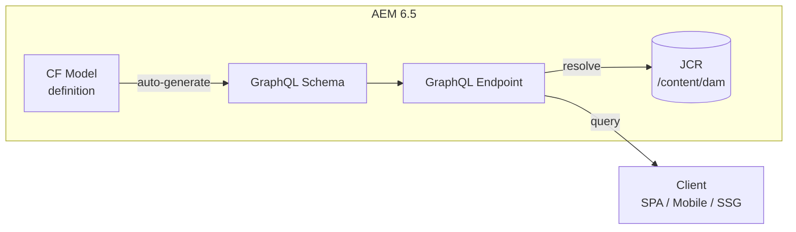
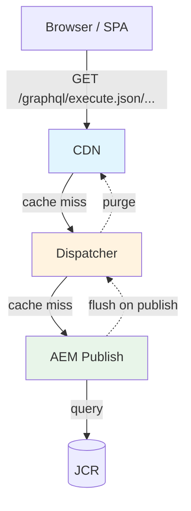

# Headless GraphQL — AEM 6.5 On-Premise

---

## Yêu Cầu Cài Đặt

GraphQL API có từ **AEM 6.5 SP10**. Phải cài thêm index package riêng:

| AEM Version | Yêu cầu |
|---|---|
| 6.5.10 — 6.5.22 | Cài [Content Fragment with GraphQL Index Package 1.0.5](https://experience.adobe.com/#/downloads/content/software-distribution/en/aem.html) |
| 6.5.23+ | Cài **Index Package 1.1.1** (bắt buộc, nếu thiếu sẽ slow/failed queries) |
| 6.5.17+ | Hỗ trợ **optimized GraphQL filtering** (cần chạy migration procedure) |

Không cài index package = query chạy trên Lucene generic index, rất chậm khi data lớn.

---

## Cách Hoạt Động

AEM tự sinh GraphQL schema từ Content Fragment Models. Mỗi model = 1 GraphQL type, mỗi field = 1 queryable property, fragment reference = nested type. Không cần viết schema thủ công.



### Mapping CF Model Field → GraphQL Type

| CF Model Field Type | GraphQL Type | Ghi chú |
|---|---|---|
| Single-line text | `String` | |
| Multi-line text | `String` | Có sub-fields: `html`, `plaintext`, `markdown` |
| Number (Integer) | `Int` | |
| Number (Float) | `Float` | |
| Boolean | `Boolean` | |
| Date and Time | `Calendar` | ISO 8601 string |
| Enumeration | `String` | Với defined values |
| Tags | `[String]` | Mảng Tag ID |
| Content Reference | `String` | Path tới asset/page |
| Fragment Reference | Nested type | Trở thành relationship, query được |
| JSON Object | `json` scalar | **Chỉ AEMaaCS**, 6.5 không hỗ trợ |

---

## Tạo GraphQL Endpoint

### Qua UI

1. **Tools → General → GraphQL**
2. Click **Create**:
   - **Name**: `myproject`
   - **Configuration**: chọn config chứa CF Models (vd: `/conf/myproject`)
3. Endpoint available tại:

```
/content/cq:graphql/myproject/endpoint.json

# hoặc JCR-safe encoding:
/content/_cq_graphql/myproject/endpoint.json
```

### Global vs Site-specific

| Endpoint | Path | Khi nào dùng |
|---|---|---|
| Global | `/content/cq:graphql/global/endpoint.json` | Dev/test, truy cập mọi model |
| Site-specific | `/content/cq:graphql/myproject/endpoint.json` | Production — giới hạn schema scope |

**Dùng site-specific trên production.** Global endpoint expose toàn bộ model của mọi site trên cùng instance — security risk.

### Tạo endpoint bằng curl (automation)

```bash
curl -u admin:admin \
  -X POST \
  -H "Content-Type: application/json" \
  -d '{
    "jcr:primaryType": "cq:Page",
    "jcr:content": {
      "jcr:primaryType": "cq:PageContent",
      "jcr:title": "myproject",
      "sling:resourceType": "cq/graphql/components/endpoint",
      "configurationName": "/conf/myproject"
    }
  }' \
  "http://localhost:4502/content/cq:graphql/myproject"
```

---

## GraphiQL IDE

AEM 6.5 ship sẵn GraphiQL IDE:

```
http://localhost:4502/content/graphiql.html
```

Tính năng: schema explorer, auto-complete, query history, variables panel.

Chọn endpoint ở dropdown phía trên trước khi query. Nếu không thấy endpoint → kiểm tra đã tạo và publish CF Model chưa.

---

## Query Cơ Bản

### List query — lấy nhiều fragments

```graphql
{
    articleList {
        items {
            _path
            title
            body {
                html
            }
            publishDate
            featured
            category
        }
    }
}
```

AEM sinh ra 2 query types cho mỗi model `Article`:
- `articleList` — lấy nhiều, hỗ trợ filter/sort/pagination
- `articleByPath` — lấy 1 fragment theo path

### Single fragment by path

```graphql
{
    articleByPath(
        _path: "/content/dam/myproject/articles/getting-started"
    ) {
        item {
            title
            body {
                html
                plaintext
            }
            publishDate
            author {
                name
                bio { plaintext }
            }
        }
    }
}
```

### Multi-line text sub-fields

Multi-line text field expose nội dung theo nhiều format:

```graphql
{
    articleList {
        items {
            body {
                html         # HTML formatted
                plaintext    # Plain text, tags stripped
                markdown     # Markdown (nếu authored bằng Markdown)
            }
        }
    }
}
```

Chỉ chọn format cần dùng — `html` + `plaintext` + `markdown` cùng lúc = over-fetch.

### Fragment references (nested queries)

Fragment reference tự động resolve thành nested type:

```graphql
{
    articleList {
        items {
            title

            # Single fragment reference
            author {
                name
                bio { html }
            }

            # Multi-valued fragment reference
            relatedArticles {
                title
                _path
            }
        }
    }
}
```

### Content reference / Image reference

```graphql
{
    articleList {
        items {
            title
            featuredImage {
                ... on ImageRef {
                    _path
                    _authorUrl
                    _publishUrl
                    mimeType
                    width
                    height
                }
            }
        }
    }
}
```

`_authorUrl` / `_publishUrl` trả về URL đầy đủ — dùng trong SPA để render image không cần hardcode hostname.

---

## Filtering, Sorting, Pagination

### Filter cơ bản

```graphql
{
    articleList(
        filter: {
            featured: { _expressions: [{ value: true }] }
            category: { _expressions: [{ value: "technology" }] }
        }
    ) {
        items {
            title
            category
        }
    }
}
```

Nhiều field trong cùng `filter` = **AND** logic.

### Filter operators

| Operator | Áp dụng | Ý nghĩa |
|---|---|---|
| `EQUALS` (default) | All | Exact match |
| `EQUALS_NOT` | All | Not equal |
| `CONTAINS` | String | Substring match (case-sensitive) |
| `CONTAINS_NOT` | String | Không chứa substring |
| `STARTS_WITH` | String | Prefix match |
| `LOWER` | Number, Date | Less than |
| `LOWER_EQUAL` | Number, Date | Less than or equal |
| `GREATER` | Number, Date | Greater than |
| `GREATER_EQUAL` | Number, Date | Greater than or equal |
| `AT` | Date | Exact date match |
| `BEFORE` | Date | Before date |
| `AFTER` | Date | After date |

### Filter theo string

```graphql
{
    articleList(
        filter: {
            title: {
                _expressions: [{
                    value: "AEM"
                    _operator: CONTAINS
                }]
            }
        }
    ) {
        items { title }
    }
}
```

### Filter theo date range

```graphql
{
    articleList(
        filter: {
            publishDate: {
                _expressions: [
                    { value: "2025-01-01T00:00:00Z", _operator: AFTER },
                    { value: "2025-12-31T23:59:59Z", _operator: BEFORE }
                ]
            }
        }
    ) {
        items { title publishDate }
    }
}
```

### Sorting

```graphql
{
    articleList(
        sort: "publishDate DESC"
    ) {
        items { title publishDate }
    }
}

# Multi-field sort
{
    articleList(
        sort: "category ASC, publishDate DESC"
    ) {
        items { title category publishDate }
    }
}
```

### Pagination (offset-based)

AEM 6.5 chỉ hỗ trợ **offset-based pagination**. Cursor-based pagination (`articlePaginated`) chỉ có trên AEMaaCS.

```graphql
# Trang 1
{
    articleList(offset: 0, limit: 10) {
        items { title }
    }
}

# Trang 2
{
    articleList(offset: 10, limit: 10) {
        items { title }
    }
}
```

**Luôn set `limit`.** Không set = AEM trả về default (thường 10, configurable). Không bao giờ query không có limit trên production.

---

## Variations

Query variation khác ngoài `master`:

```graphql
{
    articleList(variation: "summary") {
        items {
            title
            body { html }
        }
    }
}
```

Nếu field không có value trong variation → fallback về `master`.

---

## Persisted Queries

Persisted queries là cách khuyến nghị cho production — query được lưu trên server, gọi qua GET request.

**Tại sao cần dùng:**
- **Cacheable** bởi Dispatcher và CDN (GET request với URL ổn định)
- **Bảo mật** — client không gửi arbitrary query
- **Nhanh hơn** — server không parse query mỗi lần

### Tạo persisted query

```bash
curl -u admin:admin \
  -X PUT \
  -H "Content-Type: application/json" \
  -d '{
    "query": "{ articleList(sort: \"publishDate DESC\", limit: 10) { items { _path title body { html } publishDate category } } }"
  }' \
  "http://localhost:4502/graphql/persist.json/myproject/latest-articles"
```

### Gọi persisted query

```bash
# GET request — cacheable
curl "http://localhost:4502/graphql/execute.json/myproject/latest-articles"
```

### Persisted query với variables

```bash
# Tạo
curl -u admin:admin \
  -X PUT \
  -H "Content-Type: application/json" \
  -d '{
    "query": "query ArticlesByCategory($category: String!, $limit: Int = 10) { articleList(filter: { category: { _expressions: [{ value: $category }] } }, limit: $limit, sort: \"publishDate DESC\") { items { _path title publishDate category } } }"
  }' \
  "http://localhost:4502/graphql/persist.json/myproject/articles-by-category"

# Gọi với variables trong URL path
curl "http://localhost:4502/graphql/execute.json/myproject/articles-by-category;category=technology;limit=5"
```

### URL patterns

| Pattern | Method | Mô tả |
|---|---|---|
| `/graphql/persist.json/\{config\}/\{name\}` | PUT | Tạo/update persisted query |
| `/graphql/execute.json/\{config\}/\{name\}` | GET | Chạy persisted query |
| `/graphql/execute.json/\{config\}/\{name\};var1=val1;var2=val2` | GET | Chạy với variables |
| `/graphql/list.json/\{config\}` | GET | List tất cả persisted queries |

**Persisted queries phải được replicate sang Publish.** Nếu tạo trên Author mà quên activate → 404 trên Publish.

---

## Frontend Integration

### Fetch helper (JavaScript / TypeScript)

```typescript
const AEM_HOST = process.env.AEM_PUBLISH_HOST || 'https://publish.myproject.com';

async function fetchPersistedQuery<T>(
    queryPath: string,
    variables?: Record<string, string | number>
): Promise<T> {

    let url = `${AEM_HOST}/graphql/execute.json/${queryPath}`;

    if (variables) {
        const params = Object.entries(variables)
            .map(([k, v]) => `${k}=${encodeURIComponent(v)}`)
            .join(';');
        url += `;${params}`;
    }

    const response = await fetch(url, {
        method: 'GET',
        headers: { 'Content-Type': 'application/json' },
    });

    if (!response.ok) {
        throw new Error(`GraphQL error: ${response.status} ${response.statusText}`);
    }

    const json = await response.json();

    if (json.errors) {
        throw new Error(
            json.errors.map((e: { message: string }) => e.message).join(', ')
        );
    }

    return json.data;
}
```

### Sử dụng

```typescript
interface Article {
    _path: string;
    title: string;
    body: { html: string };
    publishDate: string;
}

interface ArticleListResponse {
    articleList: { items: Article[] };
}

// Fetch latest articles
const data = await fetchPersistedQuery<ArticleListResponse>(
    'myproject/latest-articles'
);
const articles = data.articleList.items;

// Fetch by category
const tech = await fetchPersistedQuery<ArticleListResponse>(
    'myproject/articles-by-category',
    { category: 'technology', limit: 5 }
);
```

### React hook

```typescript
import { useState, useEffect } from 'react';

function useArticles(category?: string) {
    const [articles, setArticles] = useState<Article[]>([]);
    const [loading, setLoading] = useState(true);
    const [error, setError] = useState<Error | null>(null);

    useEffect(() => {
        setLoading(true);

        const path = category
            ? 'myproject/articles-by-category'
            : 'myproject/latest-articles';
        const vars = category ? { category } : undefined;

        fetchPersistedQuery<ArticleListResponse>(path, vars)
            .then(data => setArticles(data.articleList.items))
            .catch(setError)
            .finally(() => setLoading(false));
    }, [category]);

    return { articles, loading, error };
}
```

---

## Dispatcher Configuration (AEM 6.5)

### Filter rules

```
# Allow persisted queries (GET)
/0100 {
    /type "allow"
    /method "GET"
    /url "/graphql/execute.json/*"
}

# Allow GraphQL endpoint (GET + POST + OPTIONS)
/0101 {
    /type "allow"
    /method "(GET|POST|OPTIONS)"
    /url "/content/_cq_graphql/*/endpoint.json"
}
```

### Client headers

```
# dispatcher/clientheaders.any
$include "./default_clientheaders.any"
"Origin"
"Access-Control-Request-Method"
"Access-Control-Request-Headers"
"Authorization"
```

### Cache rules

```
# Cache persisted query responses
/0100 {
    /glob "*.json"
    /type "allow"
}
```

### TTL cho GraphQL responses

```apache
# vhost config
<LocationMatch "^/graphql/execute\.json/.*$">
    Header set Cache-Control "public, max-age=300"
    Header set Surrogate-Control "max-age=600"
</LocationMatch>
```

### Cache invalidation

Khi Content Fragment được publish, AEM gửi flush request tới Dispatcher. Cấu hình invalidation cho `.json`:

```
# dispatcher/cache/invalidate.any
/0001 {
    /glob "*.json"
    /type "allow"
}
```

---

## CORS Configuration

Bắt buộc khi SPA ở domain khác gọi GraphQL API:

```json
// ui.config/.../com.adobe.granite.cors.impl.CORSPolicyImpl~graphql.cfg.json
{
    "supportscredentials": false,
    "supportedmethods": ["GET", "HEAD", "POST", "OPTIONS"],
    "alloworigin": [
        "https://www.myproject.com",
        "https://app.myproject.com"
    ],
    "maxage:Integer": 1800,
    "alloworiginregexp": [
        "http://localhost:.*"
    ],
    "allowedpaths": [
        "/content/_cq_graphql/myproject/endpoint.json",
        "/graphql/execute.json/.*"
    ],
    "supportedheaders": [
        "Origin",
        "Accept",
        "X-Requested-With",
        "Content-Type",
        "Access-Control-Request-Method",
        "Access-Control-Request-Headers",
        "Authorization"
    ]
}
```

**Không dùng wildcard `*` cho `alloworigin` trên production.** Liệt kê từng domain.

### Referrer filter

```json
// ui.config/.../org.apache.sling.security.impl.ReferrerFilter~graphql.cfg.json
{
    "allow.empty": false,
    "allow.hosts": [
        "www.myproject.com",
        "app.myproject.com"
    ],
    "allow.hosts.regexp": [
        "http://localhost:.*"
    ],
    "filter.methods": ["POST", "PUT", "DELETE"]
}
```

---

## Authentication (AEM 6.5)

### Publish — Anonymous access

Publish instance thường cho phép anonymous GET requests tới persisted queries. Không cần authentication nếu content đã được publish.

### Author — Basic auth (dev only)

```bash
curl -u admin:admin \
  "http://localhost:4502/graphql/execute.json/myproject/latest-articles"
```

### Author — Token-based (production)

Với AEM 6.5 on-premise, dùng token authentication cho server-to-server:

```java
// Java backend gọi Author GraphQL
URL url = new URL(
    "http://author.myproject.com/graphql/execute.json/myproject/latest-articles"
);
HttpURLConnection conn = (HttpURLConnection) url.openConnection();
conn.setRequestMethod("GET");
conn.setRequestProperty("Authorization", "Basic "
    + Base64.getEncoder().encodeToString("service-user:password".getBytes()));

// Hoặc dùng login token từ AEM:
// conn.setRequestProperty("Cookie", "login-token=" + token);
```

**Không embed Author credentials trong client-side JavaScript.** Author queries chỉ chạy từ server-side (API routes, build-time fetch, serverless functions).

---

## Caching Strategy



| Layer | Cache mechanism | Invalidation |
|---|---|---|
| Browser | `Cache-Control` header | TTL-based |
| CDN | `Surrogate-Control` header | Purge API / TTL |
| Dispatcher | File-based cache (`.stat`) | Flush agent khi content publish |
| AEM Publish | In-memory query cache | Tự động khi content thay đổi |

---

## Optimized Filtering (AEM 6.5.17+)

Từ SP17, AEM hỗ trợ optimized filtering cho GraphQL. Cần chạy migration 1 lần:

1. Vào **OSGi Console → Configuration**
2. Tìm **Content Fragment Migration Job Configuration**
3. Set:
   - `ContentFragmentMigration:Enabled` = `1`
   - `ContentFragmentMigration:Enforce` = `1`
4. Save → migration chạy tự động

Sau migration, property `cfGlobalVersion` xuất hiện tại `/content/dam` (kiểm tra trong CRXDE). Nếu import CF bằng content package sau migration → cần chạy lại.

---

## AEM 6.5 vs AEMaaCS — Khác Biệt

| Feature | AEM 6.5 (SP10+) | AEMaaCS |
|---|---|---|
| GraphQL API | Cần cài index package | Built-in |
| GraphiQL IDE | `/content/graphiql.html` | `/aem/graphiql.html` |
| Persisted queries | Hỗ trợ | Hỗ trợ |
| Cursor-based pagination | **Không** | Có |
| JSON Object field type | **Không** | Có |
| Optimized filtering | SP17+ (cần migration) | Tự động |
| Oak index | Cấu hình thủ công | Tự động |
| CDN caching | Tự cấu hình Dispatcher | Fastly tích hợp sẵn |

---

## Performance Best Practices

### Luôn dùng persisted queries

Ad-hoc POST queries bypass Dispatcher/CDN cache. Trên Publish, chỉ dùng persisted queries.

### Giới hạn query depth

```graphql
# Tệ — 4 levels nested, gây expensive JCR traversals
{
    articleList {
        items {
            author {
                articles {
                    relatedArticles {
                        author { name }
                    }
                }
            }
        }
    }
}

# Tốt — flat, chỉ lấy cần thiết
{
    articleList(limit: 10) {
        items {
            title
            body { html }
            author { name }
        }
    }
}
```

### Chỉ lấy field cần dùng

```graphql
# Tệ — over-fetch
{
    articleList {
        items {
            title
            body { html plaintext markdown }
            author { name bio { html plaintext } }
            relatedArticles { title body { html } }
        }
    }
}

# Tốt — chỉ lấy cho UI card
{
    articleList(limit: 20) {
        items {
            title
            publishDate
            category
        }
    }
}
```

### Tạo Oak index cho filter fields

Nếu filter trên field thường xuyên (vd: `category`, `publishDate`), tạo Oak property index tương ứng. Xem note [Query Builder](./1.aem-query-builder.md) phần Oak indexing.

### Chạy optimized filtering migration

Trên AEM 6.5.17+, migration giúp filter nhanh hơn bằng cách flatten CF data vào index-friendly properties.

---

## Pitfalls Thường Gặp

| Vấn đề | Nguyên nhân | Fix |
|---|---|---|
| POST query chậm trên production | Bypass Dispatcher cache | Chuyển sang persisted queries (GET) |
| CORS error trong browser | Thiếu CORS OSGi config | Cấu hình `CORSPolicyImpl`, bao gồm `OPTIONS` method |
| GraphQL trả `null` cho field có data | CF chưa publish sang Publish | Kiểm tra CF status, activate |
| Nested reference trả empty | CF được reference chưa publish | Publish cả parent và referenced fragments |
| Query chậm | Thiếu index, query depth quá sâu | Tạo Oak index, giảm depth, thêm `limit` |
| Schema không show field mới | CF Model chưa publish | Publish updated CF Model → schema regenerate |
| Persisted query 404 trên Publish | Chưa replicate persisted query | Activate persisted query từ Author sang Publish |
| `.json` cache không invalidate | Dispatcher flush agent không cover `.json` | Thêm `*.json` vào `invalidate.any` |
| `Cannot resolve field` | Tên field sai hoặc model chưa deploy | Kiểm tra schema trong GraphiQL |
| `403 Forbidden` | Referrer filter block request | Thêm domain vào `ReferrerFilter` config |
| Index package chưa cài | Query fail hoặc cực chậm | Cài đúng version index package cho SP đang dùng |
| Filter không chính xác sau import CF | `cfGlobalVersion` mất sau import package | Chạy lại optimized filtering migration |

---

## Tham Khảo

- [AEM GraphQL API for Content Fragments (6.5)](https://experienceleague.adobe.com/en/docs/experience-manager-65-lts/content/assets/extending/graphql-api-content-fragments) — Adobe Experience League
- [Headless Development for AEM 6.5](https://experienceleague.adobe.com/en/docs/experience-manager-65/content/implementing/developing/headless/introduction) — Adobe Experience League
- [Optimized GraphQL Filtering (6.5.17+)](https://experienceleague.adobe.com/en/docs/experience-manager-65/content/implementing/developing/headless/delivery-api/graphql-optimized-filtering-content-update) — Adobe Experience League
- [Persisted GraphQL Queries](https://experienceleague.adobe.com/en/docs/experience-manager-65/content/implementing/developing/headless/graphql-api/persisted-queries) — Adobe Experience League
- [CORS Configuration](https://experienceleague.adobe.com/en/docs/experience-manager-65/content/implementing/developing/headless/deployment/cross-origin-resource-sharing) — Adobe Experience League
