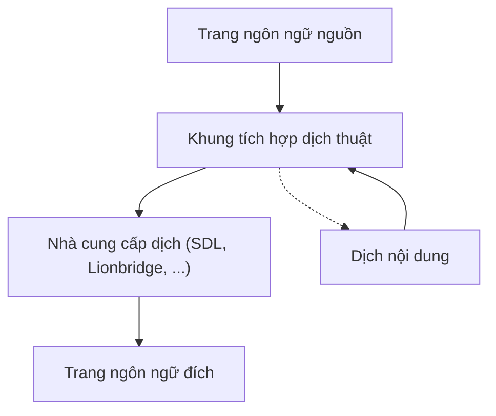
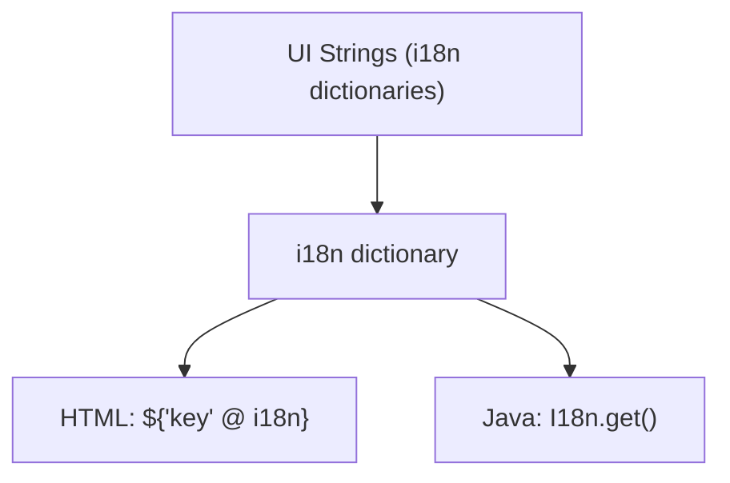
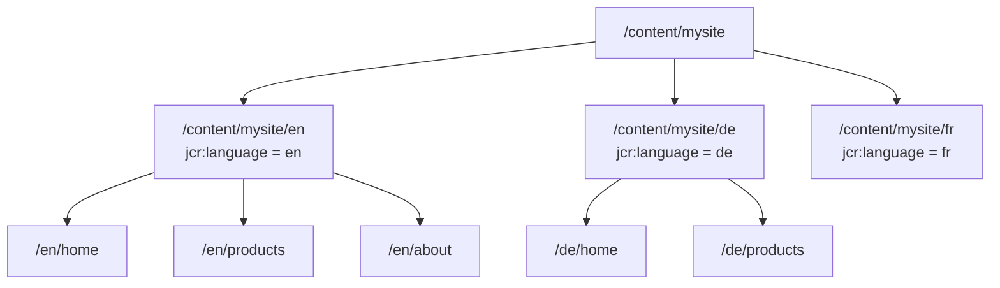
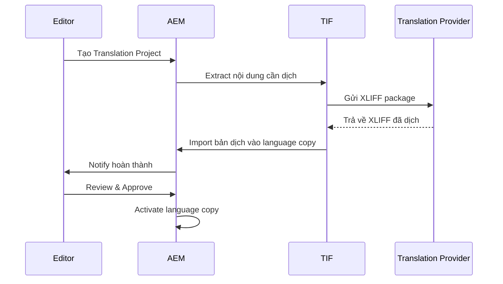

# i18n và Translation


---

AEM phân biệt hai loại đa ngôn ngữ:

1. **UI String Translation (i18n)** — dịch label, button, text cố định trong component bằng dictionary
2. **Content Translation** — dịch nội dung trang, Content Fragment, Experience Fragment thông qua Translation Integration Framework (TIF)

---

## Kiến Trúc Tổng Quan





## Phần 1 — UI String Translation (i18n Dictionaries)

### Dictionary là gì

Dictionary lưu cặp key-value ánh xạ string key sang bản dịch tương ứng. AEM dùng cơ chế `ResourceBundle` của Sling để resolve bản dịch dựa trên locale của trang.

### Cấu trúc thư mục

**Format JSON (khuyến nghị cho dự án mới):**

```
/apps/myproject/i18n/
├── en.json        ← tiếng Anh (source)
├── de.json        ← tiếng Đức
├── fr.json        ← tiếng Pháp
└── vi.json        ← tiếng Việt
```

**Format node (legacy):**

```
/apps/myproject/i18n/
├── en/
│   ├── jcr:language  = "en"
│   ├── jcr:mixinTypes = ["mix:language"]
│   └── <sling:MessageEntry nodes>
└── de/
    ├── jcr:language  = "de"
    └── <sling:MessageEntry nodes>
```

Dùng JSON format khi có thể — dễ quản lý trong source control, không cần commit JCR content.

### JSON dictionary format

```json
// /apps/myproject/i18n/en.json
{
    "jcr:language": "en",
    "jcr:mixinTypes": ["mix:language"],
    "jcr:primaryType": "nt:unstructured",
    "sling:basename": "myproject",

    "readMore":          { "jcr:primaryType": "sling:MessageEntry", "sling:key": "readMore",          "sling:message": "Read more" },
    "backToTop":         { "jcr:primaryType": "sling:MessageEntry", "sling:key": "backToTop",         "sling:message": "Back to top" },
    "searchPlaceholder": { "jcr:primaryType": "sling:MessageEntry", "sling:key": "searchPlaceholder", "sling:message": "Search..." },
    "noResults":         { "jcr:primaryType": "sling:MessageEntry", "sling:key": "noResults",         "sling:message": "No results found" },
    "resultsFound":      { "jcr:primaryType": "sling:MessageEntry", "sling:key": "resultsFound",      "sling:message": "Found {0} results for '{1}'" }
}
```

```json
// /apps/myproject/i18n/de.json
{
    "jcr:language": "de",
    "jcr:mixinTypes": ["mix:language"],
    "jcr:primaryType": "nt:unstructured",
    "sling:basename": "myproject",

    "readMore":          { "jcr:primaryType": "sling:MessageEntry", "sling:key": "readMore",          "sling:message": "Weiterlesen" },
    "backToTop":         { "jcr:primaryType": "sling:MessageEntry", "sling:key": "backToTop",         "sling:message": "Nach oben" },
    "searchPlaceholder": { "jcr:primaryType": "sling:MessageEntry", "sling:key": "searchPlaceholder", "sling:message": "Suchen..." },
    "noResults":         { "jcr:primaryType": "sling:MessageEntry", "sling:key": "noResults",         "sling:message": "Keine Ergebnisse gefunden" },
    "resultsFound":      { "jcr:primaryType": "sling:MessageEntry", "sling:key": "resultsFound",      "sling:message": "{0} Ergebnisse für '{1}' gefunden" }
}
```

### `sling:basename` — namespace dictionary

Nhiều dự án trên cùng một AEM instance có thể dùng cùng key. Dùng `sling:basename` để tránh collision:

```
/apps/myproject/i18n/     → sling:basename = "myproject"
/apps/shared/i18n/        → sling:basename = "shared"
```

Nếu không set `sling:basename`, Sling tìm trong tất cả dictionary và trả về match đầu tiên — không đảm bảo thứ tự.

---

### i18n trong HTL

#### Cơ bản

```html
<button>${'readMore' @ i18n}</button>
<!-- EN: Read more | DE: Weiterlesen -->
```

Locale tự động được resolve từ property `jcr:language` của trang, kế thừa từ language root (vd: `/content/mysite/de`).

#### Với basename

```html
<span>${'searchPlaceholder' @ i18n, basename='myproject'}</span>
```

#### Explicit locale

```html
<!-- Ép dùng tiếng Đức bất kể ngôn ngữ trang -->
<span>${'readMore' @ i18n, locale='de'}</span>
```

#### Translation hint

```html
<!-- Hint giúp translator hiểu context -->
<span>${'open' @ i18n, hint='Verb: open a menu, not the adjective'}</span>
```

#### Parameterised string

```html
<!-- Dictionary: "resultsFound": "Found {0} results for '{1}'" -->
<p>${'resultsFound' @ i18n, format=[resultCount, searchTerm]}</p>
<!-- Output: Found 42 results for 'shoes' -->
```

---

### i18n trong Java

```java
package com.myproject.core.models;

import com.day.cq.i18n.I18n;
import com.day.cq.wcm.api.Page;
import org.apache.sling.api.SlingHttpServletRequest;
import org.apache.sling.models.annotations.Model;
import org.apache.sling.models.annotations.injectorspecific.ScriptVariable;
import org.apache.sling.models.annotations.injectorspecific.Self;

import java.util.Locale;
import java.util.ResourceBundle;

@Model(adaptables = SlingHttpServletRequest.class)
public class SearchResultsModel {

    @Self
    private SlingHttpServletRequest request;

    @ScriptVariable
    private Page currentPage;

    /**
     * Dùng locale của user (từ preferences) — ưu tiên cho authenticated user.
     */
    public String getNoResultsMessage() {
        I18n i18n = new I18n(request);
        return i18n.get("noResults");
    }

    /**
     * Dùng locale của trang — phù hợp cho anonymous visitor.
     */
    public String getNoResultsMessageByPage() {
        Locale pageLocale = currentPage.getLanguage(false);
        ResourceBundle bundle = request.getResourceBundle(pageLocale);
        I18n i18n = new I18n(bundle);
        return i18n.get("noResults");
    }

    /**
     * Parameterised string — {0}, {1} tương ứng với args.
     */
    public String getResultsMessage(int count, String query) {
        I18n i18n = new I18n(request);
        // hint = null khi không cần phân biệt
        return i18n.get("resultsFound", null, count, query);
        // EN: "Found 42 results for 'shoes'"
        // DE: "42 Ergebnisse für 'shoes' gefunden"
    }

    /**
     * Với translation hint để phân biệt key trùng nghĩa.
     */
    public String getRequestLabel() {
        I18n i18n = new I18n(request);
        return i18n.get("Request", "A noun, as in a web request");
    }

    /**
     * Static method — dùng khi không muốn tạo I18n object riêng.
     */
    public String getWelcomeMessage(String username, int msgCount) {
        return I18n.get(request,
            "Welcome back {0}. You have {1} messages.",
            "username, message count",
            username, msgCount);
    }
}
```

#### `ResourceBundleProvider` — dùng trong OSGi service (không có request)

```java
package com.myproject.core.services;

import org.apache.sling.i18n.ResourceBundleProvider;
import org.osgi.service.component.annotations.Component;
import org.osgi.service.component.annotations.Reference;

import java.util.Locale;
import java.util.ResourceBundle;

@Component(service = TranslationService.class)
public class TranslationServiceImpl implements TranslationService {

    @Reference(target = "(component.name=org.apache.sling.i18n.impl.JcrResourceBundleProvider)")
    private ResourceBundleProvider resourceBundleProvider;

    @Override
    public String translate(String key, Locale locale) {
        ResourceBundle bundle = resourceBundleProvider.getResourceBundle(locale);
        if (bundle != null && bundle.containsKey(key)) {
            return bundle.getString(key);
        }
        return key; // fallback về key nếu không có bản dịch
    }

    @Override
    public String translate(String key, String languageCode) {
        return translate(key, new Locale(languageCode));
    }
}
```

---

### i18n trong JavaScript (ClientLib)

```javascript
// Require granite.utils clientlib
// categories: ["granite.utils"]

// Set locale — thường inject từ server vào page
Granite.I18n.setLocale(document.documentElement.lang || 'en');

// Basic
var label = Granite.I18n.get('readMore');

// Với hint
var label = Granite.I18n.get('open', null, 'Verb: open a menu');

// Parameterised
var msg = Granite.I18n.get(
    'Welcome back {0}. You have {1} messages.',
    [username, msgCount],
    'username, message count'
);
```

Inject locale từ HTL vào JavaScript:

```html
<!-- component.html -->
<div data-sly-use.model="com.myproject.core.models.ComponentModel">
    <script>
        Granite.I18n.setLocale('${model.locale @ context="unsafe"}');
    </script>
</div>
```

---

## Phần 2 — Content Translation

### Cấu trúc site đa ngôn ngữ



Property `jcr:language` **phải** đặt trên language root node. Nếu thiếu, i18n fallback về server default locale.

### Language Copy

Language copy là bản sao cây nội dung nguồn sang ngôn ngữ mục tiêu. Tạo bằng:

- **UI**: Sites console → chọn trang → Create → Language Copy
- **Programmatic** (xem phần dưới)

Có hai loại:
- **Manual copy** — editor tự dịch thủ công
- **TIF copy** — tự động gửi đến translation provider và nhận lại bản dịch

### Translation Integration Framework (TIF)



#### Cấu hình Translation Cloud Service

1. **Tools → Cloud Services → Translation Cloud Services** → tạo config với credentials của provider
2. Gán cloud config cho language root:
   - Properties của `/content/mysite/en` → Cloud Services → thêm translation config

#### Tạo Translation Project

1. Chọn source language root trong Sites console
2. **References panel → Language Copies → Create & Translate**
3. Chọn target languages, translation scope (trang nào)
4. Chọn Translation Project: tạo mới hoặc thêm vào project có sẵn

### Translation Rules

File `translation_rules.xml` xác định property và component nào cần được dịch:

```xml
<!-- /etc/translation/rules/translation_rules.xml -->
<?xml version="1.0" encoding="UTF-8"?>
<nodelist>
    <!-- Pages và components dưới /content -->
    <node path="/content">
        <property name="jcr:title"       translate="true"/>
        <property name="jcr:description" translate="true"/>
        <property name="text"            translate="true"/>
        <property name="title"           translate="true"/>
        <property name="alt"             translate="true"/>
        <property name="placeholder"     translate="true"/>

        <!-- KHÔNG dịch các property kỹ thuật -->
        <property name="sling:resourceType"  translate="false"/>
        <property name="cq:tags"             translate="false"/>
        <property name="fileReference"       translate="false"/>
        <property name="fragmentPath"        translate="false"/>
    </node>

    <!-- DAM assets và Content Fragment metadata -->
    <node path="/content/dam">
        <property name="jcr:title"       translate="true"/>
        <property name="jcr:description" translate="true"/>
        <property name="dc:description"  translate="true"/>
    </node>

    <!-- Experience Fragments -->
    <node path="/content/experience-fragments">
        <property name="jcr:title" translate="true"/>
        <property name="text"      translate="true"/>
    </node>
</nodelist>
```

---

## Detect Locale Hiện Tại

### Từ trang (cách phổ biến nhất)

```java
package com.myproject.core.models;

import com.day.cq.wcm.api.Page;
import org.apache.sling.api.SlingHttpServletRequest;
import org.apache.sling.models.annotations.Model;
import org.apache.sling.models.annotations.injectorspecific.ScriptVariable;

import java.util.Locale;

@Model(adaptables = SlingHttpServletRequest.class)
public class LocaleModel {

    @ScriptVariable
    private Page currentPage;

    /**
     * false = không fallback về JVM locale, dùng page hierarchy.
     */
    public Locale getPageLocale() {
        return currentPage.getLanguage(false);
    }

    public String getLanguageCode() {
        // "en", "de", "fr", "vi"
        return currentPage.getLanguage(false).getLanguage();
    }

    public String getLanguageTag() {
        // "en-US", "de-DE" — dùng cho hreflang và lang attribute HTML
        return currentPage.getLanguage(false).toLanguageTag();
    }
}
```

### Từ request (Accept-Language header)

```java
// Dùng cho anonymous visitor trên publish khi page không có jcr:language
Locale requestLocale = request.getLocale();
```

---

## Language Switcher

Component cho phép user chuyển sang bản dịch tương đương của trang hiện tại.

```java
package com.myproject.core.models;

import com.day.cq.wcm.api.Page;
import org.apache.sling.api.SlingHttpServletRequest;
import org.apache.sling.api.resource.Resource;
import org.apache.sling.models.annotations.Model;
import org.apache.sling.models.annotations.injectorspecific.ScriptVariable;
import org.apache.sling.models.annotations.injectorspecific.Self;

import java.util.ArrayList;
import java.util.Iterator;
import java.util.List;

@Model(adaptables = SlingHttpServletRequest.class)
public class LanguageSwitcherModel {

    @ScriptVariable
    private Page currentPage;

    @Self
    private SlingHttpServletRequest request;

    public List<LanguageLink> getLanguages() {
        List<LanguageLink> links = new ArrayList<>();

        // Language root của trang hiện tại, vd: /content/mysite/en (level 2)
        Page languageRoot = currentPage.getAbsoluteParent(2);
        if (languageRoot == null) {
            return links;
        }

        // Site root: /content/mysite
        Page siteRoot = languageRoot.getParent();
        if (siteRoot == null) {
            return links;
        }

        // Relative path của trang so với language root: /products/shoes
        String relativePath = currentPage.getPath()
            .substring(languageRoot.getPath().length());

        Iterator<Page> siblings = siteRoot.listChildren();
        while (siblings.hasNext()) {
            Page langPage = siblings.next();
            String langCode    = langPage.getName();
            String targetPath  = langPage.getPath() + relativePath;
            Resource targetRes = request.getResourceResolver().getResource(targetPath);
            boolean exists     = targetRes != null;

            links.add(new LanguageLink(
                langCode,
                langPage.getTitle() != null ? langPage.getTitle() : langCode.toUpperCase(),
                exists ? targetPath + ".html" : langPage.getPath() + ".html",
                langCode.equals(languageRoot.getName()),
                exists
            ));
        }

        return links;
    }

    public static class LanguageLink {
        private final String code;
        private final String label;
        private final String url;
        private final boolean active;
        private final boolean targetExists;

        public LanguageLink(String code, String label, String url,
                            boolean active, boolean targetExists) {
            this.code         = code;
            this.label        = label;
            this.url          = url;
            this.active       = active;
            this.targetExists = targetExists;
        }

        public String getCode()          { return code; }
        public String getLabel()         { return label; }
        public String getUrl()           { return url; }
        public boolean isActive()        { return active; }
        public boolean isTargetExists()  { return targetExists; }
    }
}
```

HTL:

```html
<sly data-sly-use.langSwitch="com.myproject.core.models.LanguageSwitcherModel"/>

<nav class="language-switcher"
     aria-label="Language selector"
     data-sly-test="${langSwitch.languages.size > 1}">

    <a data-sly-repeat="${langSwitch.languages}"
       href="${item.url}"
       lang="${item.code}"
       hreflang="${item.code}"
       class="lang-link ${item.active ? 'active' : ''} ${!item.targetExists ? 'disabled' : ''}"
       data-sly-attribute.aria-current="${item.active ? 'page' : ''}"
       title="${item.label}">
        ${item.code @ context='text'}
    </a>

</nav>
```

---

## Định Dạng Ngày, Số, Tiền Tệ

Dùng `java.text` classes với locale của trang, không hardcode format:

```java
package com.myproject.core.models;

import com.day.cq.wcm.api.Page;
import org.apache.sling.api.SlingHttpServletRequest;
import org.apache.sling.models.annotations.Model;
import org.apache.sling.models.annotations.injectorspecific.ScriptVariable;

import java.text.DateFormat;
import java.text.NumberFormat;
import java.util.Date;
import java.util.Locale;

@Model(adaptables = SlingHttpServletRequest.class)
public class FormattingModel {

    @ScriptVariable
    private Page currentPage;

    private Locale getLocale() {
        return currentPage.getLanguage(false);
    }

    public String formatDateShort(Date date) {
        if (date == null) return "";
        return DateFormat.getDateInstance(DateFormat.SHORT, getLocale()).format(date);
        // EN: 1/15/25 | DE: 15.01.25 | VI: 15/01/25
    }

    public String formatDateLong(Date date) {
        if (date == null) return "";
        return DateFormat.getDateInstance(DateFormat.LONG, getLocale()).format(date);
        // EN: January 15, 2025 | DE: 15. Januar 2025
    }

    public String formatNumber(double number) {
        return NumberFormat.getNumberInstance(getLocale()).format(number);
        // EN: 1,234.56 | DE: 1.234,56 | VI: 1.234,56
    }

    public String formatCurrency(double amount, String currencyCode) {
        NumberFormat formatter = NumberFormat.getCurrencyInstance(getLocale());
        formatter.setCurrency(java.util.Currency.getInstance(currencyCode));
        return formatter.format(amount);
        // EN + USD: $1,234.56 | DE + EUR: 1.234,56 €
    }
}
```

---

## Programmatic Language Copy

Tạo language copy bằng code — dùng trong migration hoặc bulk setup:

```java
package com.myproject.core.services;

import com.day.cq.wcm.api.Page;
import com.day.cq.wcm.api.PageManager;
import com.day.cq.wcm.api.WCMException;
import org.apache.sling.api.resource.ResourceResolver;

import javax.jcr.Node;
import javax.jcr.RepositoryException;
import java.util.Iterator;

public class LanguageCopyService {

    /**
     * Tạo language copy từ source sang target locale.
     * sourcePath: /content/mysite/en
     * targetPath: /content/mysite/de
     */
    public void createLanguageCopy(ResourceResolver resolver,
                                   String sourcePath,
                                   String targetPath,
                                   String targetLanguage)
            throws WCMException, RepositoryException {

        PageManager pageManager = resolver.adaptTo(PageManager.class);
        if (pageManager == null) return;

        Page sourcePage = pageManager.getPage(sourcePath);
        if (sourcePage == null) return;

        // Deep copy toàn bộ cây
        pageManager.copy(sourcePage.adaptTo(Node.class), targetPath, null, true, true);

        // Set jcr:language trên language root
        Node targetNode = resolver.getResource(targetPath).adaptTo(Node.class);
        if (targetNode != null) {
            targetNode.setProperty("jcr:language", targetLanguage);
        }

        resolver.commit();
    }
}
```

---

## Content Fragment Translation

CF được dịch thông qua TIF theo cấu trúc DAM song song:

```
/content/dam/myproject/
├── en/
│   └── articles/
│       └── my-article          ← CF gốc (tiếng Anh)
└── de/
    └── articles/
        └── my-article          ← CF bản dịch (tiếng Đức)
```

Groovy script kiểm tra CF nào chưa có language copy:

```groovy
final String SOURCE_LANG = 'en'
final String TARGET_LANG = 'de'
final String DAM_ROOT    = '/content/dam/myproject'

import javax.jcr.query.Query

String sql = """
    SELECT a.[jcr:path]
    FROM   [dam:Asset] AS a
    INNER JOIN [nt:unstructured] AS m ON ISDESCENDANTNODE(m, a)
    WHERE  ISDESCENDANTNODE(a, '${DAM_ROOT}/${SOURCE_LANG}')
      AND  m.[dam:assetState] IS NOT NULL
    ORDER  BY a.[jcr:path]
"""

def result = session.workspace.queryManager
    .createQuery(sql, Query.JCR_SQL2)
    .execute()

int missing = 0
result.rows.each { row ->
    String sourcePath = row.getPath('a')
    String targetPath = sourcePath.replace("/${SOURCE_LANG}/", "/${TARGET_LANG}/")
    if (!session.nodeExists(targetPath)) {
        out.println("MISSING translation: ${targetPath}")
        missing++
    }
}

out.println("---")
out.println("Missing ${TARGET_LANG} translations: ${missing}")
return missing
```

---

## Testing i18n Coverage

AEM có locale đặc biệt `zz_ZZ` để kiểm tra string nào chưa được i18n. String chưa dịch sẽ hiển thị dạng:

```
USR_No results found_尠
```

Set locale test cho user:

```
CRXDE: /home/users/<userid>/preferences
  → thêm property: language = "zz_ZZ"
```

Hoặc dùng Groovy Console:

```groovy
def userId = 'admin'
def userNode = session.getNode("/home/users/a/${userId}/preferences")
userNode.setProperty('language', 'zz_ZZ')
session.save()
out.println("Set test locale for ${userId}")
```

---

## Pitfalls Thường Gặp

| Vấn đề | Nguyên nhân | Fix |
|---|---|---|
| Key được trả về thay vì bản dịch | Key không có trong dictionary hoặc sai basename | Kiểm tra spelling, đảm bảo đúng `sling:basename` |
| Bản dịch đúng trên author, sai trên publish | Dictionary dưới `/apps/` không nằm trong `ui.apps` package | Kiểm tra filter.xml trong `ui.apps` |
| Sai ngôn ngữ hiển thị | `jcr:language` không set hoặc sai giá trị (vd: `de_DE` thay vì `de`) | Set đúng `jcr:language` trên language root |
| `format` options không interpolate | Value trong dictionary thiếu `\{0\}`, `\{1\}` | Kiểm tra template string trong JSON |
| Language switcher dẫn đến 404 | Target page chưa có trong language copy | Check `targetExists` trước khi render link |
| TIF project không lấy nội dung | `translation_rules.xml` thiếu property | Thêm property vào rules file |
| i18n cache không refresh sau deploy | Sling ResourceBundle cache | Invalidate cache: `/system/console/slinglog` hoặc restart bundle `org.apache.sling.i18n` |

---

## Best Practices

**Đặt tên key mô tả mục đích, không mô tả nội dung:**

```
// Tốt
"nav.backToHome"
"form.submit.button"
"search.noResultsMessage"

// Tệ
"Back to home"
"Submit"
"No results found"
```

**Dùng `sling:basename` ngay từ đầu** — thêm sau sẽ phải update tất cả HTL đang dùng.

**Luôn set `jcr:language` trên language root** — thiếu property này khiến toàn bộ i18n fallback về server locale.

**Giữ dictionary trong `ui.apps`** — đảm bảo deploy cùng code, không phụ thuộc content package. Dictionary dưới `/apps/` là immutable ở runtime.

**Dùng `hint` cho key có context không rõ ràng** — cùng một từ có thể dịch khác nhau tùy context (danh từ vs động từ).

**Test RTL** — nếu support Arabic, Hebrew: test layout với content thực, không dùng placeholder.

---

## Tham Khảo

- [Internationalizing UI Strings (AEM 6.5)](https://experienceleague.adobe.com/en/docs/experience-manager-65/content/implementing/developing/components/internationalization/i18n-dev) — Adobe Experience League
- [Internationalizing Components (AEM 6.5)](https://experienceleague.adobe.com/en/docs/experience-manager-65/content/implementing/developing/components/internationalization/i18n) — Adobe Experience League
- [Translation Integration Framework](https://experienceleague.adobe.com/en/docs/experience-manager-65/content/sites/administering/translation/translation-integration-framework) — Adobe Experience League
- [Sling i18n ResourceBundleProvider](https://sling.apache.org/documentation/bundles/internationalization-support-i18n.html) — Apache Sling
