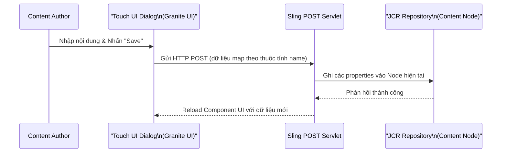
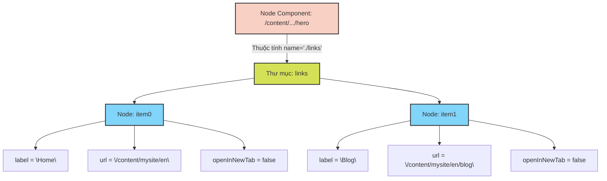

## 1. Cấu Trúc Cơ Bản Của Dialog

Trên nền tảng Touch UI, tất cả các dialog đều tuân thủ một cấu trúc XML lồng nhau nghiêm ngặt được xây dựng từ thư viện Granite UI. Dưới đây là bộ khung (skeleton) cơ bản:

```xml
<?xml version="1.0" encoding="UTF-8"?>
<jcr:root xmlns:cq="http://www.day.com/jcr/cq/1.0" 
          xmlns:jcr="http://www.jcp.org/jcr/1.0" 
          xmlns:nt="http://www.jcp.org/jcr/nt/1.0" 
          xmlns:granite="http://www.adobe.com/jcr/granite/1.0" 
          xmlns:sling="http://sling.apache.org/jcr/sling/1.0" 
          jcr:primaryType="nt:unstructured" 
          jcr:title="Tên Component" 
          sling:resourceType="cq/gui/components/authoring/dialog">
    <content jcr:primaryType="nt:unstructured" 
             sling:resourceType="granite/ui/components/coral/foundation/container">
        <items jcr:primaryType="nt:unstructured">
            <!-- Khai báo các Tabs hoặc Fields tại đây -->
        </items>
    </content>
</jcr:root>
```

Tệp tin này bắt buộc phải được đặt tại đường dẫn `_cq_dialog/.content.xml` bên trong thư mục của component.

Để hiểu rõ bản chất quá trình lưu trữ, hãy xem xét luồng tương tác giữa giao diện và JCR:



## 2. Các Trường Dữ Liệu Cốt Lõi (Common Field Types)

Dưới đây là các loại trường dữ liệu (widgets) Granite UI phổ biến nhất, là các "viên gạch" cơ bản để xây dựng mọi Dialog.

### Textfield (Văn bản một dòng)

```xml
<title jcr:primaryType="nt:unstructured" 
       sling:resourceType="granite/ui/components/coral/foundation/form/textfield" 
       fieldLabel="Tiêu đề" 
       fieldDescription="Nhập tiêu đề cho component" 
       name="./title" 
       required="{Boolean}true" 
       maxlength="100"/>
```

### Textarea (Văn bản nhiều dòng)

```xml
<description jcr:primaryType="nt:unstructured" 
             sling:resourceType="granite/ui/components/coral/foundation/form/textarea" 
             fieldLabel="Mô tả" 
             name="./description" 
             rows="5"/>
```

### Rich Text Editor (RTE)

```xml
<richText jcr:primaryType="nt:unstructured" 
          sling:resourceType="cq/gui/components/authoring/dialog/richtext" 
          fieldLabel="Nội dung" 
          name="./text" 
          useFixedInlineToolbar="{Boolean}true"/>
```

### Number Field (Trường nhập số)

```xml
<count jcr:primaryType="nt:unstructured" 
       sling:resourceType="granite/ui/components/coral/foundation/form/numberfield" 
       fieldLabel="Số lượng" 
       name="./count" 
       min="{Long}1" max="{Long}100" step="{Long}1" value="{Long}10"/>
```

### Checkbox (Hộp kiểm)

```xml
<featured jcr:primaryType="nt:unstructured" 
          sling:resourceType="granite/ui/components/coral/foundation/form/checkbox" 
          text="Nổi bật" 
          name="./featured" 
          value="{Boolean}true" 
          uncheckedValue="{Boolean}false"/>
```

### Select (Dropdown)

```xml
<alignment jcr:primaryType="nt:unstructured" 
           sling:resourceType="granite/ui/components/coral/foundation/form/select" 
           fieldLabel="Căn lề" 
           name="./alignment">
    <items jcr:primaryType="nt:unstructured">
        <left jcr:primaryType="nt:unstructured" text="Trái" value="left" selected="{Boolean}true"/>
        <center jcr:primaryType="nt:unstructured" text="Giữa" value="center"/>
        <right jcr:primaryType="nt:unstructured" text="Phải" value="right"/>
    </items>
</alignment>
```

### Path Browser (Chọn Trang hoặc Asset)

```xml
<link jcr:primaryType="nt:unstructured" 
      sling:resourceType="granite/ui/components/coral/foundation/form/pathfield" 
      fieldLabel="Đường dẫn" 
      fieldDescription="Chọn một trang" 
      name="./linkPath" 
      rootPath="/content" 
      filter="hierarchyNotFile"/>
```

**Bảng tham số `filter` thực chiến:**
| Giá trị `filter` | Phạm vi hiển thị |
| --- | --- |
| `hierarchyNotFile` | Chỉ hiển thị cấu trúc Trang (không hiển thị Assets) |
| `nosystem` | Ẩn các đường dẫn hệ thống |
| *(không khai báo)* | Hiển thị toàn bộ |

### Image Upload (Tải lên hình ảnh)

```xml
<image jcr:primaryType="nt:unstructured" 
       sling:resourceType="cq/gui/components/authoring/dialog/fileupload" 
       fieldLabel="Hình ảnh" 
       name="./file" 
       fileNameParameter="./fileName" 
       fileReferenceParameter="./fileReference" 
       allowUpload="{Boolean}true" 
       mimeTypes="[image/gif,image/jpeg,image/png,image/svg+xml,image/webp]"/>
```

### Hidden Field (Trường ẩn)

```xml
<type jcr:primaryType="nt:unstructured" 
      sling:resourceType="granite/ui/components/coral/foundation/form/hidden" 
      name="./sling:resourceType" 
      value="mysite/components/hero"/>
```

### Date Picker (Chọn ngày) & Color Picker (Chọn màu)

```xml
<eventDate jcr:primaryType="nt:unstructured" 
           sling:resourceType="granite/ui/components/coral/foundation/form/datepicker" 
           fieldLabel="Ngày sự kiện" 
           name="./eventDate" type="date" displayedFormat="YYYY-MM-DD"/>

<bgColor jcr:primaryType="nt:unstructured" 
         sling:resourceType="granite/ui/components/coral/foundation/form/colorfield" 
         fieldLabel="Màu nền" 
         name="./backgroundColor" value="#ffffff"/>
```

## 3. Tổ Chức Giao Diện Bằng Tabs

Đối với các component phức tạp, việc gom nhóm các trường dữ liệu thành các Tab là bắt buộc để tối ưu trải nghiệm Authoring.

```xml
<tabs jcr:primaryType="nt:unstructured" 
      sling:resourceType="granite/ui/components/coral/foundation/tabs" 
      maximized="{Boolean}true">
    <items jcr:primaryType="nt:unstructured">
        <content jcr:primaryType="nt:unstructured" 
                 jcr:title="Nội dung" 
                 sling:resourceType="granite/ui/components/coral/foundation/container" 
                 margin="{Boolean}true">
            <items jcr:primaryType="nt:unstructured">
                <!-- Các trường Nội dung -->
            </items>
        </content>
        <style jcr:primaryType="nt:unstructured" 
               jcr:title="Giao diện" 
               sling:resourceType="granite/ui/components/coral/foundation/container" 
               margin="{Boolean}true">
            <items jcr:primaryType="nt:unstructured">
                <!-- Các trường Giao diện -->
            </items>
        </style>
    </items>
</tabs>
```

**Mẫu (Pattern) chia Tab chuẩn công nghiệp:**
| Tab | Trường dữ liệu đặc trưng |
| --- | --- |
| **Content** | Tiêu đề, văn bản, hình ảnh (Nội dung chính yếu). |
| **Style** | Căn lề, màu sắc, kích thước (Cấu hình giao diện trực quan). |
| **Advanced** | HTML ID, CSS class, các thuộc tính Accessibility (Cài đặt kỹ thuật). |

## 4. Bản Chất Của Multifield (Mảng Dữ Liệu)

Multifield cho phép Author tạo ra một danh sách các nhóm trường lặp lại (ví dụ: Carousel Slides, List Links).

Điểm mấu chốt ở đây là thuộc tính `composite="\{Boolean\}true"`. Khi được kích hoạt, AEM sẽ lưu mỗi phần tử trong Multifield thành một **node con (child node)** độc lập mang các thuộc tính riêng. Nếu thiếu thuộc tính này, dữ liệu sẽ chỉ được lưu dưới dạng một String Array (chỉ áp dụng được cho Multifield chứa một Textfield đơn lẻ).

```xml
<links jcr:primaryType="nt:unstructured" 
       sling:resourceType="granite/ui/components/coral/foundation/form/multifield" 
       fieldLabel="Danh sách Links" 
       composite="{Boolean}true">
    <field jcr:primaryType="nt:unstructured" 
           sling:resourceType="granite/ui/components/coral/foundation/container" 
           name="./links">
        <items jcr:primaryType="nt:unstructured">
            <label jcr:primaryType="nt:unstructured" 
                   sling:resourceType="granite/ui/components/coral/foundation/form/textfield" 
                   fieldLabel="Nhãn" name="./label" required="{Boolean}true"/>
            <url jcr:primaryType="nt:unstructured" 
                 sling:resourceType="granite/ui/components/coral/foundation/form/pathfield" 
                 fieldLabel="URL" name="./url" rootPath="/content"/>
            <openInNewTab jcr:primaryType="nt:unstructured" 
                          sling:resourceType="granite/ui/components/coral/foundation/form/checkbox" 
                          text="Mở trong tab mới" name="./openInNewTab" value="{Boolean}true"/>
        </items>
    </field>
</links>
```

Sơ đồ JCR thể hiện kiến trúc lưu trữ khi sử dụng `composite=true`:



## 5. Đọc Giá Trị Bằng Sling Models

Khi cấu hình thành phần Upload Image với tham số `fileReferenceParameter="./fileReference"`, đường dẫn DAM Asset mà author chọn sẽ được lưu dưới dạng một thuộc tính String.

Trong Sling Model, bạn có thể dễ dàng map giá trị này bằng `@ValueMapValue`:

```java
@Model(adaptables = Resource.class, defaultInjectionStrategy = DefaultInjectionStrategy.OPTIONAL)
public class ImageComponentModel {
    
    @ValueMapValue
    private String fileReference; // Đường dẫn DAM, VD: "/content/dam/mysite/hero.jpg"

    public String getFileReference() {
        return fileReference;
    }
}
```

## 6. Giải Mã Thuộc Tính `name`

Thuộc tính `name` là cầu nối quyết định vị trí chính xác dữ liệu sẽ được ghi vào JCR:

| Cú pháp `name` | Vị trí lưu trữ trong cấu trúc JCR |
| --- | --- |
| `./title` | Trực tiếp tại content node của component (tên property là `title`). |
| `./jcr:title` | Trực tiếp tại content node (sử dụng namespace chuẩn `jcr`). |
| `./links/item0/label` | Lồng sâu bên dưới sub-node `links/item0`. |

Tiền tố `./` mang ý nghĩa chỉ định đường dẫn tương đối so với content resource hiện hành đang được author chỉnh sửa.

## 7. Cấu Trúc Toàn Diện: Hero Component Dialog

Dưới đây là mã nguồn XML tham khảo cho một Hero banner hoàn chỉnh, bao gồm layout chia cột, phân tab và đầy đủ các trường dữ liệu:

```xml
<?xml version="1.0" encoding="UTF-8"?>
<jcr:root xmlns:cq="http://www.day.com/jcr/cq/1.0" 
          xmlns:jcr="http://www.jcp.org/jcr/1.0" 
          xmlns:nt="http://www.jcp.org/jcr/nt/1.0" 
          xmlns:granite="http://www.adobe.com/jcr/granite/1.0" 
          xmlns:sling="http://sling.apache.org/jcr/sling/1.0" 
          jcr:primaryType="nt:unstructured" 
          jcr:title="Hero" 
          sling:resourceType="cq/gui/components/authoring/dialog">
    <content jcr:primaryType="nt:unstructured" 
             sling:resourceType="granite/ui/components/coral/foundation/container">
        <items jcr:primaryType="nt:unstructured">
            <tabs jcr:primaryType="nt:unstructured" 
                  sling:resourceType="granite/ui/components/coral/foundation/tabs" 
                  maximized="{Boolean}true">
                <items jcr:primaryType="nt:unstructured">
                    <!-- Tab Nội Dung -->
                    <content jcr:primaryType="nt:unstructured" 
                             jcr:title="Nội dung" 
                             sling:resourceType="granite/ui/components/coral/foundation/container" 
                             margin="{Boolean}true">
                        <items jcr:primaryType="nt:unstructured">
                            <columns jcr:primaryType="nt:unstructured" 
                                     sling:resourceType="granite/ui/components/coral/foundation/fixedcolumns" margin="{Boolean}true">
                                <items jcr:primaryType="nt:unstructured">
                                    <column jcr:primaryType="nt:unstructured" 
                                            sling:resourceType="granite/ui/components/coral/foundation/container">
                                        <items jcr:primaryType="nt:unstructured">
                                            <heading jcr:primaryType="nt:unstructured" 
                                                     sling:resourceType="granite/ui/components/coral/foundation/form/textfield" 
                                                     fieldLabel="Tiêu đề" name="./heading" required="{Boolean}true"/>
                                            <subheading jcr:primaryType="nt:unstructured" 
                                                        sling:resourceType="granite/ui/components/coral/foundation/form/textarea" 
                                                        fieldLabel="Tiêu đề phụ" name="./subheading" rows="3"/>
                                            <image jcr:primaryType="nt:unstructured" 
                                                   sling:resourceType="cq/gui/components/authoring/dialog/fileupload" 
                                                   fieldLabel="Ảnh Nền" name="./file" fileReferenceParameter="./fileReference" 
                                                   mimeTypes="[image/jpeg,image/png,image/webp]"/>
                                            <ctaLabel jcr:primaryType="nt:unstructured" 
                                                      sling:resourceType="granite/ui/components/coral/foundation/form/textfield" 
                                                      fieldLabel="Nhãn CTA" name="./ctaLabel"/>
                                            <ctaLink jcr:primaryType="nt:unstructured" 
                                                     sling:resourceType="granite/ui/components/coral/foundation/form/pathfield" 
                                                     fieldLabel="Link CTA" name="./ctaLink" rootPath="/content"/>
                                        </items>
                                    </column>
                                </items>
                            </columns>
                        </items>
                    </content>
                    <!-- Tab Giao Diện -->
                    <style jcr:primaryType="nt:unstructured" 
                           jcr:title="Giao diện" 
                           sling:resourceType="granite/ui/components/coral/foundation/container" 
                           margin="{Boolean}true">
                        <items jcr:primaryType="nt:unstructured">
                            <columns jcr:primaryType="nt:unstructured" 
                                     sling:resourceType="granite/ui/components/coral/foundation/fixedcolumns" margin="{Boolean}true">
                                <items jcr:primaryType="nt:unstructured">
                                    <column jcr:primaryType="nt:unstructured" 
                                            sling:resourceType="granite/ui/components/coral/foundation/container">
                                        <items jcr:primaryType="nt:unstructured">
                                            <overlay jcr:primaryType="nt:unstructured" 
                                                     sling:resourceType="granite/ui/components/coral/foundation/form/select" 
                                                     fieldLabel="Lớp phủ (Overlay)" name="./overlay">
                                                <items jcr:primaryType="nt:unstructured">
                                                    <none jcr:primaryType="nt:unstructured" text="Không có" value="none"/>
                                                    <light jcr:primaryType="nt:unstructured" text="Sáng" value="light"/>
                                                    <dark jcr:primaryType="nt:unstructured" text="Tối" value="dark" selected="{Boolean}true"/>
                                                </items>
                                            </overlay>
                                            <fullWidth jcr:primaryType="nt:unstructured" 
                                                       sling:resourceType="granite/ui/components/coral/foundation/form/checkbox" 
                                                       text="Mở rộng toàn màn hình" name="./fullWidth" value="{Boolean}true"/>
                                        </items>
                                    </column>
                                </items>
                            </columns>
                        </items>
                    </style>
                </items>
            </tabs>
        </items>
    </content>
</jcr:root>
```

## 8. Kỹ Thuật Hiển Thị Động (Conditional Show/Hide)

Một requirement rất phổ biến trong dự án thực tế là ẩn/hiện các trường dữ liệu phụ thuộc vào giá trị của một trường khác. Granite UI cung cấp sẵn client library `cq-dialog-dropdown-showhide` để giải quyết vấn đề này.

Ví dụ: Chỉ hiển thị trường "Custom URL" khi author chọn loại "Custom Link" ở Dropdown.

```xml
<!-- 1. Trường Điều Khiển (Select Dropdown) -->
<linkType jcr:primaryType="nt:unstructured" 
          sling:resourceType="granite/ui/components/coral/foundation/form/select" 
          fieldLabel="Loại Link" 
          name="./linkType" 
          granite:class="cq-dialog-dropdown-showhide">
    <granite:data jcr:primaryType="nt:unstructured" 
                  cq-dialog-dropdown-showhide-target=".link-type-showhide-target"/>
    <items jcr:primaryType="nt:unstructured">
        <none jcr:primaryType="nt:unstructured" text="Không có" value="none"/>
        <page jcr:primaryType="nt:unstructured" text="Trang AEM" value="page"/>
        <custom jcr:primaryType="nt:unstructured" text="URL Tùy chỉnh" value="custom"/>
    </items>
</linkType>

<!-- 2. Trường bị chi phối: Chỉ hiện khi linkType = "page" -->
<pagePath jcr:primaryType="nt:unstructured" 
          sling:resourceType="granite/ui/components/coral/foundation/form/pathfield" 
          fieldLabel="Chọn trang" 
          name="./pagePath" 
          rootPath="/content" 
          granite:class="hide link-type-showhide-target">
    <granite:data jcr:primaryType="nt:unstructured" showhidetargetvalue="page"/>
</pagePath>

<!-- 3. Trường bị chi phối: Chỉ hiện khi linkType = "custom" -->
<customUrl jcr:primaryType="nt:unstructured" 
           sling:resourceType="granite/ui/components/coral/foundation/form/textfield" 
           fieldLabel="URL Tùy chỉnh" 
           name="./customUrl" 
           granite:class="hide link-type-showhide-target">
    <granite:data jcr:primaryType="nt:unstructured" showhidetargetvalue="custom"/>
</customUrl>
```

**Cơ chế hoạt động:**
1. Component Dropdown được gán CSS class `cq-dialog-dropdown-showhide`. Thuộc tính `granite:data` của nó chỉ định Selector mục tiêu thông qua `cq-dialog-dropdown-showhide-target`.
2. Các component mục tiêu được gắn class mặc định là `hide` kèm theo Selector mục tiêu.
3. Node `granite:data` của target định nghĩa giá trị kích hoạt tại biến `showhidetargetvalue`. Javascript nội tại của AEM sẽ tự động lắng nghe sự kiện thay đổi và toggle class `hide`.

## 9. Sling Resource Merger: Ẩn Trường Kế Thừa Bằng `granite:hide`

Khi phát triển Proxy Component kế thừa từ **AEM Core Components**, Sling Resource Merger sẽ tự động gộp (merge) toàn bộ dialog của component cha xuống. Nếu cần loại bỏ một trường không mong muốn, kỹ thuật tối ưu nhất là tạo lại một Node rỗng có tên giống hệt Node cha và truyền cờ `granite:hide="\{Boolean\}true"`.

```xml
<!-- Ẩn thuộc tính subtitle kế thừa từ Core Component trong Proxy Dialog -->
<subtitle jcr:primaryType="nt:unstructured" granite:hide="{Boolean}true"/>
```

Thao tác này loại bỏ triệt để field `subtitle` khỏi giao diện mà không phá vỡ tính toàn vẹn của tiến trình kế thừa.