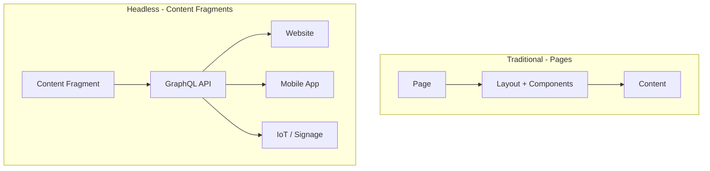
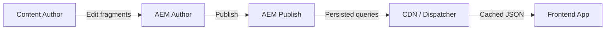

# Content Fragments & GraphQL

Content Fragments là **nội dung có cấu trúc, channel-neutral** — text, image, data — được lưu độc lập với bất kỳ page layout nào. Kết hợp với GraphQL, chúng cho phép **headless content delivery** tới bất kỳ frontend nào: website, mobile app, digital signage, hoặc bất cứ thứ gì nói HTTP.

---

## 1. Content Fragments vs Pages



| Tính năng | Pages | Content Fragments |
|---|---|---|
| **Layout** | Gắn với AEM templates | Không có layout — thuần data |
| **Delivery** | AEM render HTML | Client tự render (định dạng tùy ý) |
| **Tái sử dụng** | 1 page = 1 URL | 1 fragment = nhiều consumers |
| **Authoring** | Page editor với components | Content Fragment editor |
| **API** | Sling model export (`.model.json`) | GraphQL API |

---

## 2. Content Fragment Models

Content Fragment Model định nghĩa **cấu trúc** của fragment — giống database schema. Model được tạo trong configuration:

### Tạo model

1. Vào **Tools** → **General** → **Content Fragment Models**
2. Chọn configuration folder của bạn (ví dụ **My Site**)
3. Click **Create**
4. Đặt tên: **Article**
5. Click **Open** để thêm fields

### Các loại field

| Loại field | Mô tả | Ví dụ |
|---|---|---|
| **Single line text** | Text ngắn | Title, tên tác giả |
| **Multi line text** | Text dài có formatting | Body, description |
| **Number** | Số nguyên hoặc thập phân | Rating, price |
| **Boolean** | True/false | Featured, published |
| **Date and Time** | Date/time picker | Publish date |
| **Enumeration** | Danh sách options có sẵn | Category, status |
| **Tags** | AEM tags | Topic tags |
| **Content Reference** | Link tới asset/content | Featured image |
| **Fragment Reference** | Link tới Content Fragment khác | Author fragment |
| **JSON Object** | Arbitrary JSON | Metadata |
| **Tab Placeholder** | Tab separator để tổ chức fields | Phân nhóm fields |

### Ví dụ: Model `Article`

| Field | Loại | Cấu hình |
|---|---|---|
| Title | Single line text | Required |
| Slug | Single line text | Required, unique |
| Body | Multi line text | Rich text, required |
| Excerpt | Multi line text | Plain text, tối đa 300 chars |
| Featured Image | Content Reference | Asset reference |
| Publish Date | Date and Time | Date only |
| Featured | Boolean | Default: false |
| Author | Fragment Reference | References Author model |
| Category | Enumeration | tech, business, design |
| Tags | Tags | — |

### Ví dụ: Model `Author`

Tạo một model **Author** riêng biệt:

| Field | Loại |
|---|---|
| Name | Single line text (required) |
| Bio | Multi line text |
| Avatar | Content Reference |
| Email | Single line text |

---

## 3. Tạo Content Fragments

### Qua Assets Console

1. Vào **Assets** → **Files**
2. Navigate tới content folder (ví dụ `/content/dam/mysite/articles`)
3. Click **Create** → **Content Fragment**
4. Chọn model **Article**
5. Nhập tên và điền fields
6. Click **Create**

### Fragment Editor

Content Fragment editor hiển thị các field của model dưới dạng form:

- **Single-line fields** → text input
- **Multi-line fields** → rich text editor hoặc plain text area
- **Fragment references** → picker để chọn fragment khác
- **Tab placeholders** → tổ chức fields thành tabs

### Variations

Content Fragments hỗ trợ **variations** — các phiên bản thay thế của cùng một nội dung:

- **Master** — phiên bản mặc định
- **Named variations** — ví dụ: "Summary", "Mobile", "Newsletter"

Mỗi variation có thể override một số fields cụ thể trong khi kế thừa phần còn lại từ Master.

---

## 4. GraphQL API

AEM **tự động sinh GraphQL API** từ Content Fragment Models. Không cần code — cài model xong là API sẵn sàng.

### GraphQL Endpoint

Endpoint theo từng configuration (không phải global duy nhất). Pattern thường gặp trên local SDK:

```text
http://localhost:4502/content/_cq_graphql/<configuration>/endpoint.json
```

Thay `&lt;configuration&gt;` bằng tên configuration của site (ví dụ `mysite`). Dùng **GraphiQL IDE** để khám phá schema và test query trong quá trình phát triển.

### Field name mapping

GraphQL field names được derive từ tên field trong CF Model. AEM convert sang **camelCase** — ví dụ field label "Publish Date" trở thành `publishDate` trong GraphQL. Field names **case-sensitive** — dùng GraphiQL schema explorer để verify nếu query trả về `null` bất ngờ.

### Basic queries

**List tất cả articles:**

```graphql
{
  articleList {
    items {
      _path
      title
      slug
      excerpt
      publishDate
      featured
      category
    }
  }
}
```

**Lấy article theo path:**

```graphql
{
  articleByPath(_path: "/content/dam/mysite/articles/getting-started") {
    item {
      title
      slug
      body {
        html
        plaintext
      }
      publishDate
      author {
        name
        bio
      }
    }
  }
}
```

### Filtering

```graphql
{
  articleList(
    filter: {
      category: { _expressions: [{ value: "tech", _operator: EQUALS }] }
      featured: { _expressions: [{ value: true, _operator: EQUALS }] }
    }
  ) {
    items {
      title
      excerpt
      publishDate
    }
  }
}
```

### Sorting và Pagination

```graphql
{
  articleList(
    sort: "publishDate DESC"
    limit: 10
    offset: 0
  ) {
    items {
      title
      publishDate
    }
  }
}
```

### Rich text fields

Multi-line text field với rich text có thể trả về nhiều định dạng:

```graphql
{
  articleByPath(_path: "/content/dam/mysite/articles/example") {
    item {
      body {
        html        # Rendered HTML
        plaintext   # Plain text (stripped)
        json        # Structured JSON
      }
    }
  }
}
```

### Fragment references

Khi Article references Author:

```graphql
{
  articleList {
    items {
      title
      author {
        name
        bio
        avatar {
          ... on ImageRef {
            _path
            width
            height
          }
        }
      }
    }
  }
}
```

---

## 5. Persisted Queries

Persisted queries là **pre-defined, cached, server-side queries**. Được khuyến nghị cho môi trường production.

### Tạo persisted query

Persisted queries nên được tạo và quản lý qua AEM GraphQL tooling, sau đó promote như code/config, rồi execute qua persisted query endpoint.

### Execute persisted query

```bash
# Trên Author (local SDK) — cần authentication
curl -u admin:admin http://localhost:4502/graphql/execute.json/mysite/article-list

# Trên Publish — không cần authentication cho public queries
curl http://localhost:4503/graphql/execute.json/mysite/article-list
```

### Ad-hoc vs Persisted queries

| Tính năng | Ad-hoc queries | Persisted queries |
|---|---|---|
| **Caching** | Không cache được (Dispatcher) | Cached (GET request) |
| **Security** | Client tự định nghĩa query | Server kiểm soát query |
| **Performance** | Parse mỗi request | Parse 1 lần, execute nhiều lần |
| **CDN** | Không cache được POST | CDN-cacheable GET |

::: tip Best practice
Luôn dùng **persisted queries** trong production. Ad-hoc queries chỉ dùng trong development và GraphiQL IDE.
:::

---

## 6. Headless Content Delivery

Luồng headless điển hình với AEM:



Frontend consume GraphQL API:

```javascript
const response = await fetch(
  "https://publish.mysite.com/graphql/execute.json/mysite/article-list"
);
const data = await response.json();
const articles = data.data.articleList.items;
```

---

## 7. Content Fragments trên Pages (Hybrid)

Content Fragments cũng có thể render trên AEM Pages bằng **Content Fragment Core Component**:

1. Thêm component **Content Fragment** vào page
2. Chọn fragment cần hiển thị
3. Chọn fields cần render
4. Tùy chọn: chọn variation

Cách này bridge giữa traditional page-based và headless approach — hữu ích khi muốn dùng CF như data source nhưng vẫn cần AEM render HTML.

---

## 8. Production Hardening Checklist

| Khu vực | Khuyến nghị |
|---|---|
| Đặt tên persisted query | Dùng tên ổn định, có versioning (ví dụ `article-list-v1`) |
| Caching | Ưu tiên GET persisted queries behind Dispatcher/CDN |
| Query complexity | Giữ response shape tối thiểu; tránh unbounded list fields |
| Authorization | Chỉ expose endpoint/query cần thiết tại Publish |
| CORS | Chỉ cho phép trusted frontend origins (config qua `com.adobe.granite.cors.impl.CORSPolicyImpl`) |
| Schema evolution | Thêm fields theo backward-compatible; deprecate trước khi xóa |
| Monitoring | Track query latency, cache hit ratio, error rates |

---

## Tóm tắt

- **Content Fragments** là nội dung có cấu trúc, channel-neutral
- **Content Fragment Models** định nghĩa schema (field types, validation)
- Tạo và edit fragments trong Assets console
- **GraphQL API** được sinh tự động từ models — không cần code
- Querying hỗ trợ: filtering, sorting, pagination, rich text formats, fragment references
- **Persisted queries** cho production performance và caching
- Headless delivery flow: Author → AEM → Publish → CDN → Frontend
- CF cũng có thể dùng trên Pages với Content Fragment Core Component (hybrid approach)

---

## Tham khảo

- [Content Fragments — Experience League](https://experienceleague.adobe.com/docs/experience-manager-65/content/assets/content-fragments/content-fragments.html)
- [AEM GraphQL API — Experience League](https://experienceleague.adobe.com/docs/experience-manager-65/content/headless/graphql-api/content-fragments.html)
- [Persisted queries — Experience League](https://experienceleague.adobe.com/docs/experience-manager-65/content/headless/graphql-api/persisted-queries.html)

