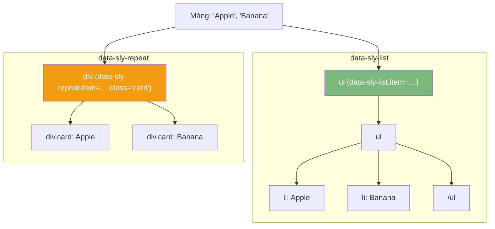

## Ngôn ngữ HTL (HTML Template Language) trong AEM

HTL (trước đây là Sightly) là ngôn ngữ template server-side của AEM. Nó thay thế hoàn toàn JSP và trở thành tiêu chuẩn để render mọi component. Triết lý cốt lõi của HTL là **mặc định bảo mật (secure by default)** — nó tự động escape (mã hóa) dữ liệu đầu ra để ngăn chặn triệt để các cuộc tấn công XSS.

---

## 1. Expressions (Biểu thức)

Expressions dùng để in giá trị ra HTML, sử dụng cú pháp `$\{\}`:

```html
<!-- In trực tiếp property từ JCR -->
<h1>${properties.jcr:title}</h1>

<!-- Lấy dữ liệu từ Sling Model -->
<p>${model.description}</p>

<!-- Chuỗi tĩnh (Literal string) -->
<span>${'Hello, World!'}</span>
```

### 1.1. Expression Options (Tùy chọn biểu thức)

Bạn có thể chỉnh sửa cách dữ liệu được render bằng cách thêm ký hiệu `@` theo sau biến:

```html
<!-- Context (Chỉ định ngữ cảnh bảo mật) -->
<a href="${link.url @ context='uri'}">${link.text}</a>

<!-- Format (Định dạng chuỗi) -->
<p>${'Price: {0}' @ format=product.price}</p>

<!-- i18n (Dịch đa ngôn ngữ) -->
<span>${'Read More' @ i18n}</span>

<!-- Join (Gộp các phần tử trong mảng) -->
<p>${model.tags @ join=', '}</p>
```

### 1.2. Display Contexts (Ngữ cảnh hiển thị)

Dù HTL tự động chọn context bảo mật, bạn vẫn có thể (và đôi khi bắt buộc) phải ghi đè nó. Dưới đây là các context thường dùng:

| Context | Vị trí sử dụng | Ví dụ HTL |
|---|---|---|
| `html` *(mặc định)* | Nội dung HTML an toàn | `&lt;p&gt;$\{text\}&lt;/p&gt;` |
| `text` | Plain text (Xóa sạch HTML) | `&lt;title&gt;$\{title @ context='text'\}&lt;/title&gt;` |
| `attribute` | Thuộc tính thẻ HTML | `&lt;div class="$\{cssClass @ context='attribute'\}"&gt;` |
| `uri` | Đường dẫn (URL) | `&lt;a href="$\{url @ context='uri'\}"&gt;` |
| `scriptString` | Gán vào biến JavaScript | `var x = "$\{val @ context='scriptString'\}"` |
| `unsafe` | Bỏ qua mọi bảo mật | `$\{richText @ context='unsafe'\}` |

> **Cảnh báo Bảo mật:** TUYỆT ĐỐI KHÔNG dùng `context='unsafe'` trừ khi bạn cực kỳ chắc chắn nội dung đó an toàn. Với văn bản từ Rich Text Editor (RTE), bản thân RTE đã lọc mã độc khi lưu, và context `html` mặc định sẽ thêm một lớp bảo mật nữa khi render. Chữ từ RTE gọi qua `$\{model.richText\}` là đã đủ an toàn!

---

## 2. Block Statements (Các thẻ lệnh)

Block statements là các thuộc tính HTML có tiền tố `data-sly-`. Chúng đóng vai trò là "linh hồn" điều khiển luồng logic của HTL.

### 2.1. `data-sly-use` (Khởi tạo Model)

Dùng để tải một Sling Model hoặc một template khác vào biến để sử dụng.

```html
<!-- Load Sling Model -->
<div data-sly-use.model="com.mysite.core.models.ArticleModel">
    <h1>${model.title}</h1>
</div>

<!-- Load một file HTL khác -->
<div data-sly-use.template="partials/header.html"></div>

<!-- Truyền tham số (Parameters) vào Model -->
<div data-sly-use.model="${'com.mysite.core.models.ListModel' @ limit=5}"></div>
```

*(Tên biến nằm sau dấu chấm — ví dụ `.model` — sẽ là định danh để bạn gọi trong HTL).*

### 2.2. `data-sly-test` (Render có điều kiện)

Tương đương lệnh `if`. Đặc biệt, nó có thể dùng để gán biến.

```html
<!-- Chỉ hiển thị thẻ <h1> nếu có title -->
<h1 data-sly-test="${model.title}">${model.title}</h1>

<!-- Mô hình If/Else kèm Gán biến (.hasItems) -->
<div data-sly-test.hasItems="${model.items.size > 0}">
    <p>Tìm thấy ${model.items.size} kết quả</p>
</div>
<div data-sly-test="${!hasItems}">
    <p>Không có kết quả nào.</p>
</div>
```

*Lưu ý: Các giá trị bị coi là `false` gồm: null, chuỗi rỗng `""`, số `0`, boolean `false`, và collection/mảng rỗng.*

### 2.3. Phân biệt `data-sly-list` và `data-sly-repeat` (Vòng lặp)

Cả hai đều dùng để duyệt mảng, nhưng chúng tác động lên cấu trúc DOM hoàn toàn khác nhau.



**Biến hỗ trợ vòng lặp (`itemList`):** Bên trong vòng lặp, HTL tự động sinh ra đối tượng `itemList` với các thuộc tính:

| Biến | Chức năng |
|---|---|
| `itemList.index` | Vị trí hiện tại (bắt đầu từ `0`) |
| `itemList.count` | Tổng số thứ tự hiện tại (bắt đầu từ `1`) |
| `itemList.first` / `last` | Trả về `true` nếu là phần tử đầu tiên / cuối cùng |
| `itemList.middle` | Trả về `true` nếu nằm ở giữa (không phải first hay last) |
| `itemList.odd` / `even` | Trả về `true` nếu index là số lẻ / số chẵn |

```html
<ul data-sly-list.item="${model.articles}">
    <li>${item.title} - Đang xem bài thứ ${itemList.count}</li>
</ul>
```

### 2.4. Phân biệt `data-sly-resource` và `data-sly-include`

Dùng để nhúng component hoặc file HTML khác vào template hiện tại.

* **`data-sly-resource`:** Nhúng một component. Quá trình này sẽ kích hoạt cơ chế Sling Resolution (gọi logic Java, nạp Dialog của component con đó).

    ```html
    <!-- Gọi component kèm resourceType -->
    <div data-sly-resource="${'header' @ resourceType='mysite/components/header'}"></div>
    
    <!-- Gọi kèm selector -->
    <div data-sly-resource="${'sidebar' @ resourceType='mysite/components/sidebar', selectors='compact'}"></div>
    
    <!-- Đổi thẻ bọc (wrapper tag) của component con -->
    <div data-sly-resource="${'text' @ resourceType='mysite/components/text', decorationTagName='article'}"></div>
    ```

* **`data-sly-include`:** Nhúng trực tiếp một đoạn mã HTML tĩnh. **KHÔNG** kích hoạt Sling Resolution.

    ```html
    <div data-sly-include="partials/footer.html"></div>
    <div data-sly-include="/apps/mysite/components/shared/utils.html"></div>
    ```

### 2.5. `data-sly-template` / `data-sly-call` (Tái sử dụng giao diện)

Định nghĩa một khối HTML dưới dạng "hàm" và gọi nó ở nhiều nơi.

```html
<!-- Định nghĩa template (có thể ở file này hoặc file khác) -->
<template data-sly-template.card="${@ title, description, link}">
    <div class="card">
        <h3>${title}</h3>
        <p>${description}</p>
        <a href="${link @ context='uri'}">Đọc thêm</a>
    </div>
</template>

<!-- Gọi template và truyền tham số thực tế -->
<div data-sly-list="${model.articles}">
    <div data-sly-call="${card @ title=item.title, description=item.excerpt, link=item.path}"></div>
</div>
```

### 2.6. `data-sly-element` (Đổi tag HTML động)

Cho phép thay đổi thẻ HTML tùy thuộc vào cấu hình của tác giả.

```html
<!-- Nếu model.headingLevel là 'h2', tag sẽ được render là <h2> -->
<h1 data-sly-element="${model.headingLevel || 'h1'}">${model.title}</h1>
```

### 2.7. `data-sly-attribute` (Gán thuộc tính HTML)

```html
<!-- Gán 1 thuộc tính -->
<div data-sly-attribute.id="${model.anchorId}">Nội dung</div>

<!-- Gán nhiều thuộc tính cùng lúc bằng Map -->
<div data-sly-attribute="${model.attributes}">Nội dung</div>

<!-- Thuộc tính có điều kiện (tự động biến mất nếu giá trị rỗng/false) -->
<input data-sly-attribute.disabled="${model.isDisabled ? 'disabled' : ''}"/>
```

### 2.8. `data-sly-text` (Ghi đè nội dung chữ)

Giữ lại text giả trên HTML để Frontend dev dễ thiết kế (hiển thị lúc design time), và tự động bị ghi đè khi render.

```html
<p data-sly-text="${model.description}">Đoạn text giả này sẽ bị thay thế hoàn toàn khi chạy.</p>
```

### 2.9. `data-sly-unwrap` (Xóa thẻ cha)

Giữ lại nội dung bên trong, nhưng tàng hình bản thân thẻ chứa nó trên giao diện. Rất hữu ích để bọc các logic HTL mà không sinh ra các thẻ rác `&lt;div/&gt;` trên DOM.

```html
<div data-sly-unwrap>
    <p>Đoạn P này sẽ không bị bọc bởi thẻ div trên trình duyệt.</p>
</div>
```

### 2.10. `data-sly-set` (Khởi tạo biến cục bộ)

Được giới thiệu từ HTL 1.4, dùng để gán một giá trị tính toán vào biến mà **không sinh ra bất kỳ thẻ HTML nào** (gọn gàng hơn việc lạm dụng `data-sly-test`).

```html
<sly data-sly-set.fullName="${model.firstName} ${model.lastName}"/>
<p>Xin chào, ${fullName}</p>
```

---

## 3. Global Objects (Các biến toàn cục)

Mọi template HTL trong AEM đều tự động được "bơm" sẵn các đối tượng sau. Bạn có thể sử dụng chúng trực tiếp mà không cần dùng `data-sly-use`:

| Đối tượng (Object) | Kiểu dữ liệu | Mô tả |
|---|---|---|
| `properties` | `ValueMap` | Chứa các properties của resource (JCR node) hiện tại. |
| `pageProperties` | `ValueMap` | Properties của trang hiện tại (nút `jcr:content`). |
| `inheritedPageProperties` | `ValueMap` | Properties của trang có tính chất kế thừa từ trang cha. |
| `currentPage` | `Page` | Đối tượng Page của trang hiện hành. |
| `currentNode` | `Node` | JCR Node hiện tại. |
| `resource` | `Resource` | Đối tượng Sling Resource hiện tại. |
| `request` | `SlingHttpServletRequest`| Request hiện tại từ browser. |
| `response` | `SlingHttpServletResponse`| Response trả về trình duyệt. |
| `log` | `Logger` | Dùng để in log ra file error.log của AEM. |
| `wcmmode` | `WCMMode` | Trạng thái hiện tại của UI (edit, preview, disabled). |
| `currentStyle` | `Style` | Cấu hình Policy hiện tại của Component. |
*(Lưu ý: Biến `currentDesign` đã bị deprecated trên AEMaaCS, hãy dùng `currentStyle` thay thế).*

**Ví dụ thực tế với Global Objects:**

```html
<!-- Lấy tiêu đề trang -->
<title>${currentPage.title || currentPage.name}</title>

<!-- Check chế độ Edit để hiển thị khung giữ chỗ (Placeholder) cho Author -->
<div data-sly-test="${wcmmode.edit || wcmmode.preview}">
    <p>Component đang trống. Hãy kéo thả dữ liệu vào đây.</p>
</div>

<!-- In log debug (Chỉ hiện trong file log backend, không hiện lên HTML) -->
${'Tiến trình render Component A bắt đầu' @ log}
```

---

## 4. The Use API (Kết nối HTL với Logic Backend)

Có 3 cách để gọi Logic từ HTL:

### Cấp độ 1: Gọi Sling Model trực tiếp (Được khuyên dùng nhất)

Đây là cách tiêu chuẩn cho 99% các component.

```html
<div data-sly-use.model="com.mysite.core.models.ArticleModel">
    ${model.title}
</div>
```

### Cấp độ 2: Gọi Sling Model kèm tham số (Parameters)

Khi bạn cần HTL truyền dữ liệu ngược lại cho Java xử lý (Ví dụ: truyền cấu hình phân trang).

**HTL Template:**

```html
<div data-sly-use.pagination="${'com.mysite.core.models.PaginationModel' @ currentPage=3, totalPages=10}">
    Trang ${pagination.currentPage} / ${pagination.totalPages}
</div>
```

**Java Sling Model:**

```java
@Model(adaptables = SlingHttpServletRequest.class)
public class PaginationModel {
    @RequestAttribute
    private int currentPage;
    
    @RequestAttribute
    private int totalPages;
    // … logic getters
}
```

### Cấp độ 3: Dùng Javascript Use Objects (Đã Deprecated)

Viết file `.js` chạy phía server. Kỹ thuật này đã **bị loại bỏ (deprecated)** trên AEM as a Cloud Service (AEMaaCS). Hãy luôn sử dụng Sling Models.

---

## 5. Ví dụ Thực Tế: Component Article Card

Để thấy sức mạnh của HTL khi kết hợp lại, hãy xem cấu trúc component Article Card (Thẻ bài viết) thực tế dưới đây:

```html
<!-- file: article-card.html -->

<!-- 1. Định nghĩa Template có thể tái sử dụng -->
<template data-sly-template.articleCard="${@ article}">
    
    <!-- 2. Test để đảm bảo object article không null -->
    <article class="cmp-article-card" data-sly-test="${article}">
        
        <!-- Hiển thị ảnh nếu có -->
        <div data-sly-test="${article.image}" class="cmp-article-card__image">
            
        </div>

        <div class="cmp-article-card__content">
            <!-- 3. Dynamic Element: Render h2, h3, hoặc h4 tùy Author chọn -->
            <h3 data-sly-element="${article.headingLevel || 'h3'}" class="cmp-article-card__title">
                <a href="${article.link @ context='uri'}">${article.title}</a>
            </h3>
            
            <p data-sly-test="${article.excerpt}" class="cmp-article-card__excerpt">
                ${article.excerpt}
            </p>
            
            <span class="cmp-article-card__date">${article.formattedDate}</span>

            <!-- 4. Vòng lặp Repeat in ra các thẻ Tags (VD: News, Tech) -->
            <ul data-sly-test="${article.tags}" class="cmp-article-card__tags">
                <li data-sly-repeat="${article.tags}" class="cmp-article-card__tag">
                    ${item}
                </li>
            </ul>
        </div>
    </article>
</template>

<!-- Gọi logic Java và Pass model vào Template vừa tạo ở trên -->
<div data-sly-use.model="com.mysite.core.models.ArticleCardModel" 
     data-sly-call="${articleCard @ article=model}">
</div>
```

---

## 6. HTL Best Practices (Thực hành tốt nhất)

1. **Luôn dùng Sling Models:** Đặt mọi logic phức tạp, vòng lặp khó, hay nối chuỗi vào Java. HTL chỉ nên làm nhiệm vụ render giao diện thuần túy.
2. **Không bao giờ dùng `context='unsafe'`:** Trừ khi bạn cực kỳ am hiểu rủi ro và biết chắc chắn nguồn dữ liệu đầu vào.
3. **Giữ template đơn giản:** Nếu một khối `data-sly-test` trở nên quá dài và phức tạp, đó là dấu hiệu bạn cần đẩy logic đó về Java.
4. **Sử dụng Template & Call:** Hãy chia nhỏ UI thành các fragment có thể tái sử dụng (`data-sly-template`/`data-sly-call`).
5. **Tuân thủ quy tắc đặt tên BEM:** Dùng tiền tố `cmp-` cho các class CSS (ví dụ `cmp-article-card__title`) để đồng bộ với chuẩn Core Components của AEM.
6. **Cung cấp Placeholder:** Luôn sử dụng `wcmmode.edit` để hiển thị dòng chữ báo hiệu cho Author khi component chưa có dữ liệu.
7. **Bảo vệ bằng `data-sly-test`:** Kiểm tra biến có `null` hay không trước khi render cấu trúc HTML để tránh vỡ giao diện.