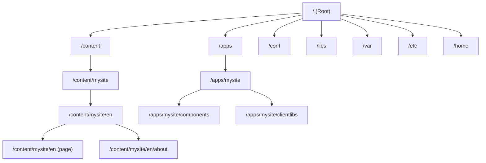
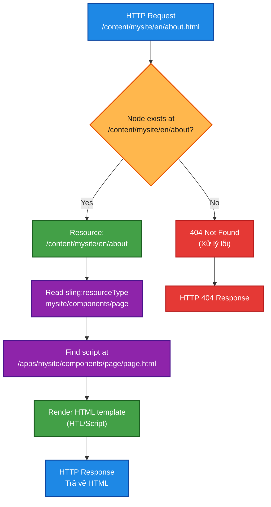

## What is the JCR

JCR là hierarchy, tree-strucutred content repository.



|Path|Contents|
|---|---|
|`/apps`|Your project's code - components, templates, clientlibs, configs|
|`/libs`|AEM's built-in code - Core Components, platform features|
|`/content`|Authored content - pages, assets|
|`/conf`|Configuration - editable templates, Cloud Configurations|
|`/var`|Runtime data - workflow instances, audit logs|
|`/etc`|Legacy config area (some items still here)|
|`/home`|Users and groups|

## Note và properties

JCR có nodes và properties
- node giống như folder. Nó có tên, type, và chứa các child nodes và properties.
- properties giống như cặp key-value được attach vào node. Value có thể là string, number, dates, boolean, hoặc binary data.

```
/content/mysite/en/about
├── jcr:primaryType = "cq:Page"
└── jcr:content
    ├── jcr:primaryType = "cq:PageContent"
    ├── jcr:title = "About Us"
    ├── sling:resourceType = "mysite/components/page"
    ├── cq:template = "/conf/mysite/settings/wcm/templates/page"
    └── root
        ├── jcr:primaryType = "nt:unstructured"
        ├── sling:resourceType = "mysite/components/container"
        └── text
            ├── jcr:primaryType = "nt:unstructured"
            ├── sling:resourceType = "mysite/components/text"
            └── text = "<p>Welcome to our company.</p>"
```

- **Pages**: là `cq:Page` nodes với `jcr:content` child
- **Page content** nằm dưới `jcr:content` - là nơi các property như `jcr:title` được lưu
- **Components** trên page là các child node nằm dưới `jcr:content` tree
- `sling:resourceType` nói cho Sling biết component nào sẽ render node này.

## Node types

| Node type             | Use                                                             |
| --------------------- | --------------------------------------------------------------- |
| `cq:Page`             | A page in the Sites console                                     |
| `cq:PageContent`      | The content node of a page (`jcr:content`)                      |
| `nt:unstructured`     | Generic node - no schema constraints. Most component data nodes |
| `nt:folder`           | A basic folder                                                  |
| `sling:Folder`        | A Sling-aware folder                                            |
| `sling:OrderedFolder` | Folder with ordered children                                    |
| `cq:Component`        | A component definition node                                     |
| `cq:Template`         | A template definition node                                      |
| `dam:Asset`           | A digital asset (image, document)                               |
Nodes cũng có thể có **mixin types** để thêm vào khả năng mở rộng. (capabilities)

|Mixin|Adds|
|---|---|
|`mix:versionable`|Version history|
|`mix:lockable`|Locking support|
|`cq:LiveRelationship`|Live Copy support (MSM)|
|`rep:AccessControllable`|ACL support|

## CRXDE basic

Edit content và khám phá các mục:
- `/content/mysite/en` - your site's English root page
- `/apps/mysite/components` - your project's component definitions
- `/libs/core/wcm/components` - AEM Core Components source
- `/conf/mysite/settings/wcm/templates` - your editable templates

## Apache Sling - the web framework

Sling là webframework nằm giữa HTTP và JCR. Nhiệm vụ chính: **phân giải URL sang JCR structure, sau đó render nó**.

### Sling request processing pipeline


**Khi một request như GET `/content/mysite/en/about.html` đến:**

1. **Giải phân giải tài nguyên (Resource resolution)** - Sling phân tách URL và tìm node JCR tại `/content/mysite/en/about`
2. **Lựa chọn script (Script selection)** - Sling đọc thuộc tính `sling:resourceType` (ví dụ: `mysite/components/page`) và tìm script render tương ứng
3. **Render (Rendering)** - template HTL (hoặc servlet) render nội dung
4. **Phản hồi (Response)** - HTML đã được render được trả về

### URL decomposition

Sling chia urls thành các phần:
![[image-2.png]]

| Thành phần | Ví dụ | Mục đích |
|:--- |:--- |:--- |
| **Đường dẫn tài nguyên (Resource path)** | `/content/mysite/en/about` | Ánh xạ tới một node JCR |
| **Bộ chọn (Selectors)** | `article` | Render thay thế (ví dụ: `about.article.html`) |
| **Phần mở rộng (Extension)** | `html` | Định dạng đầu ra |
| **Hậu tố (Suffix)** | `/suffix` | Thông tin đường dẫn bổ sung |
| **Chuỗi truy vấn (Query string)** | `key=value` | Tham số |

**Bộ chọn (Selectors) rất mạnh mẽ** - chúng cho phép bạn render cùng một nội dung theo nhiều cách khác nhau mà không cần tạo ra các endpoint mới:

- `/about.html` - render mặc định
- `/about.article.html` - render dạng bài viết
- `/about.json` - xuất JSON
- `/about.xml` - xuất XML

### Resource Resolution chi tiết

> Resource resolution là cách Sling tìm đúng JCR node cho URL



Thuộc tính `sling:resourceType` trên node trỏ đến định nghĩa của một component. Sling sẽ tìm kiếm script render theo thứ tự sau:

- `/apps/&lt;resourceType&gt;/&lt;scriptName&gt;.html` – bản override của project
- `/libs/&lt;resourceType&gt;/&lt;scriptName&gt;.html` – bản mặc định của AEM
    

Đây là cơ chế **overlay** – bạn có thể override bất kỳ component nào của AEM bằng cách đặt phiên bản của mình trong `/apps`.

Một component cũng có thể khai báo thuộc tính `sling:resourceSuperType`, trỏ đến component cha. Khi Sling không tìm thấy script trong component hiện tại, nó sẽ đi ngược lên chuỗi super-type và sử dụng script của component cha.

Đây là cách **proxy components** hoạt động – component trong project của bạn kế thừa toàn bộ phần render từ Core Component và chỉ override những gì cần thiết:

```
/apps/mysite/components/text
    sling:resourceSuperType = "core/wcm/components/text/v2/text"
    → Sling sẽ sử dụng script từ Core Component trừ khi bạn cung cấp script riêng
```

- [Sling Resource Merger](https://experienceleague.adobe.com/en/docs/experience-manager-cloud-service/content/implementing/developing/sling-resource-merger)

### Script selection rules

For a resource with `sling:resourceType = "mysite/components/text"`, Sling looks for scripts in `/apps/mysite/components/text/`:

|Request|Script looked up|
|---|---|
|`GET.html`|`text.html` or `html.html`|
|`GET.json`|`text.json` (or Sling Default GET Servlet for JSON)|
|`GET.article.html`|`text.article.html` then `text.html`|
|`POST.html`|`text.POST.html`|

Script naming conventions: `&lt;component&gt;.&lt;selector&gt;.&lt;extension&gt;.html` or the shorthand `&lt;extension&gt;.html`.

Với một resource có `sling:resourceType = "mysite/components/text"`, cơ chế **Script Resolution / Script Selection** của Sling thực tế phức tạp hơn và dựa trên nhiều yếu tố của request, không chỉ đơn giản là extension.

---

#### 1. Các yếu tố Sling dùng để chọn script

Sling sẽ xác định script dựa trên:

- **Resource Type** (`mysite/components/text`)
- **HTTP Method** (GET, POST, PUT, DELETE…)
- **Selectors** (ví dụ: `.article`, `.print`)
- **Extension** (`.html`, `.json`, `.xml`…)
- **Suffix (không ảnh hưởng trực tiếp đến chọn script)**
- **Resource Super Type chain**
- **Search Path** (`/apps` → `/libs`)

---

#### 2. Thứ tự tìm kiếm script (ưu tiên cao → thấp)

Sling sẽ tìm script theo thứ tự **cụ thể → tổng quát hơn**:

##### Ví dụ request:

```
GET /content/page.article.print.html
```

##### Thứ tự lookup:

```
/apps/mysite/components/text/text.article.print.html
/apps/mysite/components/text/article.print.html

/apps/mysite/components/text/text.article.html
/apps/mysite/components/text/article.html

/apps/mysite/components/text/text.print.html
/apps/mysite/components/text/print.html

/apps/mysite/components/text/text.html
/apps/mysite/components/text/html.html
```

Nếu không tìm thấy → chuyển sang:

```
/libs/mysite/components/text/…
```

Nếu vẫn không có → tiếp tục theo `sling:resourceSuperType`

---

#### 3. Quy tắc naming đầy đủ

##### Format đầy đủ:

```
<resourceType>.<selector>.<extension>.<method>
```

##### Format thường dùng:

```
<component>.<selector>.<extension>.html
<selector>.<extension>.html
<extension>.html
```

---

#### 4. Mapping cụ thể theo request

##### 4.1 GET.html

```
GET /page.html
```

Lookup:

```
text.html
html.html
```

---

##### 4.2 GET với selectors

```
GET /page.article.html
```

Lookup:

```
text.article.html
article.html
text.html
```

---

##### 4.3 Multiple selectors

```
GET /page.a.b.html
```

Lookup:

```
text.a.b.html
a.b.html
text.a.html
a.html
text.b.html
b.html
text.html
```

---

##### 4.4 GET.json

```
GET /page.json
```

Lookup:

```
text.json
json.json
```

Nếu không có → fallback:

- **Sling Default GET Servlet** (render JSON từ JCR)

---

##### 4.5 POST

```
POST /page.html
```

Lookup:

```
text.POST.html
POST.html
```

Nếu không có → fallback:

- Sling POST Servlet

---

#### 5. Super Type chain

Nếu không tìm thấy trong component hiện tại:

```
mysite/components/text
   ↓
core/wcm/components/text/v2/text
```

Sling sẽ tiếp tục lookup cùng quy tắc ở component cha.

---

#### 6. Search Path (overlay)

Thứ tự:

```
/apps → /libs
```

→ `/apps` override `/libs`

---

#### 7. Tổng kết nguyên tắc quan trọng

- Sling luôn ưu tiên:
    
    1. Cụ thể hơn (nhiều selector hơn)
    2. Đúng HTTP method
    3. Đúng extension
    4. Component hiện tại trước
    5. Sau đó mới đến super type
    6. Cuối cùng là `/libs`
        
- Script có thể viết theo:
    - component-specific (`text.html`)
    - generic (`html.html`)
- Selector resolution là **progressive fallback**

---

#### 8. Ví dụ thực tế dễ hiểu

Request:

```
GET /content/page.article.html
```

Sling sẽ thử:

1. `/apps/mysite/components/text/text.article.html`
2. `/apps/mysite/components/text/article.html`
3. `/apps/mysite/components/text/text.html`
4. `/libs/…`
5. `resourceSuperType`
6. Default servlet

## Resources và Resource API

Trong Slign, mọi thứ đều là **Resource**. `Resource` là Java abstraction của JCR node.

```java
// Lấy resource Resolver
ResourceResolver resolver = request.getResourceResolver();

// Resolve a resource by path
Resource page = resolver.getResource("/content/mysite/en/about");

// Read properties
ValueMap properties = page.getChild("jcr:content").getValueMap();
String title = properties.get("jcr:title", "Untitled");

// Iterate children
for (Resource child : page.getChildren()) {
    String name = child.getName();
    String type = child.getResourceType();
}
```

Các interface quan trọng:

| Interface            | Purpose                                                 |
| -------------------- | ------------------------------------------------------- |
| `Resource`           | Represents a JCR node (or virtual resource)             |
| `ResourceResolver`   | Resolves paths to resources, creates/modifies resources |
| `ValueMap`           | Read properties from a resource (like a type-safe Map)  |
| `ModifiableValueMap` | Write properties to a resource                          |

## Adaptable pattern

Sling sử dụng extensively mẫu thiết kế Adaptable - bạn chuyển đổi (adapt) một object sang object khác:

```java
// Adapt một Resource sang Page
Page page = resource.adaptTo(Page.class);

// Adapt một Resource sang Sling Model
MyModel model = resource.adaptTo(MyModel.class);

// Adapt một Resource sang ValueMap
ValueMap props = resource.adaptTo(ValueMap.class);

// Adapt một Resource sang Node (JCR API)
Node node = resource.adaptTo(Node.class);
```

Mẫu thiết kế này là trọng tâm trong phát triển AEM. Sling Models (chương 7) là cách chính để bạn adapt resources thành các Java object tùy chỉnh.

## Content paths và conventions

AEM có các convention mạnh mẽ về nơi lưu trữ content:

**Code paths (immutable trong AEMaaCS)**

| Path | Contents |
|------|----------|
| `/apps/mysite/components/` | Định nghĩa component của bạn |
| `/apps/mysite/clientlibs/` | Client libraries CSS/JS của bạn |
| `/apps/mysite/i18n/` | Từ điển i18n của bạn |

**Content paths (mutable)**

| Path | Contents |
|------|----------|
| `/content/mysite/` | Các page của site |
| `/content/dam/mysite/` | Digital assets (images, PDFs) |
| `/content/experience-fragments/mysite/` | Experience Fragments |
| `/conf/mysite/` | Cấu hình site (templates, Cloud Configs) |

**System paths**

| Path | Contents |
|------|----------|
| `/libs/` | Code built-in của AEM - không bao giờ sửa đổi |
| `/var/` | Dữ liệu runtime (workflow, audit) |
| `/home/users/` | Tài khoản user |
| `/home/groups/` | Groups |

**Rule**: Không bao giờ sửa đổi `/libs`. Luôn overlay hoặc extend trong `/apps`. Trong AEMaaCS, `/libs` là read-only.

## Querying the JCR

Ngoài việc duyệt tree, bạn có thể query nó. AEM hỗ trợ hai ngôn ngữ query:

### QueryBuilder

API query của AEM - sử dụng trong Java code và HTTP:

```
http://localhost:4502/bin/querybuilder.json?
  path=/content/mysite
  &type=cq:Page
  &property=jcr:content/jcr:title
  &property.operation=like
  &property.value=%25about%25
  &p.limit=10
```

Trong Java (ví dụ: bên trong một Sling Model), bạn sử dụng QueryBuilder service:

```java
@Model(adaptables = Resource.class, defaultInjectionStrategy = DefaultInjectionStrategy.OPTIONAL)
public class PageSearchModel {

    @OSGiService
    private QueryBuilder queryBuilder;

    @Self
    private Resource resource;

    public List<String> findPageTitles() {
        Map<String, String> params = new HashMap<>();
        params.put("path", "/content/mysite");
        params.put("type", "cq:Page");
        params.put("property", "jcr:content/jcr:title");
        params.put("property.operation", "like");
        params.put("property.value", "%about%");
        params.put("p.limit", "10");

        ResourceResolver resolver = resource.getResourceResolver();
        Session session = resolver.adaptTo(Session.class);
        Query query = queryBuilder.createQuery(PredicateGroup.create(params), session);
        SearchResult result = query.getResult();

        List<String> titles = new ArrayList<>();
        for (Hit hit : result.getHits()) {
            try {
                titles.add(hit.getTitle());
            } catch (RepositoryException e) {
                // handle exception
            }
        }
        return titles;
    }
}
```

### JCR-SQL2

Cú pháp giống SQL cho các query JCR:

```sql
SELECT *
FROM [cq:Page] AS page
INNER JOIN [nt:unstructured] AS content ON ISCHILDNODE(content, page)
WHERE ISDESCENDANTNODE(page, '/content/mysite')
  AND content.[jcr:title] LIKE '%about%'
```

**Lưu ý sửa lỗi**: Cú pháp `page.[jcr:content/jcr:title]` không hợp lệ trong JCR-SQL2. Để query property trên child node, bạn phải sử dụng `INNER JOIN` với `ISCHILDNODE()` như ví dụ trên.

Bạn có thể chạy query trong công cụ query của CRXDE Lite (panel dưới) hoặc QueryBuilder Debugger tại `http://localhost:4502/libs/cq/search/content/querydebug.html`.

**Cảnh báo performance**: Các query không có index phù hợp sẽ chậm và có thể block repository. Luôn test performance của query và tạo Oak indexes cho các query production. Xem tham khảo JCR để biết chi tiết.

For deeper JCR topics, see the Modify and Query the JCR and JCR Node Operations references.