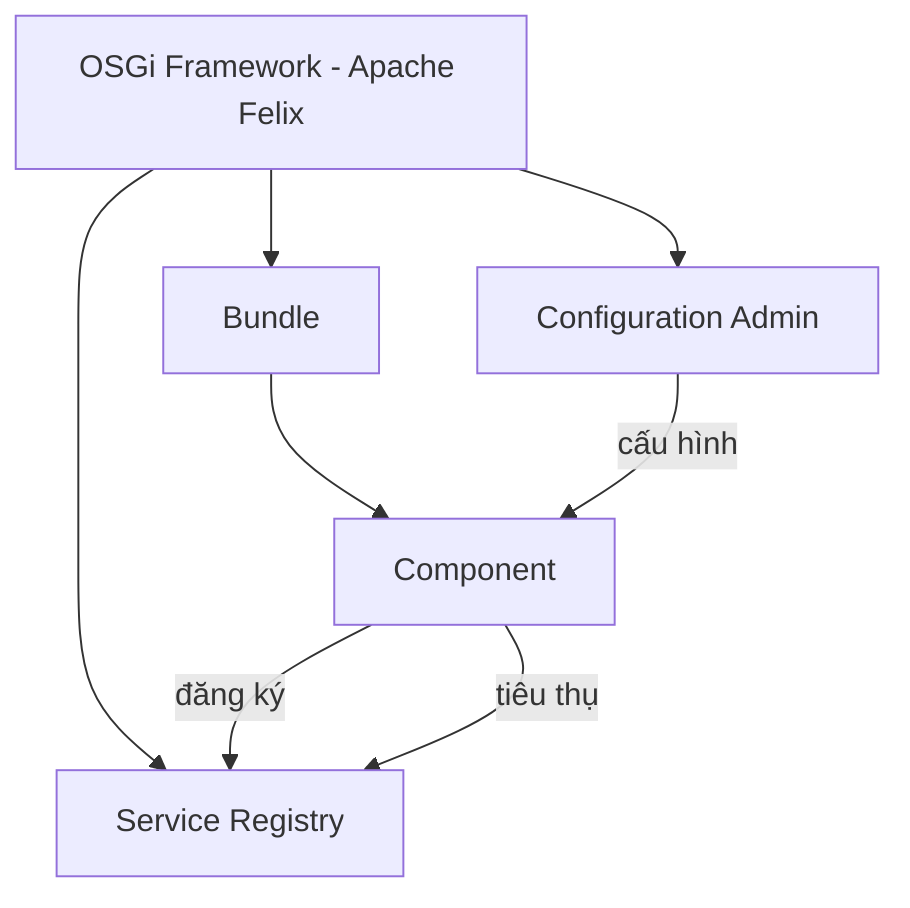
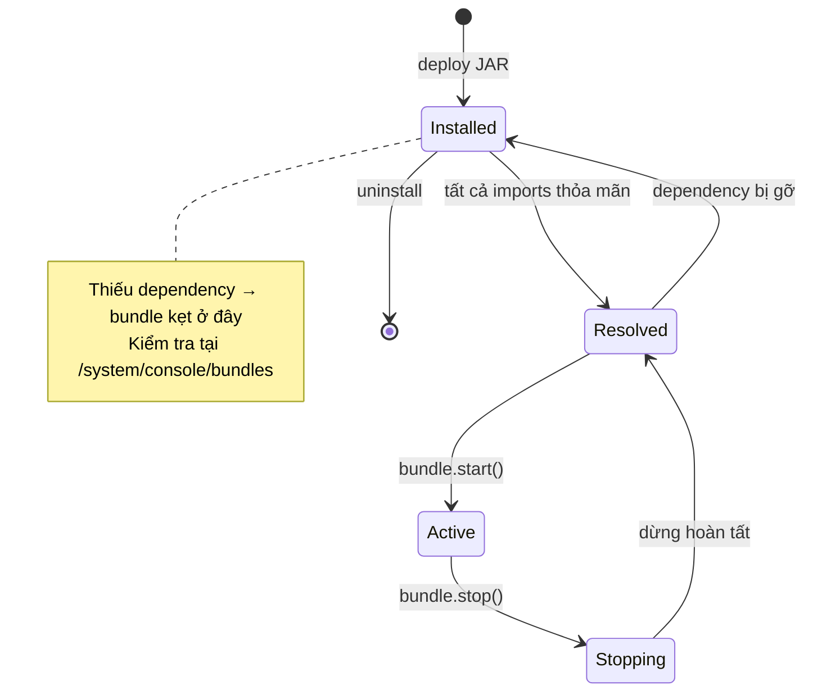
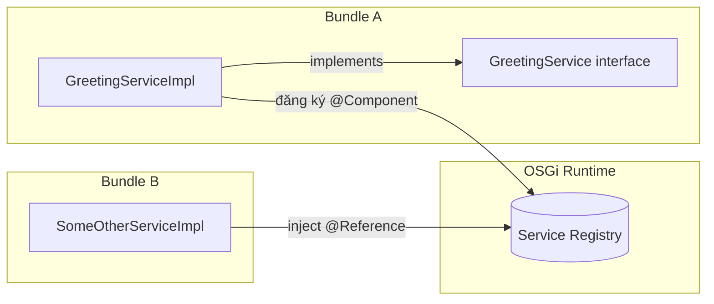
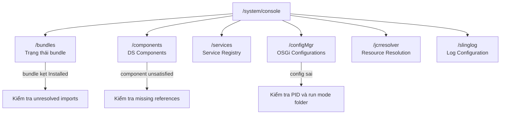
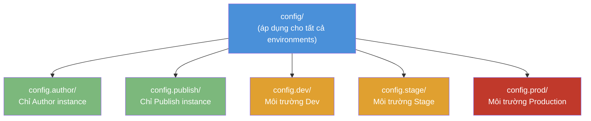
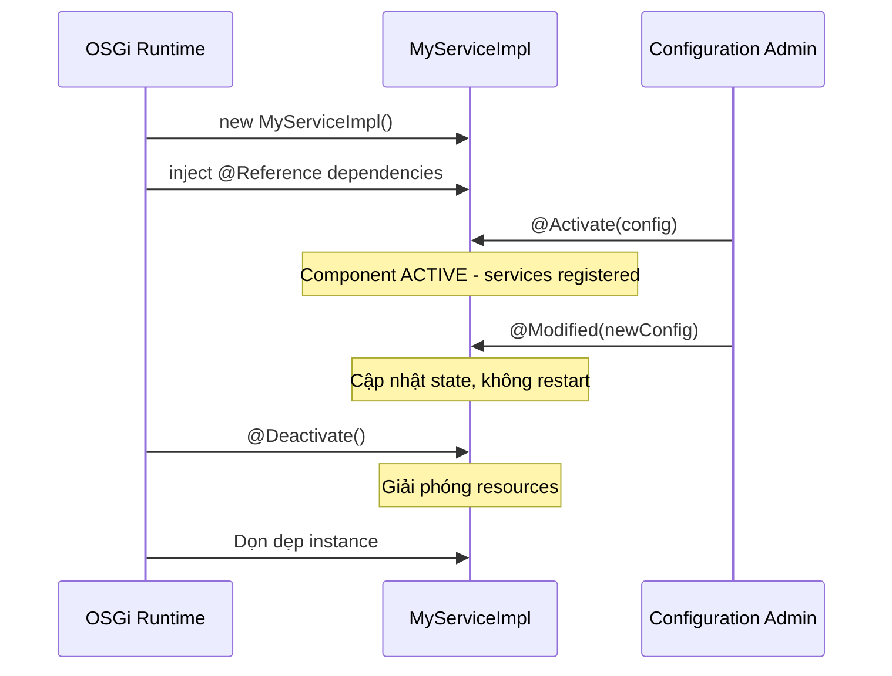
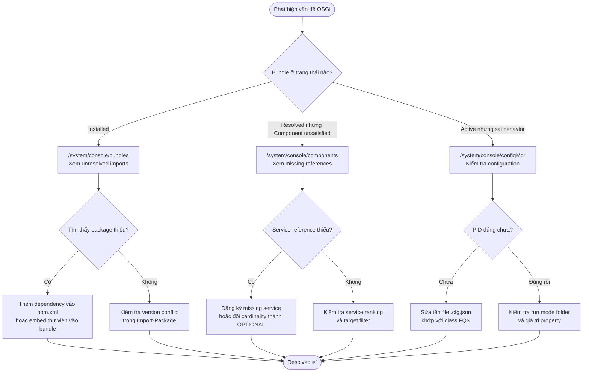

## OSGi Fundamentals (Nền tảng OSGi trong AEM)

OSGi là hệ thống module quản lý toàn bộ code Java trong AEM. Mọi đoạn Java — code của bạn, code của AEM, thư viện bên thứ ba — đều chạy bên trong một **OSGi bundle**. Hiểu OSGi là nền tảng thiết yếu để viết services, quản lý configurations, và debug.

---

### 1. OSGi là gì?

OSGi (Open Services Gateway initiative) là một đặc tả cho ứng dụng Java theo kiến trúc module hóa. Trong AEM, nó được hiện thực bởi **Apache Felix**.

Các khái niệm cốt lõi:

|Khái niệm|Mô tả|
|---|---|
|**Bundle**|Một file JAR với metadata đặc biệt. Đây là đơn vị triển khai (deployment unit)|
|**Service**|Một Java interface được đăng ký trong service registry. Các bundle khác có thể tra cứu và sử dụng|
|**Component**|Một Java class được quản lý, có thể cung cấp services và tiêu thụ services khác|
|**Configuration**|Tập hợp key-value dùng để thay đổi hành vi của component mà không cần redeploy|



---

### 2. Bundles

Một bundle là file JAR với OSGi metadata khai báo trong `MANIFEST.MF`:

```
Bundle-SymbolicName: com.mysite.core
Bundle-Version: 1.0.0
Import-Package: org.apache.sling.api, javax.inject
Export-Package: com.mysite.core.models
```

Trong Maven project, module `core/` sẽ sinh ra một OSGi bundle. Plugin `maven-bundle-plugin` (hoặc `bnd-maven-plugin`) tự động tạo manifest.

#### Vòng đời Bundle (Bundle Lifecycle)

Mỗi bundle trải qua các trạng thái sau:

|Trạng thái|Ý nghĩa|
|---|---|
|**Installed**|Bundle đã được nạp vào container nhưng các dependency chưa được giải quyết|
|**Resolved**|Tất cả imports đã được thỏa mãn; sẵn sàng để khởi động|
|**Active**|Đang chạy — services đã được đăng ký|
|**Stopping**|Đang tắt|



> **Lưu ý:** Nếu bundle bị kẹt ở trạng thái **Installed** thay vì **Active**, tức là có dependency chưa được giải quyết. Web Console sẽ hiển thị các package nào đang bị thiếu.

---

### 3. Services

Services là cách chính để các Java component giao tiếp trong OSGi. Một service bao gồm:

1. Một **Java interface** định nghĩa hợp đồng (contract)
2. Một **implementation class** được đăng ký vào service registry
3. **Consumers** tra cứu và sử dụng service



#### Declarative Services (DS)

AEM hiện đại sử dụng **OSGi Declarative Services** với annotations:

**Định nghĩa interface:**

```java
package com.mysite.core.services;

public interface GreetingService {
    String greet(String name);
}
```

**Implementation:**

```java
package com.mysite.core.services.impl;

import com.mysite.core.services.GreetingService;
import org.osgi.service.component.annotations.Component;

@Component(service = GreetingService.class)
public class GreetingServiceImpl implements GreetingService {

    @Override
    public String greet(String name) {
        return "Hello, " + name + "!";
    }
}
```

Annotation `@Component` thông báo cho OSGi:

- Class này là một **managed component**
- Nó cung cấp **service interface** `GreetingService`
- OSGi sẽ tạo instance, quản lý vòng đời, và đăng ký vào service registry

#### Tiêu thụ Services

Các service khác tham chiếu service bằng `@Reference`:

```java
import com.mysite.core.services.GreetingService;
import org.osgi.service.component.annotations.Component;
import org.osgi.service.component.annotations.Reference;

@Component(service = SomeOtherService.class)
public class SomeOtherServiceImpl implements SomeOtherService {

    @Reference
    private GreetingService greetingService;

    public void doSomething() {
        String message = greetingService.greet("AEM");
        // "Hello, AEM!"
    }
}
```

Trong Sling Model, dùng `@OSGiService`:

```java
@Model(
    adaptables = {SlingHttpServletRequest.class, Resource.class},
    adapters = {GreetingModel.class, ComponentExporter.class},
    resourceType = GreetingModel.RESOURCE_TYPE,
    defaultInjectionStrategy = DefaultInjectionStrategy.OPTIONAL)
public class GreetingModel {

    @OSGiService
    private GreetingService greetingService;

    @PostConstruct
    public void init() {
        final String message = greetingService.greet("AEM");
    }
}
```

OSGi tự động **inject** service. Nếu service không available, component sẽ không được activate — đây gọi là **dependency satisfaction**.

#### Service Ranking

Khi có nhiều implementation của cùng một interface, OSGi dùng **service ranking** để quyết định cái nào được inject:

```java
@Component(
    service = GreetingService.class,
    property = {
        "service.ranking:Integer=100"
    }
)
public class CustomGreetingServiceImpl implements GreetingService {
    // Implementation này được ưu tiên hơn các implementation có ranking thấp hơn
}
```

Ranking cao hơn sẽ thắng khi chỉ chọn một service (cardinality mặc định của `@Reference` là **mandatory/unary** — đúng một service). Đây là cách bạn override các service mặc định của AEM.

Bạn cũng có thể kiểm soát cardinality và target filtering trên `@Reference`:

```java
// Optional: component vẫn activate dù không có implementation nào
@Reference(cardinality = ReferenceCardinality.OPTIONAL)
private GreetingService greetingService;

// Multiple: inject tất cả implementations (List)
@Reference(cardinality = ReferenceCardinality.MULTIPLE)
private List<GreetingService> greetingServices;

// Target filter: chọn một implementation cụ thể theo property
@Reference(target = "(service.pid=com.mysite.core.services.impl.CustomGreetingServiceImpl)")
private GreetingService greetingService;
```

---

### 4. OSGi Web Console

Web Console là công cụ debug đa năng. Truy cập tại:

```
http://localhost:4502/system/console
```

Credentials: **admin / admin**

#### Các trang Console quan trọng

|Console|URL|Hiển thị|
|---|---|---|
|**Bundles**|`/system/console/bundles`|Tất cả bundles đã cài và trạng thái|
|**Components**|`/system/console/components`|Tất cả DS components (active, satisfied, unsatisfied)|
|**Services**|`/system/console/services`|Tất cả services đã đăng ký|
|**Configuration**|`/system/console/configMgr`|Tất cả OSGi configurations|
|**Resource Resolver**|`/system/console/jcrresolver`|Test resource resolution|
|**Log Support**|`/system/console/slinglog`|Cấu hình logging|



#### Debug bundle không start được

1. Vào **Bundles** (`/system/console/bundles`)
2. Tìm bundle của bạn (tìm theo `Bundle-SymbolicName`)
3. Nếu bundle ở trạng thái **Installed** (không phải Active), click vào để xem **unresolved imports**
4. Các package thiếu cho biết dependency nào chưa available

**Nguyên nhân thường gặp:**

- Một thư viện bên thứ ba chưa được embed vào bundle của bạn
- Xung đột phiên bản package giữa code của bạn và AEM
- Thiếu AEM API dependency

#### Test Resource Resolution

Trang **Sling Resource Resolver** cho phép test cách URL được resolve:

1. Vào `/system/console/jcrresolver`
2. Nhập URL (ví dụ: `/content/mysite/en/about.html`)
3. Click **Resolve** để xem resource và rendering script nào được Sling chọn

---

### 5. OSGi Configurations

Configurations cho phép thay đổi hành vi service mà không cần sửa code. Chúng được lưu trong JCR và có thể thay đổi theo **run mode** (author, publish, dev, stage, prod).

#### Khai báo Configuration bằng Annotations

Dùng `@ObjectClassDefinition` và `@AttributeDefinition`:

```java
package com.mysite.core.services.impl;

import org.osgi.service.metatype.annotations.AttributeDefinition;
import org.osgi.service.metatype.annotations.ObjectClassDefinition;

@ObjectClassDefinition(name = "Greeting Service Configuration")
public @interface GreetingServiceConfig {

    @AttributeDefinition(
        name = "Default Greeting",
        description = "The greeting prefix to use"
    )
    String greeting_prefix() default "Hello";

    @AttributeDefinition(
        name = "Enabled",
        description = "Whether the service is active"
    )
    boolean enabled() default true;
}
```

#### Sử dụng Configuration trong Service

```java
import org.osgi.service.component.annotations.Activate;
import org.osgi.service.component.annotations.Component;
import org.osgi.service.metatype.annotations.Designate;

@Component(service = GreetingService.class)
@Designate(ocd = GreetingServiceConfig.class)
public class GreetingServiceImpl implements GreetingService {

    private String prefix;
    private boolean enabled;

    @Activate
    protected void activate(GreetingServiceConfig config) {
        this.prefix = config.greeting_prefix();
        this.enabled = config.enabled();
    }

    @Override
    public String greet(String name) {
        if (!enabled) {
            return "";
        }
        return prefix + ", " + name + "!";
    }
}
```

Method `@Activate` được gọi khi component khởi động và nhận configuration hiện tại.

#### File Configuration trong Repository

Configurations được lưu dưới dạng file `.cfg.json` trong module `ui.config`:

```
ui.config/src/main/content/jcr_root/apps/mysite/osgiconfig/
├── config/                          # Tất cả environments
│   └── com.mysite.core.services.impl.GreetingServiceImpl.cfg.json
├── config.author/                   # Chỉ Author
├── config.publish/                  # Chỉ Publish
├── config.dev/                      # Dev environment
├── config.stage/                    # Stage environment
└── config.prod/                     # Production
```

Nội dung file configuration:

```json
{
  "greeting.prefix": "Welcome",
  "enabled": true
}
```

> **Quy ước đặt tên:** Method `greeting_prefix()` trong annotation ánh xạ thành config key `greeting.prefix`. OSGi chuyển dấu gạch dưới (`_`) trong tên method thành dấu chấm (`.`) trong tên property của configuration.

|Tên method|Config property key|
|---|---|
|`greeting_prefix()`|`greeting.prefix`|
|`my__property()`|`my_property`|
|`trailing_()`|`trailing`|

#### Run Modes

Run modes quyết định những configurations nào đang active:

|Run mode|Khi nào active|
|---|---|
|`author`|Trên Author instance|
|`publish`|Trên Publish instance|
|`dev`|Môi trường Development|
|`stage`|Môi trường Stage|
|`prod`|Môi trường Production|



Configurations là **cộng dồn (cumulative)** — `config/` áp dụng ở mọi nơi, và các folder cụ thể hơn sẽ thêm/ghi đè giá trị khi run mode tương ứng active.

> **Mẹo:** Giữ giá trị mặc định trong `config/`, sau đó chỉ thêm override cho từng environment cụ thể ở các folder tương ứng.

#### Chỉnh sửa Configuration qua Web Console

Trong quá trình phát triển, bạn có thể edit configuration trực tiếp:

1. Vào `/system/console/configMgr`
2. Tìm kiếm tên service của bạn
3. Chỉnh sửa giá trị và click **Save**

> **Quan trọng:** Các thay đổi qua Web Console chỉ là tạm thời — chúng sẽ mất khi instance khởi động lại. Để có configuration bền vững, hãy sử dụng file `.cfg.json` trong module `ui.config`.

---

### 6. Component Lifecycle Annotations

Ngoài `@Activate`, OSGi còn hỗ trợ các lifecycle annotation khác:

```java
@Component(service = MyService.class)
public class MyServiceImpl implements MyService {

    @Activate
    protected void activate(MyConfig config) {
        // Gọi khi component khởi động
        // Khởi tạo resources, đọc config
    }

    @Modified
    protected void modified(MyConfig config) {
        // Gọi khi configuration thay đổi lúc runtime
        // Cập nhật internal state mà không cần restart
    }

    @Deactivate
    protected void deactivate() {
        // Gọi khi component dừng
        // Giải phóng resources
    }
}
```

|Annotation|Khi nào được gọi|
|---|---|
|`@Activate`|Component khởi động (tất cả dependencies đã satisfied)|
|`@Modified`|Configuration thay đổi trong khi component đang active|
|`@Deactivate`|Component dừng (bundle dừng, hoặc dependency bị mất)|



---

### 7. Sling Models và OSGi

Sling Models **không** phải là Declarative Services component thông thường (`@Component`). Thay vào đó, metadata của Sling Model được Sling Models framework tự khám phá — framework này tự nó chạy thông qua OSGi services:

```java
@Model(adaptables = Resource.class, adapters = MyModel.class)
public class MyModelImpl implements MyModel {
    // ...
}
```

```mermaid
graph LR
    subgraph "Bundle core"
        SM["MyModelImpl<br/>@Model"]
        DS["GreetingServiceImpl<br/>@Component"]
    end
    subgraph "OSGi Runtime"
        SR["(Service Registry)"]
        SMF["Sling Models Framework"]
    end
    DS -->|đăng ký| SR
    SMF -->|khám phá model| SM
    SM -->|@OSGiService inject từ| SR
    SMF -->|là OSGi service trong| SR
```

Bundle `core/` vẫn cần metadata và dependencies đúng, vì model discovery và adaptation đều chạy bên trong OSGi runtime.

---

### 8. Bảng Troubleshooting

|Triệu chứng|Kiểm tra đầu tiên|Cách sửa thường gặp|
|---|---|---|
|Bundle kẹt ở `Installed`|`/system/console/bundles` — xem imports/exports|Thêm/sửa dependency hoặc package version|
|Component unsatisfied|`/system/console/components` — xem references|Đăng ký missing service hoặc nới lỏng reference cardinality|
|Config không được áp dụng|`/system/console/configMgr` — kiểm tra PID và values|Sửa tên PID/file, xác nhận run mode folder|
|Service implementation không như kỳ vọng|`/system/console/services` — xem ranking|Điều chỉnh `service.ranking` và target filters|
|Chạy được local SDK nhưng fail trên cloud|Cloud logs + committed config files|Chuyển các edit tạm thời trên console thành file `.cfg.json` trong `ui.config`|



---

### 9. Các Pattern OSGi phổ biến trong AEM

#### Pattern 1: Service Interface + Implementation

Luôn tách biệt interface khỏi implementation:

```
com.mysite.core.services/
├── GreetingService.java          # Interface (exported)
└── impl/
    └── GreetingServiceImpl.java  # Implementation (không export)
```

Interface nằm trong package được **export** bởi bundle. Implementation nằm trong sub-package `impl` và **không được export**. Đây là encapsulation sạch.

```mermaid
graph LR
    subgraph "Package: com.mysite.core.services (EXPORTED)"
        I[GreetingService.java<br/>interface]
    end
    subgraph "Package: com.mysite.core.services.impl (NOT EXPORTED)"
        Impl[GreetingServiceImpl.java<br/>class]
    end
    subgraph "Bundle B (Consumer)"
        C[SomeOtherServiceImpl]
    end
    Impl -->|implements| I
    C -->|@Reference — chỉ thấy interface| I
```

#### Pattern 2: Scheduler Service

Chạy code theo lịch:

```java
@Component(
    service = Runnable.class,
    property = {
        "scheduler.expression=0 0 2 * * ?",  // Mỗi ngày lúc 2 giờ sáng
        "scheduler.concurrent=false"
    }
)
public class DailyCleanupJob implements Runnable {

    @Override
    public void run() {
        // Logic dọn dẹp
    }
}
```

#### Pattern 3: Event Handler

Phản ứng với OSGi events:

```java
@Component(
    service = EventHandler.class,
    property = {
        "event.topics=org/apache/sling/api/resource/Resource/CHANGED"
    }
)
public class ResourceChangeHandler implements EventHandler {

    @Override
    public void handleEvent(Event event) {
        String path = (String) event.getProperty("path");
        if (path != null) {
            // Xử lý khi resource thay đổi tại path
        }
    }
}
```

> **Lưu ý AEM 6.5 vs AEMaaCS:** Classic replication events (`com/day/cq/replication/job/publish`) áp dụng cho AEM 6.5. Trong AEM as a Cloud Service, content distribution thay thế classic replication và sử dụng các event topic khác. Để theo dõi content changes, ưu tiên dùng Sling Resource Observation (`ResourceChangeListener`) hoặc OSGi events với resource topics như ví dụ trên.

---

### Tóm tắt

```text
OSGi trong AEM
├── Bundle
│   ├── JAR với MANIFEST.MF đặc biệt
│   ├── Lifecycle: Installed → Resolved → Active
│   └── Debug tại /system/console/bundles
├── Service
│   ├── Java interface + implementation
│   ├── Đăng ký bằng @Component
│   ├── Inject bằng @Reference / @OSGiService
│   └── Ranking để override
├── Configuration
│   ├── @ObjectClassDefinition / @AttributeDefinition
│   ├── File .cfg.json trong ui.config
│   └── Run modes: author, publish, dev, stage, prod (cộng dồn)
├── Lifecycle Annotations
│   ├── @Activate — component khởi động
│   ├── @Modified — config thay đổi runtime
│   └── @Deactivate — component dừng
├── Web Console
│   ├── /system/console/bundles
│   ├── /system/console/components
│   └── /system/console/configMgr
└── Patterns
    ├── Service interface + impl separation
    ├── Scheduler — Runnable + cron expression
    └── Event Handler — react to OSGi events
```

Những gì bạn đã học:

- **OSGi** là hệ thống module quản lý toàn bộ Java code trong AEM
- **Bundles** là JAR với metadata — có vòng đời (installed, resolved, active)
- **Services** được đăng ký vào service registry và được inject bằng `@Reference`
- Annotations **Declarative Services** (`@Component`, `@Reference`, `@Activate`) là cách hiện đại để viết OSGi code
- **Web Console** tại `/system/console` là công cụ thiết yếu để debug
- **Configurations** được quản lý qua file `.cfg.json` với các folder theo run mode
- **Run modes** kiểm soát configuration nào đang active (author, publish, dev, stage, prod)
- Các pattern phổ biến: service interface + impl, schedulers, event handlers

Với nền tảng đã nắm (JCR, Sling, OSGi), chúng ta đã sẵn sàng để xây dựng AEM component đầu tiên.