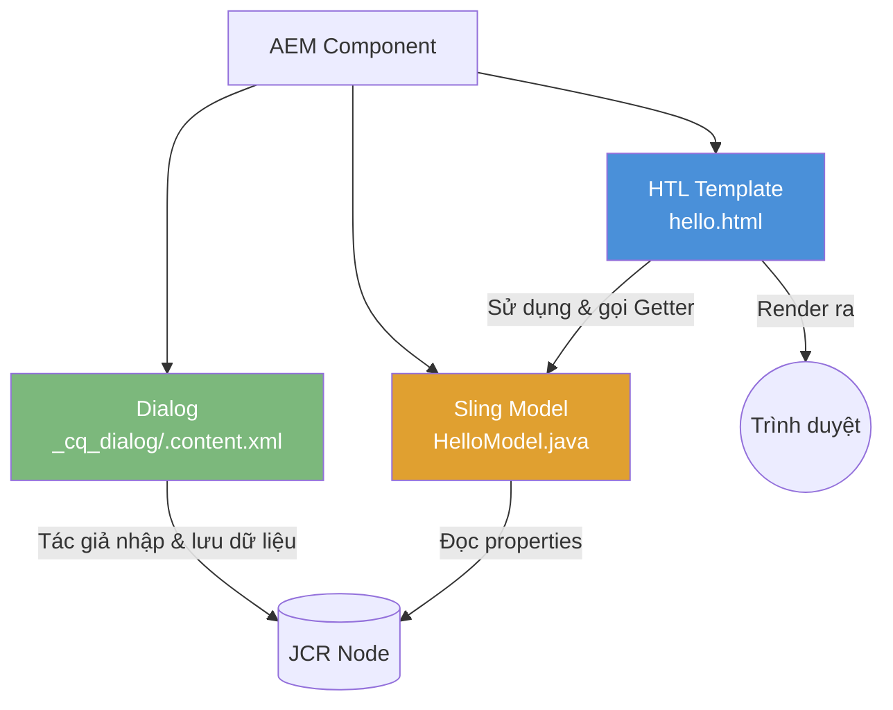
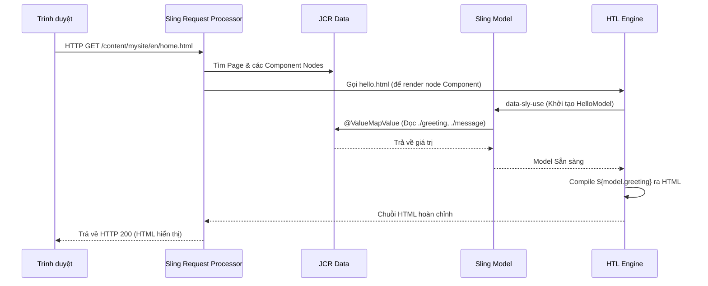
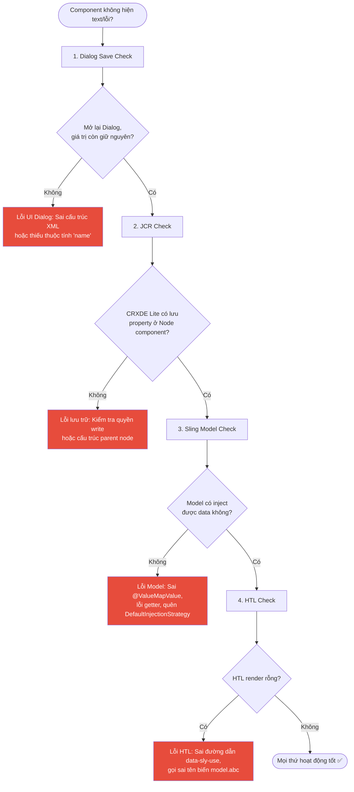

## Cấu trúc và Xây dựng Component Đầu Tiên Trong AEM

Component là những khối xây dựng (building blocks) cơ bản của các trang AEM. Một nút bấm (button), một khối văn bản, một hình ảnh trượt (carousel) hay một hero banner — mỗi yếu tố này đều là một component. Trong bài viết này, chúng ta sẽ tự tay tạo một component từ con số không và thấu hiểu mọi file liên quan.

---

## 1. Bộ ba Component (The Component Triad)

Mọi AEM Component hoàn chỉnh thường được cấu thành từ ba thành phần chính (triad). Không phải component nào cũng cần đủ cả ba (một component cực kỳ đơn giản có thể chỉ cần HTL), nhưng hầu hết các component trong thực tế đều sử dụng kiến trúc này:

| Thành phần | Loại File | Mục đích |
|---|---|---|
| **Dialog** | XML (`.content.xml`) | Định nghĩa giao diện Authoring — các trường nhập liệu (form fields) cho content author. |
| **HTL Template** | `.html` | Chịu trách nhiệm render mã HTML dựa trên dữ liệu từ Model cung cấp. |
| **Sling Model** | `.java` | Đọc dữ liệu (content) từ JCR, xử lý logic và cung cấp dữ liệu an toàn cho Template. |



---

## 2. Phân bổ File trong Project

Mã nguồn của một Component được chia làm hai khu vực (module) riêng biệt: phần UI (Frontend/Config) và phần Logic (Backend).

**Phần UI (Nằm trong module `ui.apps`):**

```text [ui.apps structure]
ui.apps/src/main/content/jcr_root/apps/mysite/components/
└── hello/
    ├── .content.xml        # Component definition (định nghĩa cq:Component)
    ├── hello.html          # HTL template (Giao diện hiển thị)
    └── _cq_dialog/
        └── .content.xml    # Author dialog (Giao diện nhập liệu)
```

**Phần Backend (Nằm trong module `core`):**

```text [core structure]
core/src/main/java/com/mysite/core/models/
└── HelloModel.java         # Sling Model
```

---

## 3. Các bước xây dựng Component

### Bước 1: Định nghĩa Component (Component Definition)

File `.content.xml` ở thư mục gốc của component định nghĩa node `cq:Component`:

```xml [.content.xml]
<?xml version="1.0" encoding="UTF-8"?>
<jcr:root xmlns:cq="http://www.day.com/jcr/cq/1.0" xmlns:jcr="http://www.jcp.org/jcr/1.0"
    jcr:primaryType="cq:Component"
    jcr:title="Hello"
    jcr:description="A simple greeting component"
    componentGroup="My Site - Content"/>
```

| Property | Chức năng |
|---|---|
| `jcr:primaryType` | Bắt buộc phải là `cq:Component` |
| `jcr:title` | Tên hiển thị trong danh sách component (Component Browser) |
| `jcr:description` | Dòng mô tả (Tooltip) khi hover chuột |
| `componentGroup` | Phân nhóm component. Nên dùng chung một nhóm (VD: `"My Site - Content"`) để dễ tìm kiếm. |

### Bước 2: Viết HTL Template

HTL (HTML Template Language) chịu trách nhiệm render HTML. Tạo file `hello.html`:

```html [hello.html]
<div class="cmp-hello" data-sly-use.model="com.mysite.core.models.HelloModel">
    <h2 class="cmp-hello__title">${model.greeting}</h2>
    <p class="cmp-hello__message">${model.message}</p>
</div>
```

**Template này thực hiện 3 việc:**
1. Dùng `data-sly-use` để khởi tạo Sling Model (Class Java).
2. Lấy dữ liệu từ Model qua cú pháp `$\{model.property\}`.
3. Output ra HTML với quy tắc đặt tên CSS theo chuẩn **BEM** (`cmp-` prefix) — đây là chuẩn của AEM Core Components.

### Bước 3: Tạo Sling Model

Sling Model đọc giá trị từ JCR node và chuẩn bị data cho HTL:

```java [HelloModel.java]
package com.mysite.core.models;

import org.apache.sling.api.resource.Resource;
import org.apache.sling.models.annotations.Default;
import org.apache.sling.models.annotations.DefaultInjectionStrategy;
import org.apache.sling.models.annotations.Model;
import org.apache.sling.models.annotations.injectorspecific.ValueMapValue;

@Model(adaptables = Resource.class, defaultInjectionStrategy = DefaultInjectionStrategy.OPTIONAL)
public class HelloModel {

    @ValueMapValue
    @Default(values = "Hello, World!")
    private String greeting;

    @ValueMapValue
    @Default(values = "This is my first AEM component.")
    private String message;

    public String getGreeting() { return greeting; }
    public String getMessage() { return message; }
}
```

**Giải thích các Annotations:**

| Annotation | Ý nghĩa |
|---|---|
| `@Model(adaptables = Resource.class)` | Khai báo đây là Sling Model, được adapt từ một `Resource` (JCR Node). |
| `@ValueMapValue` | Tiêm (Inject) giá trị từ JCR properties của component vào biến này. |
| `@Default` | Cung cấp giá trị mặc định nếu tác giả (Author) chưa nhập gì. |

> **Quan trọng:** Nếu bạn không khai báo `defaultInjectionStrategy = DefaultInjectionStrategy.OPTIONAL`, chiến lược mặc định của Sling Model là `REQUIRED`. Khi đó, nếu tác giả kéo component vào trang mà chưa điền form (chưa có data trong JCR), model sẽ bị lỗi và component trả về lỗi thay vì hiển thị dữ liệu mặc định. **Luôn luôn sử dụng `OPTIONAL`.**

### Bước 4: Tạo Author Dialog

Dialog quyết định những trường (fields) mà tác giả nhìn thấy để nhập liệu. Tạo file `_cq_dialog/.content.xml`:

```xml
<?xml version="1.0" encoding="UTF-8"?>
<jcr:root xmlns:cq="http://www.day.com/jcr/cq/1.0" xmlns:jcr="http://www.jcp.org/jcr/1.0" xmlns:nt="http://www.jcp.org/jcr/nt/1.0" xmlns:granite="http://www.adobe.com/jcr/granite/1.0" xmlns:sling="http://sling.apache.org/jcr/sling/1.0"
    jcr:primaryType="nt:unstructured"
    jcr:title="Hello"
    sling:resourceType="cq/gui/components/authoring/dialog">
    <content jcr:primaryType="nt:unstructured" sling:resourceType="granite/ui/components/coral/foundation/container">
        <items jcr:primaryType="nt:unstructured">
            <tabs jcr:primaryType="nt:unstructured" sling:resourceType="granite/ui/components/coral/foundation/tabs" maximized="{Boolean}true">
                <items jcr:primaryType="nt:unstructured">
                    <!-- Tab Properties -->
                    <properties jcr:primaryType="nt:unstructured" jcr:title="Properties" sling:resourceType="granite/ui/components/coral/foundation/container" margin="{Boolean}true">
                        <items jcr:primaryType="nt:unstructured">
                            <columns jcr:primaryType="nt:unstructured" sling:resourceType="granite/ui/components/coral/foundation/fixedcolumns" margin="{Boolean}true">
                                <items jcr:primaryType="nt:unstructured">
                                    <column jcr:primaryType="nt:unstructured" sling:resourceType="granite/ui/components/coral/foundation/container">
                                        <items jcr:primaryType="nt:unstructured">
                                            <!-- Trường nhập Greeting -->
                                            <greeting jcr:primaryType="nt:unstructured" 
                                                sling:resourceType="granite/ui/components/coral/foundation/form/textfield" 
                                                fieldLabel="Greeting" 
                                                name="./greeting" 
                                                required="{Boolean}true"/>
                                            <!-- Trường nhập Message -->
                                            <message jcr:primaryType="nt:unstructured" 
                                                sling:resourceType="granite/ui/components/coral/foundation/form/textarea" 
                                                fieldLabel="Message" 
                                                name="./message"/>
                                        </items>
                                    </column>
                                </items>
                            </columns>
                        </items>
                    </properties>
                </items>
            </tabs>
        </items>
    </content>
</jcr:root>
```

> **Lưu ý:** Thuộc tính `name` (như `name="./greeting"`) là quan trọng nhất. Nó quyết định tên của property sẽ được lưu vào JCR và phải khớp chính xác với tên biến bạn inject ở Sling Model (`private String greeting;`).

---

## 4. Luồng Render Component (Rendering Flow)

Điều gì thực sự xảy ra khi người dùng tải một trang có chứa Component của bạn?



---

## 5. Triển khai và Kiểm thử

1. **Build mã nguồn:** Ở thư mục gốc (`mysite`), chạy lệnh:

   ```bash
   mvn clean install -PautoInstallSinglePackage
   ```

2. **Kéo thả component vào trang:**
   - Mở AEM: `http://localhost:4502/sites.html`
   - Chỉnh sửa một trang (Edit mode).
   - Mở Side Panel, tìm `Hello` và kéo thả vào trang.
   - Nhấn vào component (icon mỏ lết) để mở Dialog, điền thông tin và lưu.
3. **Kiểm chứng tại CRXDE Lite:** Vào đường dẫn chứa trang, tìm tới node component bạn vừa thả, bạn sẽ thấy dữ liệu được lưu:

   ```text
   hello
   ├── jcr:primaryType = "nt:unstructured"
   ├── sling:resourceType = "mysite/components/hello"
   ├── greeting = "Welcome to My Site"        (<- Từ Dialog)
   └── message = "We build amazing things."   (<- Từ Dialog)
   ```

---

## 6. Sổ tay Debug: Từ Dialog đến HTML (4 Checkpoints)

Nếu component của bạn không hiển thị nội dung như kỳ vọng, hãy thực hiện bài kiểm tra 4 bước sau để khoanh vùng chính xác lỗi:



---

## 7. Proxy Components (AEM Core Components)

Trong thực tế dự án, thay vì tự code component "Text" hay "Image" từ đầu như trên, chúng ta sử dụng **Core Components** (được cung cấp sẵn bởi Adobe) thông qua mẫu thiết kế **Proxy Component**.

Tạo một component rất nhẹ và trỏ đến Core Component qua thuộc tính `sling:resourceSuperType`:

```xml
<!-- apps/mysite/components/text/.content.xml -->
<jcr:root xmlns:cq="http://www.day.com/jcr/cq/1.0" xmlns:jcr="http://www.jcp.org/jcr/1.0"
    jcr:primaryType="cq:Component"
    jcr:title="Text"
    componentGroup="My Site - Content"
    sling:resourceSuperType="core/wcm/components/text/v2/text"/>
```

Nhờ `sling:resourceSuperType`, component của bạn kế thừa toàn bộ tính năng, dialog và Sling Model của `core/wcm/components/text/v2/text`. Bạn chỉ ghi đè (override) các file cụ thể (ví dụ HTL) nếu muốn thay đổi giao diện. Maven archetype tự động tạo ra các Proxy này cho bạn khi khởi tạo dự án.