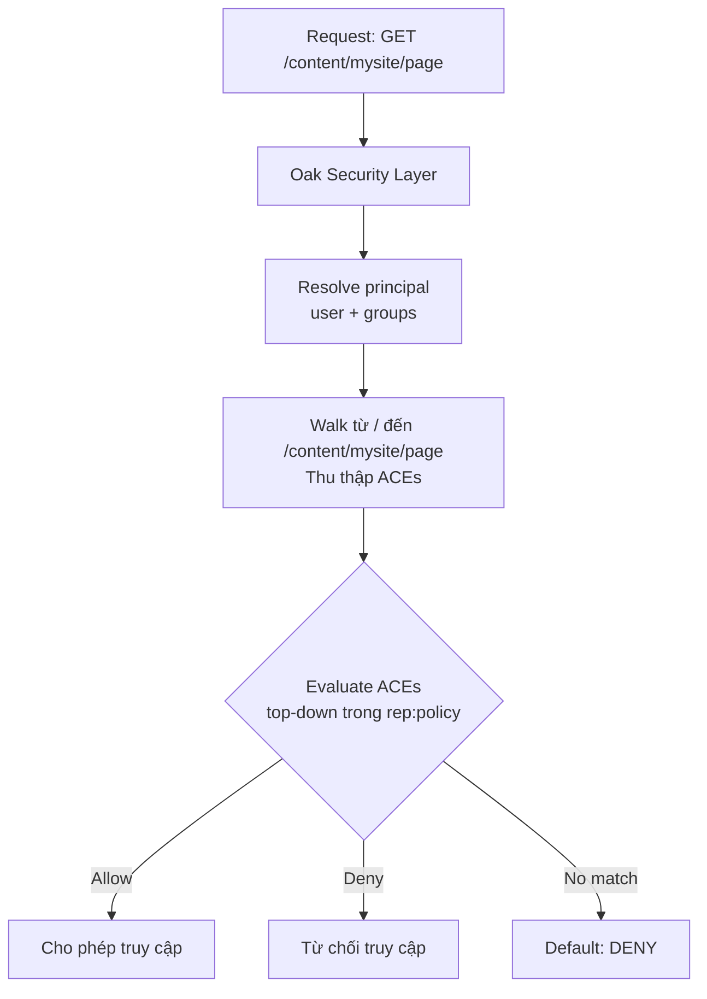
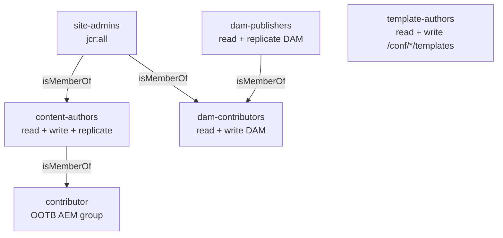

# ACL và Permissions — AEM 6.5 On-Premise

> Phạm vi: AEM 6.5 on-premise, Java 8 (SP1+) / Java 11 (SP9+), Jackrabbit Oak

---

## 1. Permission Model — Cách ACL Hoạt Động

AEM dùng Jackrabbit Oak access control layer. Mỗi thao tác đọc, ghi, xóa trên JCR đều được kiểm soát bởi Access Control List (ACL) — map principals (user, group) với privileges trên path cụ thể.



Mỗi JCR node có thể có child node `rep:policy` chứa Access Control Entries (ACE):

```
/content/mysite/
└── rep:policy/
    ├── allow  (rep:GrantACE)
    │   ├── rep:principalName = "content-authors"
    │   └── rep:privileges = ["jcr:read", "rep:write", "crx:replicate"]
    └── deny   (rep:DenyACE)
        ├── rep:principalName = "restricted-editors"
        └── rep:privileges = ["jcr:removeNode"]
```

### Privilege reference

| Privilege | Phạm vi |
|---|---|
| `jcr:read` | Đọc node và properties |
| `rep:write` | Tạo, sửa, xóa node/property |
| `jcr:addChildNodes` | Tạo child nodes |
| `jcr:removeChildNodes` | Xóa child nodes |
| `jcr:removeNode` | Xóa chính node đó |
| `jcr:modifyProperties` | Chỉnh sửa properties (không tạo/xóa node) |
| `crx:replicate` | Activate / publish content |
| `jcr:readAccessControl` | Đọc ACL policies |
| `jcr:modifyAccessControl` | Sửa ACL policies |
| `jcr:versionManagement` | Tạo và restore versions |
| `jcr:lockManagement` | Lock / unlock nodes |
| `jcr:all` | Toàn bộ privileges (superuser) |

### Thứ tự đánh giá ACE

1. ACE được evaluate từ trên xuống trong `rep:policy`
2. **Deny thắng Allow** tại cùng path
3. ACE trên child path ghi đè parent ACE (specific wins)
4. User `admin` bypass toàn bộ ACL
5. Group `everyone` áp dụng cho mọi user đã xác thực

---

## 2. `rep:glob` Patterns

`rep:glob` giới hạn ACE chỉ áp dụng cho tập con của path bên dưới. Cho phép kiểm soát chi tiết mà không cần tạo ACE trên từng node:

```
/content/mysite/
└── rep:policy/
    └── allow
        ├── rep:principalName = "content-authors"
        ├── rep:privileges = ["jcr:read"]
        └── rep:glob = "*/jcr:content*"
```

### Bảng pattern thường dùng

| Pattern | Match |
|---|---|
| `""` (empty string) | Chỉ node đó, không bao gồm con |
| `*` | Direct children trực tiếp |
| `*/jcr:content` | `jcr:content` của direct children |
| `*/jcr:content*` | `jcr:content` và toàn bộ subtree bên dưới, cho direct children |
| `/*/jcr:content/*` | Properties/children dưới `jcr:content` ở depth 2 |

### Ví dụ: cho đọc content nhưng không thấy page trong navigation

```
Path:      /content/mysite/secret
rep:glob:  */jcr:content*
Privilege: jcr:read (allow)
```

User có thể đọc `jcr:content` (title, properties) nhưng không thấy page node `secret` trong tree.

---

## 3. Netcentric ACL Tool — Tiêu Chuẩn Cho AEM 6.5 On-Premise

[Netcentric ACL Tool](https://github.com/Netcentric/accesscontroltool) là công cụ de facto để quản lý permissions trong AEM 6.5 enterprise projects. Định nghĩa ACL bằng YAML, idempotent, version-controlled, deploy qua content package.

### So sánh nhanh

| | Repoinit | Netcentric ACL Tool |
|---|---|---|
| Format | DSL trong `.cfg.json` | YAML |
| Group management | Basic | Đầy đủ (hierarchy, membership) |
| ACL + glob | Có | Có (+ CUG, run mode) |
| Dump existing | Không | Có (`acl-dump`) |
| Pre-deploy validation | Không | Có |
| AEM 6.5 | Cần config thêm | Full support |

### Cài đặt vào project

```xml
<!-- pom.xml của all module -->
<dependency>
    <groupId>biz.netcentric.cq.tools.accesscontroltool</groupId>
    <artifactId>accesscontroltool-bundle</artifactId>
    <version>3.7.0</version>
</dependency>
<dependency>
    <groupId>biz.netcentric.cq.tools.accesscontroltool</groupId>
    <artifactId>accesscontroltool-package</artifactId>
    <version>3.7.0</version>
    <type>zip</type>
</dependency>
```

Embed trong `all` package.

### Định nghĩa Groups (`myproject-groups.yaml`)

```yaml
- group_config:
    - content-authors:
        name: "Content Authors"
        description: "Can author content on mysite"
        path: /home/groups/myproject
        isMemberOf: contributor

    - dam-contributors:
        name: "DAM Contributors"
        description: "Can upload and manage assets"
        path: /home/groups/myproject

    - dam-publishers:
        name: "DAM Publishers"
        description: "Can publish assets"
        path: /home/groups/myproject
        isMemberOf: dam-contributors

    - template-authors:
        name: "Template Authors"
        description: "Can create and edit editable templates"
        path: /home/groups/myproject

    - site-admins:
        name: "Site Administrators"
        description: "Full access to mysite"
        path: /home/groups/myproject
        isMemberOf: content-authors, dam-contributors
```

### Định nghĩa ACLs (`myproject-acls.yaml`)

```yaml
- content-authors:
    # Pages: đọc, viết, publish
    - path: /content/mysite
      permission: allow
      privileges: jcr:read,rep:write,crx:replicate
    # Không cho xóa top-level pages
    - path: /content/mysite
      permission: deny
      privileges: jcr:removeNode
      repGlob: ""
    # DAM: chỉ đọc
    - path: /content/dam/mysite
      permission: allow
      privileges: jcr:read
    # Tags: đọc và tạo
    - path: /content/cq:tags/mysite
      permission: allow
      privileges: jcr:read,jcr:addChildNodes,jcr:modifyProperties
    # Experience Fragments
    - path: /content/experience-fragments/mysite
      permission: allow
      privileges: jcr:read,rep:write

- dam-contributors:
    - path: /content/dam/mysite
      permission: allow
      privileges: jcr:read,rep:write
    # Yêu cầu approval workflow trước khi publish
    - path: /content/dam/mysite
      permission: deny
      privileges: crx:replicate

- dam-publishers:
    - path: /content/dam/mysite
      permission: allow
      privileges: jcr:read,crx:replicate

- template-authors:
    - path: /conf/mysite/settings/wcm/templates
      permission: allow
      privileges: jcr:read,rep:write
    - path: /conf/mysite/settings/wcm/policies
      permission: allow
      privileges: jcr:read,rep:write
    - path: /content/mysite
      permission: allow
      privileges: jcr:read

- site-admins:
    - path: /content/mysite
      permission: allow
      privileges: jcr:all
    - path: /content/dam/mysite
      permission: allow
      privileges: jcr:all
    - path: /content/experience-fragments/mysite
      permission: allow
      privileges: jcr:all
    - path: /conf/mysite
      permission: allow
      privileges: jcr:all
```

### Apply ACL thủ công

```bash
# Trigger apply qua JMX
curl -u admin:admin -X POST \
  "http://localhost:4502/system/console/jmx/biz.netcentric.cq.tools.accesscontroltool:type=ACTService/op/apply"
```

Hoặc vào `/system/console/actool` trong Felix Console.

### Dump permissions hiện tại để audit

```bash
curl -u admin:admin \
  "http://localhost:4502/system/console/jmx/biz.netcentric.cq.tools.accesscontroltool:type=ACTService/op/getDump/java.lang.String" \
  -d "p0=content-authors"
```

### Advanced: glob restriction trong YAML

```yaml
- content-authors:
    - path: /content/mysite
      permission: allow
      privileges: jcr:read
      repGlob: "*/jcr:content*"
```

### Advanced: Conditional ACL theo run mode

```yaml
# Chỉ apply trên publish instance
- content-authors:
    - path: /content/mysite
      permission: allow
      privileges: jcr:read
      runModes: publish
```

---

## 4. Service Users

Service user là system principal cho OSGi service dùng để access JCR. Thay thế `loginAdministrative()` đã deprecated.

### Tạo service user trên AEM 6.5

Cách 1 — Tạo thủ công qua CRX/DE hoặc User Admin:
- Vào `/libs/granite/security/content/useradmin`
- Tạo user với type `System User`
- Path thường dùng: `/home/users/system/myproject/`

Cách 2 — Netcentric ACL Tool (`system_users` section):

```yaml
- system_users:
    - myproject-content-reader:
        path: /home/users/system/myproject
    - myproject-content-writer:
        path: /home/users/system/myproject
    - myproject-workflow-service:
        path: /home/users/system/myproject

- myproject-content-reader:
    - path: /content/mysite
      permission: allow
      privileges: jcr:read
    - path: /content/dam/mysite
      permission: allow
      privileges: jcr:read

- myproject-content-writer:
    - path: /content/mysite
      permission: allow
      privileges: jcr:read,rep:write
    - path: /content/dam/mysite
      permission: allow
      privileges: jcr:read,rep:write

- myproject-workflow-service:
    - path: /content/mysite
      permission: allow
      privileges: jcr:read,rep:write,crx:replicate
    - path: /var/workflow
      permission: allow
      privileges: jcr:read
```

### Service user mapping — OSGi config

```json
// org.apache.sling.serviceusermapping.impl.ServiceUserMapperImpl.amended~myproject.cfg.json
{
    "user.mapping": [
        "com.myproject.core:content-reader=myproject-content-reader",
        "com.myproject.core:content-writer=myproject-content-writer",
        "com.myproject.core:workflow-service=myproject-workflow-service"
    ]
}
```

### Dùng trong Java code

```java
@Reference
private ResourceResolverFactory resolverFactory;

public void readContent() {
    Map<String, Object> authInfo = Collections.singletonMap(
        ResourceResolverFactory.SUBSERVICE, "content-reader"
    );

    try (ResourceResolver resolver =
            resolverFactory.getServiceResourceResolver(authInfo)) {

        Resource resource = resolver.getResource("/content/mysite/en/home");
        if (resource != null) {
            String title = resource.getChild("jcr:content")
                .getValueMap().get("jcr:title", "");
            LOG.info("Title: {}", title);
        }

    } catch (LoginException e) {
        LOG.error("Service user login failed for subservice 'content-reader'", e);
    }
}
```

---

## 5. Group Hierarchy Khuyến Nghị

Nguyên tắc: **least privilege** — bắt đầu từ không có gì, thêm dần theo nhu cầu thực tế.



| Group | Mục đích | Permissions cốt lõi |
|---|---|---|
| `content-authors` | Author và publish pages | read, write, replicate trên `/content/mysite` |
| `dam-contributors` | Upload và quản lý assets | read, write trên `/content/dam/mysite` |
| `dam-publishers` | Publish assets | read, replicate trên `/content/dam/mysite` |
| `template-authors` | Tạo và quản lý editable templates | read, write trên `/conf/mysite/settings/wcm/templates` |
| `tag-administrators` | Quản lý tag taxonomy | read, write trên `/content/cq:tags/mysite` |
| `site-admins` | Full access cho một site | jcr:all trên `/content/mysite`, `/content/dam/mysite` |
| `workflow-users` | Start và participate workflows | read trên `/var/workflow/models` |

Quy tắc thiết kế:
- Assign user vào group, không assign permission trực tiếp cho user
- `site-admins` kế thừa từ `content-authors` và `dam-contributors` qua `isMemberOf`
- Mỗi group một scope rõ ràng, không overlap trách nhiệm

---

## 6. Closed User Groups (CUGs)

CUG giới hạn `jcr:read` trên một subtree chỉ cho các principals được chỉ định. Dùng cho premium content, member-only section, intranet.

### Cách CUG hoạt động

1. `rep:cugPolicy` node giới hạn `jcr:read` cho các principals được liệt kê
2. Tất cả user khác (kể cả anonymous) bị deny read
3. CUG chỉ ảnh hưởng read access — write access vẫn do regular ACL kiểm soát
4. CUG kế thừa xuống child nodes

### Cấu hình trong Netcentric ACL Tool

```yaml
- premium-members:
    - path: /content/mysite/premium
      permission: allow
      privileges: jcr:read

# CUG config
- cug_config:
    - path: /content/mysite/premium
      principalNames: premium-members
```

### CUG qua JCR XML (trong ui.content package)

```xml
<jcr:root
    xmlns:rep="internal"
    jcr:primaryType="rep:CugPolicy"
    rep:principalNames="[premium-members]"/>
```

Node này đặt tại `/content/mysite/premium/rep:cugPolicy`.

---

## 7. Programmatic ACL — Đọc và Ghi

### Đọc ACL hiện tại

```java
import javax.jcr.Session;
import javax.jcr.security.AccessControlList;
import javax.jcr.security.AccessControlEntry;
import javax.jcr.security.AccessControlManager;
import javax.jcr.security.AccessControlPolicy;

Session session = resolver.adaptTo(Session.class);
AccessControlManager acm = session.getAccessControlManager();

AccessControlPolicy[] policies = acm.getPolicies("/content/mysite");
for (AccessControlPolicy policy : policies) {
    if (policy instanceof AccessControlList) {
        AccessControlList acl = (AccessControlList) policy;
        for (AccessControlEntry ace : acl.getAccessControlEntries()) {
            LOG.info("Principal: {}, Privileges: {}",
                ace.getPrincipal().getName(),
                Arrays.toString(ace.getPrivileges()));
        }
    }
}
```

### Ghi ACL programmatically

```java
import org.apache.jackrabbit.api.security.JackrabbitAccessControlList;
import org.apache.jackrabbit.api.security.JackrabbitAccessControlManager;
import org.apache.jackrabbit.oak.spi.security.principal.PrincipalImpl;

JackrabbitAccessControlManager acm =
    (JackrabbitAccessControlManager) session.getAccessControlManager();

// Lấy ACL đang tồn tại hoặc tạo mới
JackrabbitAccessControlList acl = null;

for (AccessControlPolicy p : acm.getPolicies("/content/mysite")) {
    if (p instanceof JackrabbitAccessControlList) {
        acl = (JackrabbitAccessControlList) p;
        break;
    }
}

if (acl == null) {
    for (AccessControlPolicy p : acm.getApplicablePolicies("/content/mysite")) {
        if (p instanceof JackrabbitAccessControlList) {
            acl = (JackrabbitAccessControlList) p;
            break;
        }
    }
}

if (acl == null) {
    throw new IllegalStateException("Cannot obtain ACL for /content/mysite");
}

Privilege[] privileges = {
    acm.privilegeFromName("jcr:read"),
    acm.privilegeFromName("rep:write")
};

acl.addAccessControlEntry(new PrincipalImpl("content-authors"), privileges);
acm.setPolicy("/content/mysite", acl);
session.save();
```

Lưu ý: dùng programmatic ACL trong migration script hoặc Groovy Console, không dùng trong production code thường xuyên. Quản lý ACL nên đi qua Netcentric ACL Tool.

---

## 8. Kiểm Tra Permissions

### Impersonation qua UI

1. Vào `/libs/granite/security/content/useradmin.html`
2. Chọn user → Click **Impersonate**
3. Browse site với permissions của user đó

### Kiểm tra qua Groovy Console

```groovy
import javax.jcr.Session
import javax.jcr.security.Privilege

def session = resourceResolver.adaptTo(Session.class)
def acm = session.accessControlManager

def checkPrivilege(String path, String privilegeName) {
    def priv = [acm.privilegeFromName(privilegeName)] as Privilege[]
    def result = acm.hasPrivileges(path, priv)
    println "${privilegeName} on ${path}: ${result}"
}

checkPrivilege("/content/mysite", "jcr:read")
checkPrivilege("/content/mysite", "rep:write")
checkPrivilege("/content/mysite", "crx:replicate")
checkPrivilege("/content/dam/mysite", "rep:write")
```

### Permission checker endpoint

AEM cung cấp endpoint kiểm tra permission nhanh:

```
GET /system/console/jcr?path=/content/mysite&user=content-author-user
```

### Kiểm tra effective permissions trong CRXDE Lite

1. Mở CRXDE Lite → `/content/mysite`
2. Tab **Access Control** — xem toàn bộ ACE trên path đó
3. Nút **Effective Permissions** → nhập username → xem quyền thực tế sau khi tổng hợp cả hierarchy

---

## 9. Repoinit — Baseline Cho AEM 6.5

Repoinit không phải tiêu chuẩn chính trên AEM 6.5 như trên AEMaaCS, nhưng vẫn hoạt động. Phù hợp cho việc khởi tạo service user và ACL cơ bản trong môi trường không có Netcentric ACL Tool.

```json
// org.apache.sling.jcr.repoinit.RepositoryInitializer~myproject.cfg.json
{
    "scripts": [
        "create service user myproject-content-reader with path system/myproject",
        "",
        "set ACL for myproject-content-reader",
        "    allow jcr:read on /content/mysite",
        "    allow jcr:read on /content/dam/mysite",
        "end",
        "",
        "create group content-authors with path /home/groups/myproject",
        "",
        "set ACL for content-authors",
        "    allow jcr:read,rep:write,crx:replicate on /content/mysite",
        "    deny jcr:removeNode on /content/mysite",
        "    allow jcr:read on /content/dam/mysite",
        "end"
    ]
}
```

### Repoinit syntax reference

| Statement | Ví dụ |
|---|---|
| Tạo service user | `create service user my-user with path system/myproject` |
| Tạo group | `create group my-group with path /home/groups/myproject` |
| Thêm vào group | `add content-authors to group myproject-super-authors` |
| Set ACL | `set ACL for principal-name` ... `end` |
| Allow | `allow jcr:read on /content/mysite` |
| Deny | `deny rep:write on /content/mysite` |
| Glob restriction | `allow jcr:read on /content restriction(rep:glob,*/jcr:content*)` |
| Tạo path | `create path /content/mysite(sling:OrderedFolder)` |

Trên AEM 6.5, ưu tiên Netcentric ACL Tool cho group management và ACL phức tạp. Dùng repoinit cho service user baseline và các path initialization.

---

## 10. Best Practices và Pitfalls Thường Gặp

### Best Practices

- Mọi permission định nghĩa trong Git, deploy qua CI/CD — không chỉnh tay trong production
- Assign user vào group, không assign permission trực tiếp cho user
- Test permission changes trên dev/stage trước production
- Dùng ACL Tool dump để audit định kỳ, phát hiện drift
- Dùng `jcr:modifyProperties` thay `rep:write` khi user chỉ cần sửa nội dung, không cần tạo/xóa node

### Pitfalls thường gặp

| Lỗi | Giải pháp |
|---|---|
| User không thấy page sau deploy | Kiểm tra group có `jcr:read` trên `/content` và tất cả ancestor nodes |
| ACL Tool chạy nhưng permissions không apply | Kiểm tra YAML syntax; xem log trong Felix Console `/system/console/actool` |
| Service user bị `LoginException` | Kiểm tra service user mapping config và user tồn tại trong `/home/users/system/` |
| Deny ACE không có hiệu lực | Deny phải nằm sau (hoặc cùng level) với allow ACE trong evaluation order |
| CUG block toàn bộ anonymous access | Kiểm tra `principalNames` đúng group; kiểm tra group membership của user |
| `rep:glob` match quá rộng | Test glob cẩn thận; empty string `""` chỉ match đúng node đó |
| Permissions đúng trên Author nhưng sai trên Publish | ACL phải được set cho cả publish-side groups; kiểm tra CUG có bật trên Publish |
| Repoinit script fail silent | Kiểm tra `error.log` sau deployment cho repoinit execution errors |
| `jcr:all` trên `/content` gán cho non-admin group | Quá rộng — chỉ gán `jcr:all` trên site-specific path (`/content/mysite`) |
| ACL Tool YAML dùng `actions` thay vì `privileges` | `actions` là legacy (CRX2), luôn dùng `privileges` cho Oak |
| Service user access DAM rendition nhưng thiếu read trên parent | Phải có `jcr:read` trên toàn bộ ancestor path từ `/content/dam` trở xuống |

---

## Tham Khảo

- [Netcentric ACL Tool](https://github.com/Netcentric/accesscontroltool) — GitHub
- [Jackrabbit Oak Access Control](https://jackrabbit.apache.org/oak/docs/security/accesscontrol.html)
- [AEM 6.5 User Administration](https://experienceleague.adobe.com/en/docs/experience-manager-65/content/security/security) — Adobe Experience League
- [Repoinit Language Reference](https://sling.apache.org/documentation/bundles/repository-initialization.html) — Apache Sling
