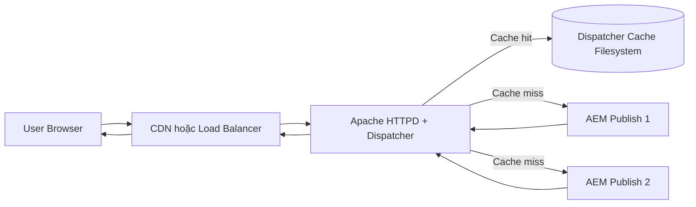
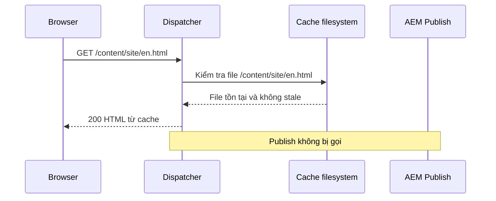
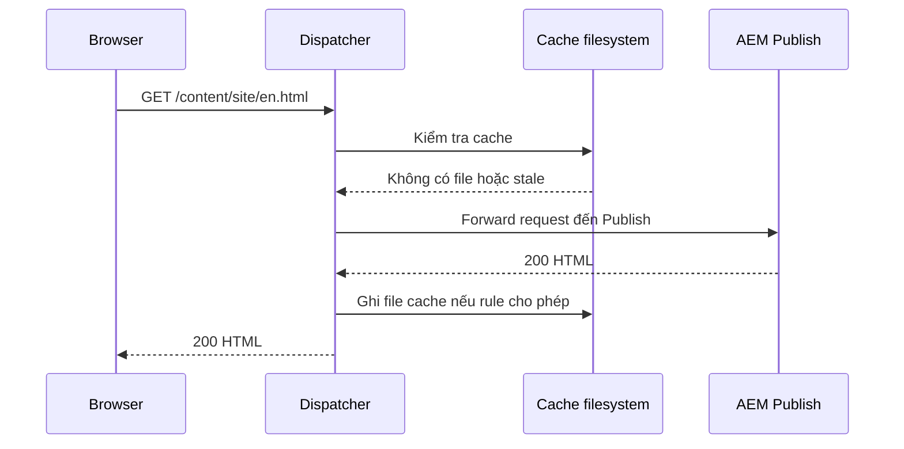
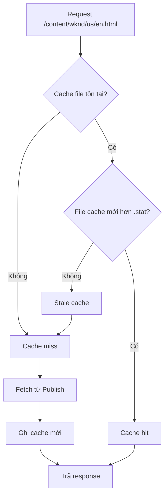
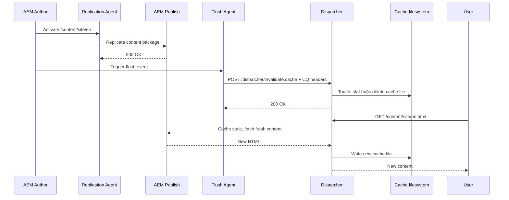
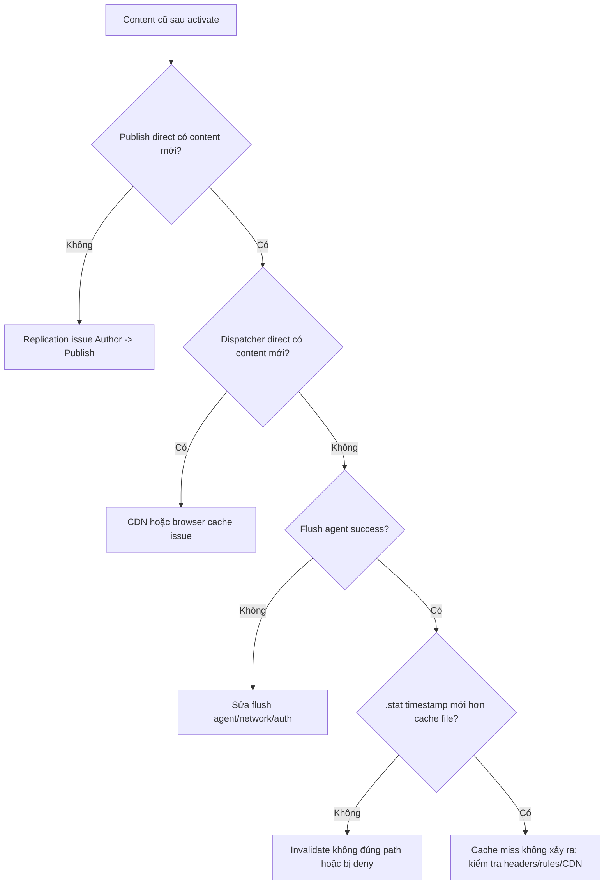
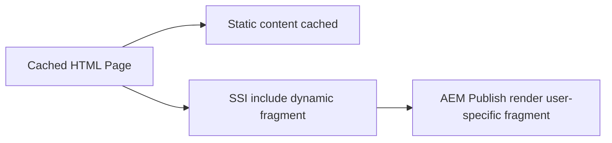
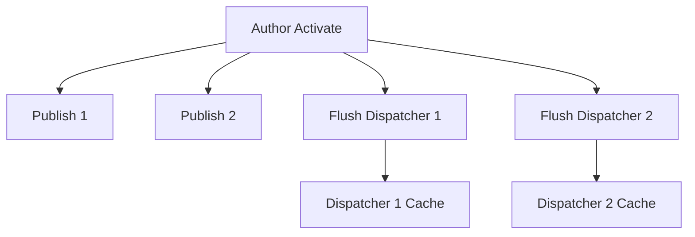
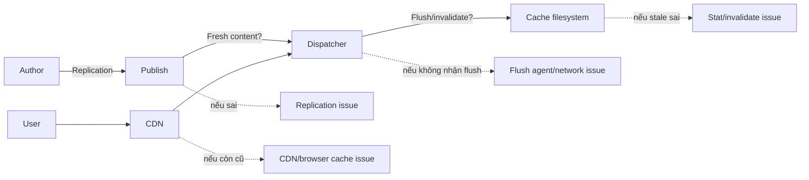

# AEM Dispatcher, Cache và Flush Cache trong AEM 6.5 On-Premise

> Tài liệu kỹ thuật dành cho AMS engineer làm việc với AEM 6.5 on-premise: hiểu Dispatcher, cơ chế cache, flush/invalidate, các nguyên nhân gây stale content, 404/403, cache miss bất thường và checklist xử lý sự cố production.

## 1. Dispatcher là gì?

Dispatcher là module của Adobe chạy trên web server như Apache HTTP Server hoặc IIS. Trong AEM 6.5 on-premise, Dispatcher thường nằm giữa CDN/load balancer và Publish instance.

Dispatcher có hai nhiệm vụ chính:

- **Caching**: lưu response tĩnh từ Publish xuống filesystem để giảm tải cho AEM.
- **Load balancing / filtering**: phân phối request đến nhiều Publish và chặn request không hợp lệ bằng `/filter` rules.



Trong AMS/on-premise, phần lớn issue liên quan đến Dispatcher không nằm ở code Java mà nằm ở sự phối hợp giữa:

- **AEM replication** từ Author sang Publish.
- **Flush agent** từ Author hoặc Publish sang Dispatcher.
- **Dispatcher cache rules** trong `dispatcher.any`.
- **Apache rewrite/filter/header rules**.
- **CDN cache** nếu có layer phía trước Dispatcher.

---

## 2. Luồng request khi có cache

### 2.1 Cache hit

Khi file đã tồn tại trong cache và còn hợp lệ, Dispatcher trả trực tiếp từ filesystem.



### 2.2 Cache miss

Khi chưa có cache hoặc cache đã stale, Dispatcher gọi Publish, nhận response rồi ghi xuống cache nếu response đủ điều kiện cache.



Một response thường không được cache nếu rơi vào các trường hợp sau:

- **HTTP method không phải GET/HEAD**: ví dụ `POST`, `PUT`, `DELETE`.
- **URL có query string**: mặc định Dispatcher không cache request có `?param=value`, trừ khi cấu hình `/ignoreUrlParams` phù hợp.
- **Response có header chống cache**: ví dụ `Cache-Control: no-cache`, `no-store`, `private`.
- **Path không match `/rules` trong `/cache`**.
- **Request bị chặn bởi `/filter`**.
- **Response status không phù hợp**: ví dụ `500`, `403`, tùy cấu hình có thể không cache hoặc bị cache sai nếu rule không chặt.

---

## 3. Dispatcher cache lưu ở đâu?

Dispatcher lưu cache dưới dạng file thật trên filesystem của web server.

Ví dụ request:

```text
GET /content/wknd/us/en.html
```

Có thể được lưu thành:

```text
/cache-root/content/wknd/us/en.html
```

Asset DAM:

```text
GET /content/dam/wknd/image.jpg
```

Có thể được lưu thành:

```text
/cache-root/content/dam/wknd/image.jpg
```

Cấu hình liên quan trong `dispatcher.any`:

```text
/cache
  {
    /docroot "/mnt/dispatcher/cache"
    /rules
      {
        /0000 { /glob "*" /type "allow" }
      }
    /statfileslevel "2"
    /invalidate
      {
        /0000 { /glob "*.html" /type "allow" }
        /0001 { /glob "*.json" /type "allow" }
      }
    /allowedClients
      {
        /0000 { /glob "127.0.0.1" /type "allow" }
      }
  }
```

Các section quan trọng:

| Section | Vai trò |
|---|---|
| `/docroot` | Thư mục chứa cache file |
| `/rules` | Quyết định path nào được cache |
| `/invalidate` | Quyết định file extension/path nào được phép invalidate |
| `/statfileslevel` | Quyết định phạm vi `.stat` file dùng để đánh dấu stale |
| `/allowedClients` | IP nào được phép gọi flush endpoint |
| `/ignoreUrlParams` | Query params nào được bỏ qua để vẫn cache được |
| `/headers` | Header nào được cache kèm response |
| `/filter` | Rule bảo mật chặn/cho request đi vào Publish |

---

## 4. `.stat` file và cơ chế invalidation

Dispatcher không nhất thiết xóa toàn bộ file cache mỗi lần flush. Với HTML, cơ chế phổ biến là chạm vào `.stat` file để đánh dấu cache cũ là stale.

```text
/cache-root
├── content
│   ├── .stat
│   └── wknd
│       ├── .stat
│       └── us
│           ├── .stat
│           └── en.html
```

Khi có flush cho `/content/wknd/us/en`, Dispatcher cập nhật timestamp của `.stat` file ở cấp tương ứng. Request tiếp theo so sánh timestamp của file cache với `.stat` file:

- **Cache file mới hơn `.stat`**: cache còn hợp lệ.
- **Cache file cũ hơn `.stat`**: cache stale, Dispatcher gọi Publish để lấy bản mới.



### 4.1 `statfileslevel`

`/statfileslevel` quyết định Dispatcher tạo `.stat` file sâu tới mức nào.

Ví dụ:

```text
/statfileslevel "2"
```

Với path `/content/wknd/us/en.html`, Dispatcher có thể xét `.stat` ở các cấp đầu như:

```text
/cache-root/content/.stat
/cache-root/content/wknd/.stat
```

Ý nghĩa vận hành:

- **Level thấp**: flush rộng hơn, ít stale content hơn nhưng cache bị invalidate nhiều hơn.
- **Level cao**: flush hẹp hơn, giữ cache tốt hơn nhưng dễ stale nếu cấu hình flush không chính xác.

Khuyến nghị thực tế:

- Với site nhỏ hoặc ít traffic: `statfileslevel` thấp dễ vận hành hơn.
- Với nhiều site/multitenant: cần cân bằng để tránh flush một site làm mất cache của site khác.
- Không thay đổi `statfileslevel` trên production nếu chưa test impact cache hit ratio.

---

## 5. Flush cache hoạt động như thế nào?

Flush cache là quá trình gửi request đặc biệt đến Dispatcher để invalidate cache khi content thay đổi.

Có hai mô hình phổ biến:

- **Author flush agent**: Author activate content và gửi flush request đến Dispatcher.
- **Publish flush agent**: Publish nhận replication rồi tự gửi flush đến Dispatcher gần nó.

Trong AEM 6.5 on-premise, mô hình được chọn phụ thuộc kiến trúc mạng và tiêu chuẩn vận hành. Với nhiều môi trường AMS, flush từ Author đến Dispatcher hoặc từ Publish đến Dispatcher đều có thể gặp; cần kiểm tra thực tế trong `/etc/replication/agents.author` và `/etc/replication/agents.publish`.

### 5.1 Luồng activate + flush



### 5.2 Flush request headers

Flush agent thường gửi request đến endpoint:

```text
http://dispatcher-host/dispatcher/invalidate.cache
```

Headers quan trọng:

| Header | Ví dụ | Ý nghĩa |
|---|---|---|
| `CQ-Action` | `Activate`, `Deactivate`, `Delete` | Loại replication action |
| `CQ-Handle` | `/content/wknd/us/en` | Path content thay đổi |
| `CQ-Path` | `/content/wknd/us/en` | Path content, tùy version/config |
| `Content-Type` | `application/octet-stream` | Header thường dùng bởi flush agent |
| `Content-Length` | `0` | Request không cần body |

Ví dụ test thủ công từ server được allow:

```bash
curl -i -X POST "http://dispatcher-host/dispatcher/invalidate.cache" \
  -H "CQ-Action: Activate" \
  -H "CQ-Handle: /content/wknd/us/en" \
  -H "Content-Type: application/octet-stream" \
  -H "Content-Length: 0"
```

Nếu test từ máy cá nhân, request có thể bị chặn bởi `/allowedClients`, firewall hoặc network ACL. Khi debug production, nên test từ Author/Publish host hoặc jumpbox được phép.

---

## 6. Khác nhau giữa delete cache và invalidate cache

Dispatcher có hai kiểu xử lý chính:

| Cơ chế | Mô tả | Khi nào gặp |
|---|---|---|
| Delete file | Xóa trực tiếp file cache khỏi filesystem | Asset, file binary hoặc flush theo path cụ thể |
| Invalidate bằng `.stat` | Chạm `.stat` để đánh dấu stale | HTML/page cache phổ biến |

Điểm dễ nhầm:

- Flush thành công không có nghĩa file `.html` biến mất khỏi cache folder.
- File vẫn còn trên disk nhưng bị xem là stale nếu timestamp cũ hơn `.stat`.
- Người mới debug thường kiểm tra thấy file còn tồn tại rồi kết luận flush fail; kết luận này chưa chắc đúng.

Cách kiểm tra đúng:

```bash
stat /mnt/dispatcher/cache/content/wknd/us/en.html
stat /mnt/dispatcher/cache/content/wknd/.stat
```

So sánh `Modify` timestamp của file cache và `.stat` liên quan.

---

## 7. Các issue thường gặp liên quan đến Dispatcher cache

## 7.1 User thấy content cũ sau khi activate

### Triệu chứng

- Author đã activate page thành công.
- Publish mở trực tiếp thấy content mới.
- Qua Dispatcher/CDN vẫn thấy content cũ.

### Nguyên nhân thường gặp

| Nguyên nhân | Cách kiểm tra | Hướng xử lý |
|---|---|---|
| Flush agent disabled | AEM Tools → Replication → Agents | Enable agent đúng môi trường |
| Flush agent queue bị stuck | Kiểm tra queue/log replication | Clear lỗi network/auth, retry queue |
| Dispatcher chặn flush IP | Dispatcher log có deny trong `/allowedClients` | Allow IP Author/Publish gửi flush |
| Flush đến sai Dispatcher | Transport URI trỏ nhầm host | Sửa URI theo topology |
| CDN còn cache | Bypass CDN hoặc check `Age` header | Purge CDN hoặc chỉnh TTL/surrogate key |
| `.stat` không cover đúng path | So sánh `statfileslevel` và path | Điều chỉnh invalidate/statfileslevel sau khi test |
| Cache file được serve bởi node khác | Multi-dispatcher cache không đồng bộ | Flush tất cả Dispatcher hoặc dùng shared invalidation |

### Flow debug nhanh



---

## 7.2 Một page mới activate nhưng Dispatcher trả 404

### Triệu chứng

- Page mới tạo đã activate.
- Publish direct trả 200.
- Dispatcher trả 404 hoặc vẫn trả 404 cũ.

### Nguyên nhân thường gặp

- **404 bị cache**: Dispatcher hoặc CDN cache response 404.
- **Parent path chưa được invalidate**: listing/navigation/header cache vẫn cũ.
- **Rewrite rule sai**: extensionless URL map sai sang path không tồn tại.
- **Filter rule chặn path mới**: `/filter` chưa allow URL pattern.
- **Permission trên Publish**: anonymous không đọc được path mới.

### Checklist

1. Gọi trực tiếp Publish bằng cùng Host header nếu có virtual host mapping.
2. Kiểm tra Dispatcher access/error log cho status thật.
3. Kiểm tra file cache có tồn tại dạng 404 hay không.
4. Purge path cụ thể và parent navigation page.
5. Kiểm tra `/filter` và Apache rewrite.
6. Kiểm tra ACL anonymous trên Publish.

---

## 7.3 Asset đã update nhưng browser vẫn thấy ảnh cũ

### Nguyên nhân thường gặp

- DAM asset binary được cache ở Dispatcher hoặc CDN.
- Browser cache còn giữ asset do `Cache-Control: max-age` dài.
- Asset URL không đổi sau khi replace binary.
- Rendition cache chưa được clear.
- Flush chỉ invalidate page HTML, không invalidate DAM path.

### Hướng xử lý

- Dùng versioned URL hoặc fingerprint nếu asset thuộc clientlib/build artifact.
- Với DAM asset authored, đảm bảo activation/flush cover `/content/dam/...`.
- Kiểm tra CDN TTL và purge DAM path.
- Kiểm tra response headers:

```bash
curl -I https://www.example.com/content/dam/site/image.jpg
```

Các header cần chú ý:

```text
Cache-Control
Age
ETag
Last-Modified
Expires
Via
X-Cache
```

---

## 7.4 Cache miss quá nhiều, Publish bị tải cao

### Triệu chứng

- Dispatcher hit ratio thấp.
- Publish CPU/thread tăng cao.
- Access log có nhiều request đi vào Publish.

### Nguyên nhân thường gặp

| Nguyên nhân | Mô tả |
|---|---|
| URL có query string | Mỗi URL khác nhau làm cache miss nếu không cấu hình `/ignoreUrlParams` |
| Header chống cache | `Cache-Control: no-cache/private` từ app hoặc servlet |
| Cookie làm bypass cache | Rule Apache/Dispatcher bypass khi có auth/session cookie |
| Flush quá rộng | `statfileslevel` thấp hoặc flush root path quá thường xuyên |
| Personalized content trong page | Page vary theo user nên không nên cache toàn trang |
| Dispatcher rule quá chặt | `/cache /rules` deny nhiều path có thể cache |

### `/ignoreUrlParams`

Ví dụ chỉ bỏ qua tracking params an toàn:

```text
/ignoreUrlParams
  {
    /0001 { /glob "utm_*" /type "allow" }
    /0002 { /glob "gclid" /type "allow" }
    /0003 { /glob "fbclid" /type "allow" }
    /9999 { /glob "*" /type "deny" }
  }
```

Không nên allow toàn bộ query params nếu site có search, filter, pagination hoặc API trả response khác nhau theo query.

---

## 7.5 Personalized content bị cache nhầm

### Triệu chứng

- User A thấy thông tin của User B.
- Header/login state bị sai.
- Component phụ thuộc cookie/session nhưng HTML page bị cache.

### Nguyên nhân

Page HTML có dynamic component nhưng vẫn được cache như static page.

### Hướng xử lý

- Tách dynamic fragment bằng Sling Dynamic Include (SDI).
- Set `Dispatcher: no-cache` cho response thực sự không được cache.
- Đảm bảo auth pages không match cache allow rules.
- Không render thông tin user-specific trực tiếp vào page cacheable.



---

## 8. Flush agent configuration checklist

Trong AEM 6.5, kiểm tra flush agent tại:

```text
Author: /etc/replication/agents.author
Publish: /etc/replication/agents.publish
```

Checklist cấu hình:

| Mục | Cần kiểm tra |
|---|---|
| Enabled | Agent đang enable đúng môi trường |
| Transport URI | Trỏ đúng Dispatcher endpoint |
| Method | Thường là POST |
| Headers | Có `CQ-Action`, `CQ-Handle`, `CQ-Path` |
| Credentials | Nếu Dispatcher endpoint yêu cầu basic auth |
| Retry queue | Không bị stuck do network/timeout |
| SSL | Certificate trust nếu dùng HTTPS nội bộ |
| Multiple Dispatchers | Flush đủ tất cả node/cache layer |

Log cần xem:

```text
crx-quickstart/logs/error.log
crx-quickstart/logs/replication.log
crx-quickstart/logs/audit.log
```

Trên Dispatcher/web server:

```text
Apache access_log
Apache error_log
Dispatcher log
```

---

## 9. Dispatcher logs và cách đọc

Dispatcher log là nguồn quan trọng nhất khi xử lý cache issue.

Các pattern cần tìm:

```text
cache-action for [/content/site/en.html]: HIT
cache-action for [/content/site/en.html]: MISS
cache-action for [/content/site/en.html]: REFRESH
request declined by filter
Ignoring request because of query string
URI not canonical
```

Khi debug, cần phân biệt:

| Log pattern | Ý nghĩa |
|---|---|
| `HIT` | Trả từ cache |
| `MISS` | Không có cache, gọi Publish |
| `REFRESH` | Cache stale, refresh từ Publish |
| `DENY` hoặc `declined by filter` | Bị `/filter` chặn |
| `not cacheable` | Response/path không đủ điều kiện cache |

Nếu không có Dispatcher log chi tiết, tăng log level tạm thời trong maintenance window. Không bật debug quá lâu trên production vì log có thể tăng rất nhanh.

---

## 10. Quy trình debug production an toàn

### Bước 1: Xác định layer trả content cũ

Test theo thứ tự:

```text
Publish direct -> Dispatcher direct -> CDN/public URL -> Browser
```

Dùng `curl -I` để xem header:

```bash
curl -I https://www.example.com/content/site/en.html
```

Nếu có thể, bypass CDN bằng host mapping nội bộ:

```bash
curl -I http://dispatcher-host/content/site/en.html -H "Host: www.example.com"
```

### Bước 2: So sánh response headers

Header nên kiểm tra:

| Header | Ý nghĩa |
|---|---|
| `Age` | CDN/proxy cache age |
| `Cache-Control` | Policy cache |
| `ETag` | Entity version |
| `Last-Modified` | Thời điểm modified |
| `Via` | Proxy/CDN đi qua |
| `X-Cache` | CDN hit/miss nếu có |
| `X-Dispatcher` | Header custom nếu team có cấu hình |

### Bước 3: Kiểm tra replication và flush

- Page activation có success không?
- Publish direct đã có content mới chưa?
- Flush agent queue có stuck không?
- Dispatcher access log có nhận request `/dispatcher/invalidate.cache` không?
- Status của flush request là `200`, `403`, `404` hay `500`?

### Bước 4: Kiểm tra cache filesystem

```bash
ls -la /mnt/dispatcher/cache/content/site/en.html
find /mnt/dispatcher/cache/content/site -name ".stat" -ls
```

So sánh timestamp:

```bash
stat /mnt/dispatcher/cache/content/site/en.html
stat /mnt/dispatcher/cache/content/site/.stat
```

### Bước 5: Xác định có CDN/browser cache không

Nếu Dispatcher direct đã đúng nhưng public URL vẫn sai, issue nằm ở CDN hoặc browser cache.

Hướng xử lý:

- Purge CDN path.
- Giảm TTL cho HTML.
- Đảm bảo HTML không bị cache quá lâu ở browser.
- Dùng cache-busting cho static assets.

---

## 11. Cấu hình khuyến nghị cho AEM 6.5 on-premise

### 11.1 Chỉ cache content an toàn

Không cache các endpoint động:

```text
/rules
  {
    /0000 { /glob "*" /type "deny" }
    /0100 { /glob "/content/*.html" /type "allow" }
    /0101 { /glob "/content/dam/*" /type "allow" }
    /0102 { /glob "/etc.clientlibs/*" /type "allow" }
  }
```

### 11.2 Chặn query params không rõ mục đích

Chỉ ignore tracking params đã biết. Không ignore `q`, `search`, `page`, `sort`, `filter` nếu response thay đổi theo chúng.

### 11.3 Không cache authenticated response

Nếu request có login token hoặc session cookie, cần bypass cache theo thiết kế.

Các cookie cần chú ý trong AEM:

```text
login-token
cq-authoring-mode
authorization-related cookies
custom session cookies
```

### 11.4 Flush đủ các Dispatcher node

Với topology nhiều Dispatcher:



Nếu chỉ flush một node, user đi qua load balancer có thể lúc thấy content mới, lúc thấy content cũ.

---

## 12. Runbook xử lý sự cố thường gặp

### Case A: Activate xong vẫn thấy content cũ

1. Mở Publish direct để xác nhận content đã replicate.
2. Kiểm tra replication queue.
3. Kiểm tra flush agent queue.
4. Tìm request `/dispatcher/invalidate.cache` trong Apache access log.
5. Nếu không có request: issue nằm ở AEM flush agent/network.
6. Nếu có `403`: kiểm tra `/allowedClients` hoặc auth.
7. Nếu có `200`: kiểm tra `.stat` timestamp và `statfileslevel`.
8. Nếu Dispatcher direct đúng nhưng public URL sai: purge CDN.

### Case B: Một số user thấy đúng, một số user thấy sai

1. Kiểm tra có nhiều Dispatcher/CDN edge không.
2. So sánh response header `Age`, `Via`, `X-Cache`.
3. Test từng Dispatcher node nếu có thể.
4. Purge tất cả cache layer liên quan.
5. Kiểm tra load balancer sticky route hoặc origin routing.

### Case C: Flush làm site chậm sau mỗi publish

1. Xem flush path có quá rộng không.
2. Kiểm tra `statfileslevel`.
3. Kiểm tra content activation có trigger nhiều flush liên tục không.
4. Giới hạn batch activation hoặc schedule publish ngoài peak hour.
5. Tối ưu cache rule để asset/clientlibs không bị invalidate không cần thiết.

### Case D: Page có query params không cache được

1. Xác định query param có ảnh hưởng response không.
2. Nếu chỉ tracking: thêm vào `/ignoreUrlParams` allow list.
3. Nếu ảnh hưởng response: không ignore, hoặc thiết kế URL/path cacheable hơn.
4. Kiểm tra CDN có normalize query params không.

---

## 13. Checklist trước khi thay đổi Dispatcher config

Trước khi deploy thay đổi Dispatcher config production:

- Backup config hiện tại.
- Validate syntax Dispatcher/Apache.
- Test trên lower environment có topology gần production.
- Test các nhóm URL: HTML, DAM, clientlibs, JSON model, servlet, vanity URL.
- Test activate + flush.
- Test rollback plan.
- Theo dõi hit ratio, Publish CPU, 4xx/5xx sau deploy.

Các command thường dùng trên Apache HTTPD:

```bash
apachectl configtest
apachectl graceful
```

Với Dispatcher SDK hoặc containerized setup, dùng command validate tương ứng theo chuẩn project.

---

## 14. Mental model cho AMS engineer

Khi gặp issue cache, luôn hỏi theo thứ tự:

1. **Content đã đến Publish chưa?** Nếu chưa, đó là replication issue.
2. **Dispatcher đã nhận flush chưa?** Nếu chưa, đó là flush agent/network issue.
3. **Flush có làm cache stale đúng path không?** Nếu chưa, đó là invalidate/statfileslevel issue.
4. **Request tiếp theo có đi qua Dispatcher cache không?** Nếu không, đó là cacheability/rules/header issue.
5. **Có layer nào phía trước Dispatcher còn cache không?** Nếu có, đó là CDN/browser cache issue.



---

## 15. Tham khảo

- [Dispatcher Overview — Adobe Experience League](https://experienceleague.adobe.com/en/docs/experience-manager-dispatcher/using/dispatcher)
- [Dispatcher Configuration](https://experienceleague.adobe.com/en/docs/experience-manager-dispatcher/using/configuring/dispatcher-configuration)
- [Configuring Dispatcher Cache](https://experienceleague.adobe.com/en/docs/experience-manager-dispatcher/using/configuring/dispatcher-configuration#configuring-the-dispatcher-cache-cache)
- [Invalidating Cached Pages From AEM](https://experienceleague.adobe.com/en/docs/experience-manager-dispatcher/using/configuring/page-invalidate)
- [AEM 6.5 Replication](https://experienceleague.adobe.com/en/docs/experience-manager-65/content/implementing/deploying/configuring/replication)
