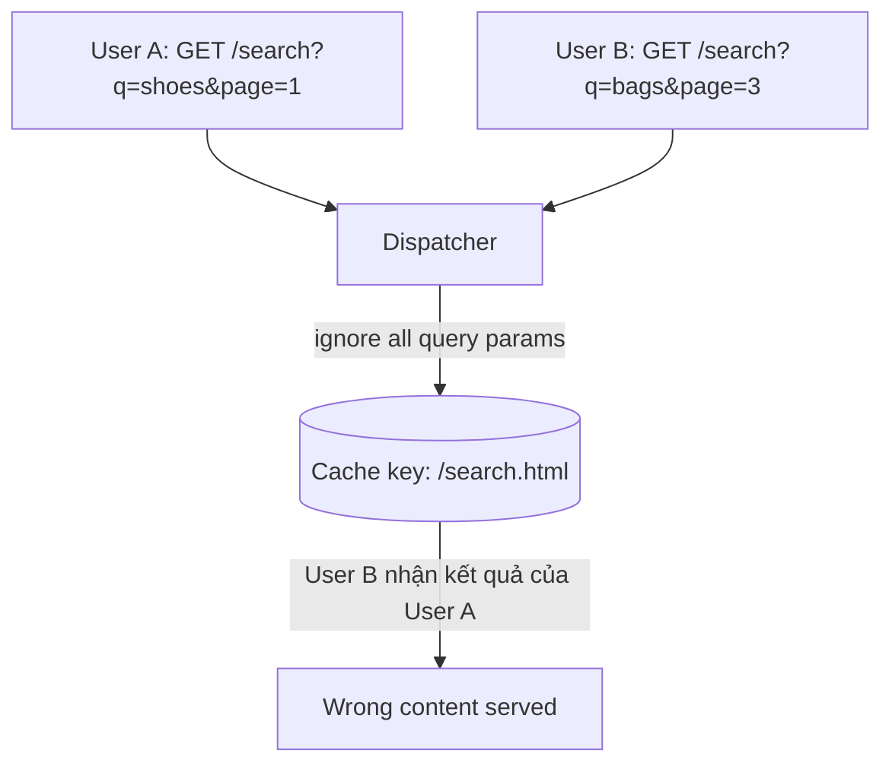
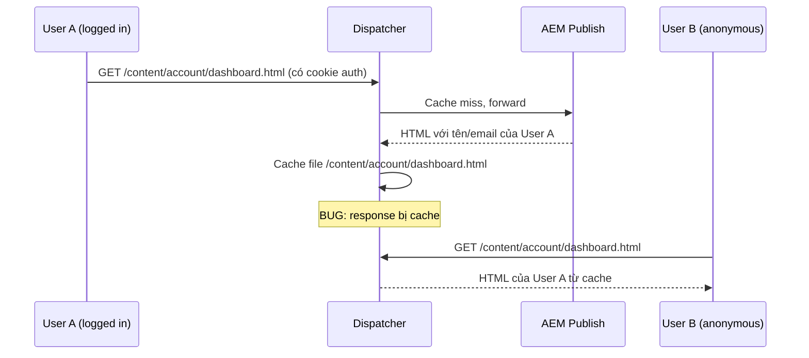
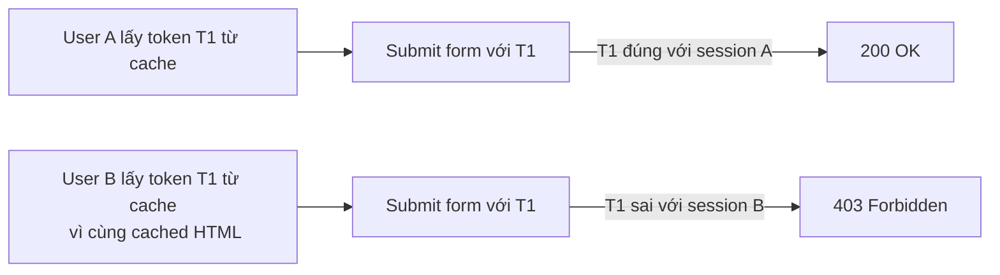
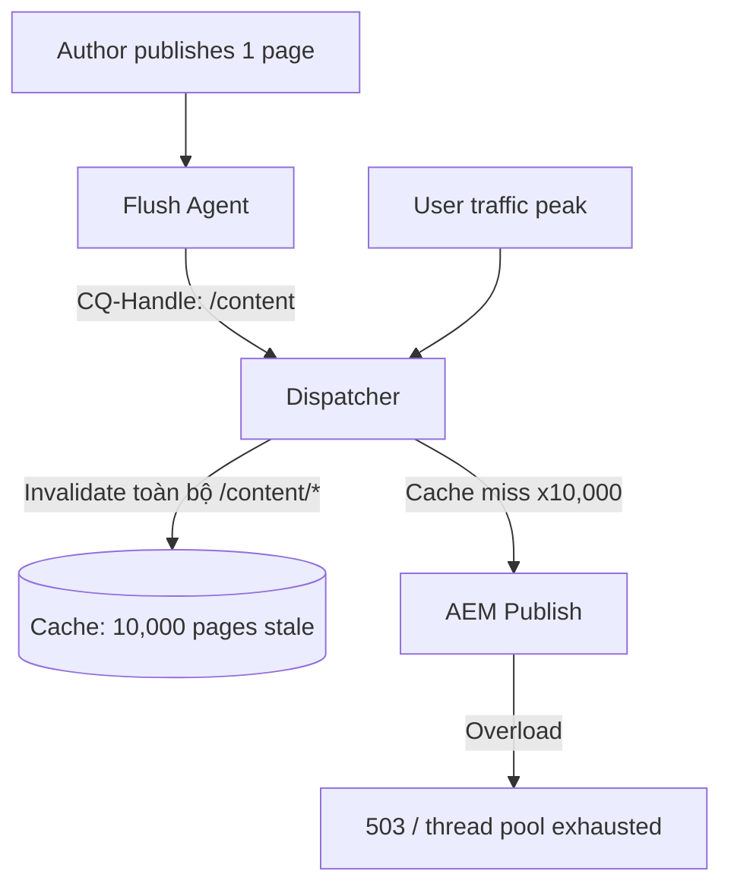
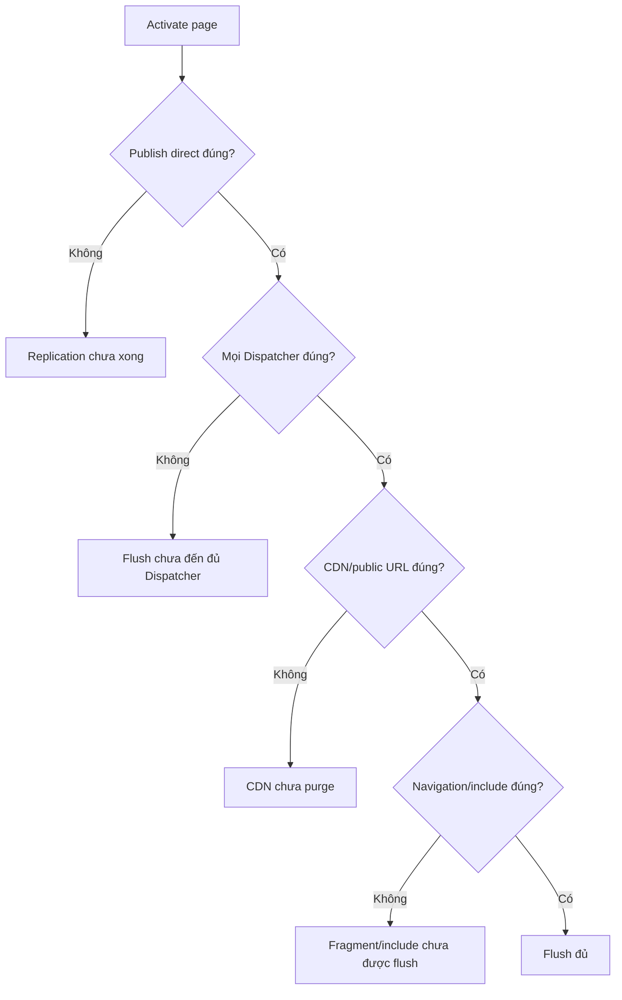
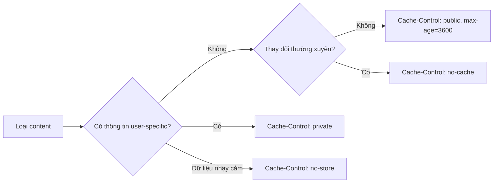
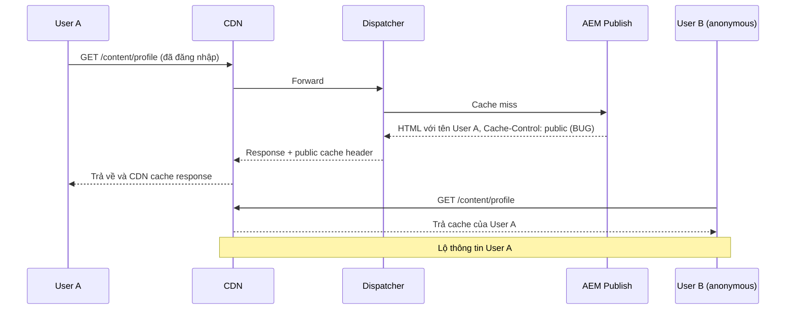
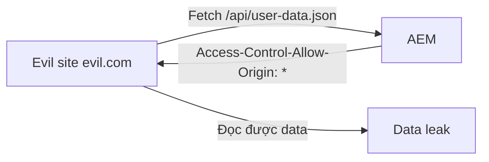
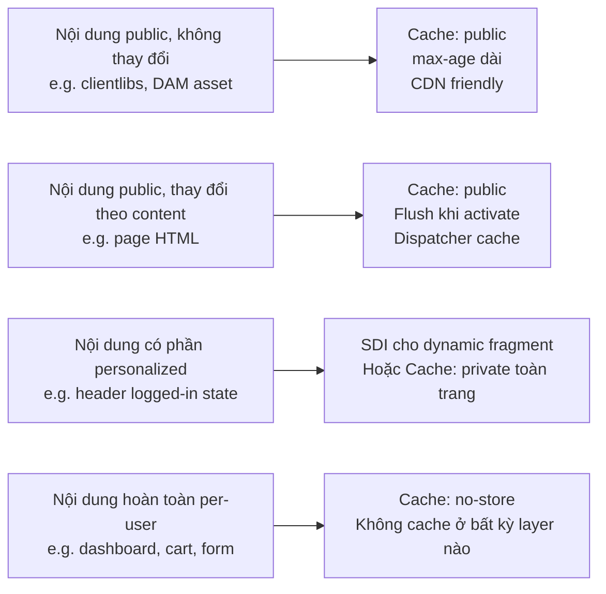

# Dispatcher: Cấu hình Cache và Rủi ro Thường Gặp trong AEM 6.5

> **Rủi ro: Trung bình – Cao.** Dispatcher là lớp phòng thủ đầu tiên của hệ thống AEM. Cấu hình sai ở tầng này không chỉ gây stale content mà còn có thể rò rỉ thông tin người dùng, phá vỡ CSRF protection, tạo ra các lỗ hổng bảo mật nghiêm trọng hoặc làm sập Publish dưới tải cache miss đột biến.

Tài liệu này tập trung vào **ba nhóm rủi ro chính** thường gặp nhất trong thực tế vận hành AEM 6.5 on-premise:

1. Cache những thứ không nên cache.
2. Flush cache không đúng cách.
3. Bỏ qua headers quan trọng.

---

## 1. Cache những thứ không nên cache

### 1.1 Cache request có query string không được lọc đúng

Mặc định Dispatcher không cache request có query string. Tuy nhiên, nhiều team cấu hình `/ignoreUrlParams` quá rộng để tăng cache hit ratio mà không kiểm soát kỹ.

**Cấu hình nguy hiểm:**

```text
/ignoreUrlParams
  {
    /0001 { /glob "*" /type "allow" }
  }
```

Cấu hình này bỏ qua toàn bộ query params và cache tất cả, bao gồm:

- `?wcmmode=disabled` — trang preview của author, không dành cho người dùng.
- `?debug=layout` — debug output.
- `?token=xxx` — token trong một số tích hợp.
- `?page=2&sort=price` — kết quả search/filter khác nhau mỗi request.

Hậu quả:



**Cấu hình an toàn: chỉ ignore tracking params đã biết, deny phần còn lại:**

```text
/ignoreUrlParams
  {
    /0001 { /glob "utm_source"    /type "allow" }
    /0002 { /glob "utm_medium"    /type "allow" }
    /0003 { /glob "utm_campaign"  /type "allow" }
    /0004 { /glob "utm_term"      /type "allow" }
    /0005 { /glob "utm_content"   /type "allow" }
    /0006 { /glob "gclid"         /type "allow" }
    /0007 { /glob "fbclid"        /type "allow" }
    /9999 { /glob "*"             /type "deny" }
  }
```

> Mọi query param ảnh hưởng đến response — pagination, sort, filter, search term — **không được** đưa vào allow list.

---

### 1.2 Cache response của người dùng đã đăng nhập

Đây là rủi ro bảo mật nghiêm trọng nhất liên quan đến Dispatcher. Nếu HTML page của user đã authenticate bị cache và trả cho user khác, thông tin cá nhân có thể bị lộ.

**Cơ chế gây ra:**

AEM khi nhận request từ authenticated user sẽ render nội dung theo quyền của họ. Nếu Dispatcher không phân biệt và cache response này, request tiếp theo từ anonymous user sẽ nhận được nội dung đã được render với quyền của người dùng kia.



**Nguyên nhân thường gặp:**

- Dispatcher không check cookie/auth header trước khi cache.
- AEM không trả `Cache-Control: private` hoặc `no-store` cho page cần authenticate.
- Rule `/cache /rules` allow toàn bộ `/content/*` mà không loại trừ đường dẫn cần auth.

**Cách phòng ngừa:**

Cách 1 — Loại trừ path cần auth khỏi cache rules:

```text
/cache
  {
    /rules
      {
        /0000 { /glob "*"                      /type "deny"  }
        /0100 { /glob "/content/public/*.html" /type "allow" }
        /0101 { /glob "/content/dam/*"         /type "allow" }
        /0102 { /glob "/etc.clientlibs/*"      /type "allow" }
      }
  }
```

Cách 2 — Bypass cache khi có session/auth cookie (Apache/Dispatcher rule):

```text
/cache
  {
    /sessionmanagement
      {
        /directory "/mnt/dispatcher/sessions"
        /encode    "md5"
        /header    "HTTP:authorization"
        /timeout   "800"
      }
  }
```

Cách 3 — Đảm bảo AEM/Sling servlet trả đúng header cho page có auth:

```java
response.setHeader("Cache-Control", "private, no-store");
response.setHeader("Pragma", "no-cache");
```

Hoặc dùng OSGi factory config cho Sling Response Header Filter:

```text
sling.filter.pattern = /content/account/.*
response.header = Cache-Control: private, no-store
```

---

### 1.3 Cache trang/form có chứa CSRF token

CSRF (Cross-Site Request Forgery) token trong AEM được sinh ra per-session hoặc per-request. Token này nằm trong form HTML hoặc response JSON.

**Vấn đề:** Nếu page chứa CSRF token bị cache, mọi user sẽ nhận cùng token cũ. Khi submit form, token không còn hợp lệ nên AEM từ chối request với lỗi `403 Forbidden`.



Ngoài ra, nếu token bị lưu trong cache public, kẻ tấn công có thể lấy token từ cached response và dùng để forge request từ session khác.

**Cách phòng ngừa:**

Không cache page/endpoint có CSRF token:

```text
/rules
  {
    /0000 { /glob "*"                  /type "deny"  }
    /0100 { /glob "/content/site/*.html" /type "allow" }
    /0200 { /glob "/content/forms/*"   /type "deny"  }
  }
```

Đảm bảo AEM trả response cho form pages:

```text
Cache-Control: no-store
```

Với AEM Forms hoặc các component sử dụng `CQ.shared.CSRF`, xác nhận endpoint `/libs/granite/csrf/token.json` không bao giờ bị cache.

---

## 2. Flush Cache không đúng cách

### 2.1 Flush quá rộng — gây áp lực lớn lên Publish

**Flush quá rộng** xảy ra khi flush agent invalidate quá nhiều cache cùng lúc, dẫn đến cache miss đồng loạt. Publish nhận hàng nghìn request cùng lúc khi user access sau đợt flush.

**Trường hợp điển hình:**



**Nguyên nhân thường gặp:**

- Flush agent cấu hình handle là `/content` hoặc `/` thay vì path cụ thể.
- Replication event trigger flush với path quá cao trong hierarchy.
- Workflow hoặc script flush thủ công theo root path.
- `statfileslevel` quá thấp (ví dụ `0`) làm mọi flush invalidate toàn bộ cache.

**Cách kiểm soát:**

Giới hạn path `/invalidate` trong `dispatcher.any` để chỉ cho phép flush các extension an toàn:

```text
/invalidate
  {
    /0000 { /glob "*.html" /type "allow" }
    /0001 { /glob "*.json" /type "allow" }
    /0002 { /glob "*.css"  /type "deny"  }
    /0003 { /glob "*.js"   /type "deny"  }
  }
```

Tăng `statfileslevel` phù hợp với depth của content tree:

```text
/statfileslevel "3"
```

Với `/statfileslevel "3"`, flush `/content/site/en/page` chỉ invalidate từ cấp 3 trở xuống, không ảnh hưởng site khác trên cùng server.

Ví dụ minh họa `statfileslevel`:

```text
/content
├── site-a          ← cấp 1
│   └── en          ← cấp 2
│       └── page    ← cấp 3 — chỉ invalidate đến đây
├── site-b          ← không bị ảnh hưởng
```

**Cấu hình flush agent chính xác:**

```text
CQ-Handle:  /content/site-a/en/homepage
CQ-Action:  Activate
```

Không để `CQ-Handle: /content` hay `CQ-Handle: /` trừ khi thực sự cần flush toàn bộ.

---

### 2.2 Flush không đủ — nội dung cũ hiển thị

**Flush không đủ** xảy ra khi activate page nhưng cache của page đó hoặc các page phụ thuộc không được invalidate đúng.

**Các tình huống điển hình:**

| Tình huống | Hậu quả |
|---|---|
| Flush chỉ đến một Dispatcher trong cụm multi-dispatcher | User đi qua Dispatcher khác vẫn thấy nội dung cũ |
| Navigation/header component được cache riêng | Trang mới publish nhưng menu không cập nhật |
| Fragment/include được cache riêng bởi SDI | Page template đã flush nhưng fragment cũ vẫn hiển thị |
| URL vanity không được invalidate | `/en/about` flush nhưng `/about` vẫn stale |
| Flush agent lỗi network tạm thời | Queue stuck, flush không được gửi |
| CDN cache phía trước không được purge | Dispatcher đã mới nhưng CDN trả bản cũ |

**Kiểm tra flush có đủ không:**



**Đảm bảo flush tất cả Dispatcher:**

Với topology nhiều Dispatcher, mỗi node phải có flush agent riêng hoặc flush agent gọi đến endpoint broadcast:

```text
/etc/replication/agents.author/dispatcher-flush-1
/etc/replication/agents.author/dispatcher-flush-2
```

**Kiểm tra queue:**

```text
AEM → Tools → Replication → Agents on Author
```

Queue stuck biểu hiện ở số lượng items tăng dần, retry errors trong log.

---

### 2.3 Dispatcher Flush Rules — nắm vững để tránh cả hai cực

`/invalidate` rules trong `dispatcher.any` quyết định **loại file nào** được phép invalidate khi Dispatcher nhận request flush.

**Ví dụ rule đầy đủ với giải thích:**

```text
/cache
  {
    /docroot "/mnt/dispatcher/cache"
    /statfileslevel "3"

    /invalidate
      {
        /0000 { /glob "*.html" /type "allow" }
        /0001 { /glob "*.json" /type "allow" }
        /0002 { /glob "*.gif"  /type "deny"  }
        /0003 { /glob "*.png"  /type "deny"  }
        /0004 { /glob "*.jpg"  /type "deny"  }
        /0005 { /glob "*.js"   /type "deny"  }
        /0006 { /glob "*.css"  /type "deny"  }
      }
  }
```

Các extension `deny` sẽ không bị invalidate khi có flush request. Binary asset và clientlibs thường không cần flush theo page activation vì chúng có versioned URL hoặc có cache TTL riêng.

**Kiểm tra rule invalidate có hoạt động đúng:**

```bash
# Gửi flush request thủ công từ host được allow
curl -i -X POST "http://dispatcher-host/dispatcher/invalidate.cache" \
  -H "CQ-Action: Activate" \
  -H "CQ-Handle: /content/site/en/test-page" \
  -H "Content-Type: application/octet-stream" \
  -H "Content-Length: 0"
```

Kiểm tra Dispatcher log để xác nhận invalidation đã xảy ra:

```text
[pid 12345] [client 10.0.0.5:12345] [cms_invalidate] invalidating /content/site/en/test-page.html
```

---

## 3. Bỏ qua Headers quan trọng

### 3.1 Thiếu `Cache-Control: private` cho nội dung cá nhân hóa

HTTP header `Cache-Control` là chuẩn giao tiếp giữa application và tất cả các lớp cache: browser, CDN, proxy, Dispatcher.

Nếu AEM không set header phù hợp cho nội dung personalized, các lớp cache trung gian có thể lưu và phục vụ nội dung đó cho người dùng khác.

**Phân loại `Cache-Control` directives phổ biến:**

| Directive | Ý nghĩa | Dùng cho |
|---|---|---|
| `public` | Có thể cache bởi bất kỳ cache nào | Static public content |
| `private` | Chỉ browser của user mới cache | Nội dung có phần cá nhân hóa |
| `no-cache` | Phải revalidate với server trước khi serve | Content thay đổi thường xuyên |
| `no-store` | Không cache ở bất kỳ đâu | Dữ liệu nhạy cảm, form có token |
| `max-age=N` | Thời gian tính bằng giây trước khi coi là stale | Static assets, CDN |
| `s-maxage=N` | Như `max-age` nhưng chỉ áp dụng cho shared cache (CDN, proxy) | CDN TTL riêng biệt với browser |

**Các trường hợp cần set đúng header:**



**Cách set header trong AEM:**

Trong Sling servlet hoặc component backend:

```java
@Override
protected void doGet(SlingHttpServletRequest request,
                     SlingHttpServletResponse response) throws IOException {
    // Page có section cá nhân hóa
    response.setHeader("Cache-Control", "private, no-store");
    // ...
}
```

Dùng Apache mod_headers trong virtual host config:

```apache
<LocationMatch "^/content/account/.*">
    Header set Cache-Control "private, no-store"
    Header unset ETag
</LocationMatch>
```

Dùng Dispatcher rule để thêm/ghi đè headers trả về:

```text
/cache
  {
    /headers
      {
        "Cache-Control"
        "Expires"
        "Content-Type"
        "ETag"
      }
  }
```

> Mục `/headers` trong Dispatcher config liệt kê các header từ Publish được **lưu kèm** cache response và trả lại cho client. Không liệt kê = header bị bỏ.

**Ví dụ rủi ro thực tế:**



---

### 3.2 Không set `Access-Control-Allow-Origin` chính xác

CORS (Cross-Origin Resource Sharing) headers kiểm soát domain nào được phép gọi tài nguyên AEM từ JavaScript.

**Hai lỗi cấu hình phổ biến:**

**Lỗi 1: Quá rộng — `Access-Control-Allow-Origin: *`**

Cho phép mọi domain đọc response. Chấp nhận được với static public assets (fonts, images không nhạy cảm). Nguy hiểm với:

- JSON API trả data nhạy cảm.
- Endpoint cần authentication.
- Bất kỳ response nào có nội dung per-user.



**Lỗi 2: Thiếu hoàn toàn — CORS error trên browser**

Không có CORS header trong khi frontend domain khác AEM origin:

```text
Access to fetch at 'https://api.brand.com/content/data.json'
from origin 'https://www.brand.com' has been blocked by CORS policy:
No 'Access-Control-Allow-Origin' header is present
```

**Cấu hình đúng trong AEM 6.5:**

Dùng Adobe Granite Cross-Origin Resource Sharing Policy OSGi factory:

```text
PID: com.adobe.granite.cors.impl.CORSPolicyImpl

alloworigin           = ["https://www.brand.com", "https://staging.brand.com"]
alloworiginregexp     = []
allowedpaths          = ["/content/api/.*", "/bin/api/.*"]
exposedheaders        = []
maxage                = 1800
supportedmethods      = ["GET", "HEAD"]
supportscredentials   = false
```

> Không set `alloworigin = ["*"]` cho bất kỳ endpoint nào trả dữ liệu có auth.

Hoặc qua Apache virtual host:

```apache
<LocationMatch "^/content/api/.*">
    Header set Access-Control-Allow-Origin "https://www.brand.com"
    Header set Access-Control-Allow-Methods "GET, HEAD"
    Header set Access-Control-Allow-Headers "Content-Type"
</LocationMatch>
```

**Dispatcher và CORS:**

Nếu Dispatcher cache response, CORS header phải được liệt kê trong `/cache /headers` để được giữ lại:

```text
/cache
  {
    /headers
      {
        "Cache-Control"
        "Content-Type"
        "Access-Control-Allow-Origin"
        "Access-Control-Allow-Methods"
        "Access-Control-Allow-Headers"
        "ETag"
      }
  }
```

Nếu response được cache mà không có CORS header, các request tiếp theo từ browser sẽ bị block mặc dù Publish trả header đúng.

---

### 3.3 Bảng tổng hợp headers quan trọng cần kiểm soát

| Header | Rủi ro khi thiếu/sai | Giá trị an toàn cho các tình huống |
|---|---|---|
| `Cache-Control: private` | Nội dung user bị cache ở CDN/Dispatcher | Dùng cho page có phần personalized |
| `Cache-Control: no-store` | Data nhạy cảm, token bị lưu | Form có CSRF token, session page |
| `Cache-Control: public, max-age=N` | CDN không cache được static asset, tải Publish cao | Static asset có versioned URL |
| `Access-Control-Allow-Origin` | CORS error hoặc data leak tùy cấu hình | Explicit domain list, không dùng `*` với auth endpoint |
| `Vary: Cookie` | Nội dung theo user bị cache và trả lẫn cho nhau | Page vary theo logged-in state |
| `X-Content-Type-Options: nosniff` | Browser MIME sniff attack | Thêm vào mọi response HTML/JSON |
| `Strict-Transport-Security` | Downgrade attack HTTPS→HTTP | Cấu hình ở Apache HTTPS vhost |
| `X-Frame-Options: SAMEORIGIN` | Clickjacking | Thêm vào mọi page AEM |

---

## 4. Quy trình kiểm tra cấu hình Dispatcher trước production

### Checklist bảo mật cache

```text
□ /ignoreUrlParams chỉ allow tracking params đã biết, deny * ở cuối
□ Không có cache /rules allow /content/account/*, /content/user/*, /content/forms/*
□ CSRF token endpoint (/libs/granite/csrf/token.json) bị deny trong cache rules
□ Page có auth đang trả Cache-Control: private hoặc no-store
□ CORS policy dùng explicit domain list, không dùng * cho auth endpoint
□ CORS headers được liệt kê trong /cache /headers để giữ lại khi cache
□ /allowedClients chỉ allow IP cần thiết cho flush endpoint
```

### Checklist flush

```text
□ statfileslevel phù hợp với depth của content tree
□ Flush agent trỏ đúng host/port của từng Dispatcher
□ Tất cả Dispatcher node đều có flush agent riêng
□ /invalidate chỉ allow extension cần thiết (html, json)
□ Flush agent queue không bị stuck
□ Vanity URL path cũng được flush khi page tương ứng activate
□ Navigation/header page được flush khi có thay đổi structure
```

### Lệnh kiểm tra nhanh

Kiểm tra header của response:

```bash
# Kiểm tra public page
curl -si https://www.example.com/content/site/en.html | grep -E "Cache-Control|Age|Via|Set-Cookie"

# Kiểm tra page cần auth
curl -si https://www.example.com/content/account/dashboard.html | grep -E "Cache-Control|Set-Cookie"

# Kiểm tra CORS
curl -si -H "Origin: https://www.example.com" https://api.example.com/content/data.json \
  | grep -E "Access-Control"
```

Kiểm tra cache file còn tồn tại không:

```bash
ls -la /mnt/dispatcher/cache/content/account/dashboard.html
```

Nếu file này tồn tại: có khả năng page cần auth đang bị cache.

---

## 5. Tóm tắt nguyên tắc vận hành



- **Cache aggressively** với nội dung thực sự static và public.
- **Không cache** bất cứ thứ gì liên quan đến session, auth, form token.
- **Flush chính xác** theo path, đủ tất cả Dispatcher, đủ CDN.
- **Kiểm tra headers** là bước verification cuối mỗi lần thay đổi cấu hình.

---

## 6. Tham khảo

- [Dispatcher Security Checklist — Adobe Experience League](https://experienceleague.adobe.com/en/docs/experience-manager-dispatcher/using/getting-started/security-checklist)
- [Dispatcher Cache Configuration](https://experienceleague.adobe.com/en/docs/experience-manager-dispatcher/using/configuring/dispatcher-configuration#configuring-the-dispatcher-cache-cache)
- [Configure Cache Invalidation](https://experienceleague.adobe.com/en/docs/experience-manager-dispatcher/using/configuring/page-invalidate)
- [AEM CORS Configuration](https://experienceleague.adobe.com/en/docs/experience-manager-learn/foundation/security/understand-cross-origin-resource-sharing)
- [HTTP Caching — MDN Web Docs](https://developer.mozilla.org/en-US/docs/Web/HTTP/Caching)
