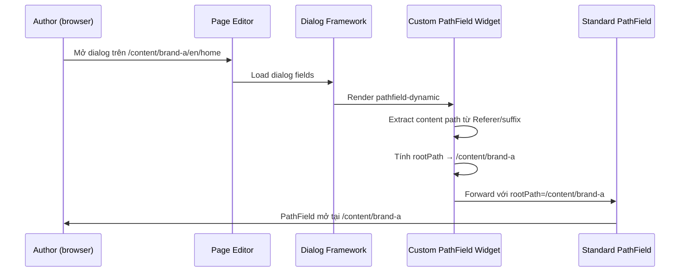

# Custom Dialog Widgets trong AEM 6.5

> Nguồn học chính: [Custom Dialog Widgets | Luca Nerlich](https://lucanerlich.com/aem/ui/custom-dialog-widgets/).
> Note này viết lại bằng tiếng Việt để mình ôn và áp dụng cho AEM 6.5 on-premise.

## Ý chính cần nhớ

Granite UI cung cấp sẵn rất nhiều dialog fields, nhưng các dự án multi-site và multi-tenant thường cần **context-aware widgets** — widget tự điều chỉnh hành vi dựa trên page đang được edit.

Ví dụ thực tế:
- `PathField` tự root về DAM folder của site hiện tại, không phải `/content/dam` chung.
- Asset side panel chỉ hiện assets thuộc brand đang được edit.
- Dropdown options thay đổi theo site/tenant.

Tất cả các kỹ thuật trên đều theo cùng một pattern: **intercept lúc render, inject context, forward sang component gốc**.

---

## Pattern tổng quát

```text
Dialog XML (sling:resourceType → custom widget)
        ↓
Custom Servlet/JSP intercepts request
        ↓
Extract content path (từ Referer header / suffix / request param)
        ↓
Compute dynamic value (rootPath, searchRoot, DataSource options...)
        ↓
Wrap resource với value đã tính, forward sang Granite UI component gốc
        ↓
Author thấy widget đã được configure đúng context
```

### Khi nào dùng cách nào

| Kỹ thuật | Server / Client | Use case |
|---|---|---|
| **Custom PathField widget** (Servlet/JSP) | Server-side | Dynamic `rootPath` cho PathField hoặc PathBrowser |
| **Asset finder searchRoot override** | Client-side (JS) | Dynamic root cho asset side panel |
| **DataSource servlet** | Server-side | Dynamic options cho Select, Autocomplete, TagField |
| **Render Condition** | Server-side | Show/hide toàn bộ field theo context |
| **Dialog clientlib show/hide** | Client-side (JS) | Toggle field visibility theo giá trị field khác |

---

## Dynamic PathField Root Path

### Vấn đề

`PathField` có property `rootPath` xác định nơi path browser mở ra. Trong dialog XML tĩnh:

```xml
<link
    jcr:primaryType="nt:unstructured"
    sling:resourceType="granite/ui/components/coral/foundation/form/pathfield"
    fieldLabel="Select page"
    rootPath="/content/my-site"
    name="./linkPath"/>
```

Single site thì ổn. Nhưng trong dự án multi-site (`/content/brand-a`, `/content/brand-b` dùng chung component), cần `rootPath` tự thay đổi theo site đang được edit.

**Vấn đề cốt lõi:** `rootPath` được đọc server-side lúc render dialog. Không thể thay đổi qua JavaScript client-side.

### Giải pháp: Custom Granite UI field component

Tạo custom `sling:resourceType` wrap standard PathField, tính `rootPath` tại render time dựa trên content path hiện tại.


#### Bước 1: Reference custom widget trong dialog

```xml
<link
    jcr:primaryType="nt:unstructured"
    sling:resourceType="myproject/widgets/pathfield-dynamic"
    fieldLabel="Internal Link"
    name="./linkPath"/>
```

#### Bước 2: Tạo component node

**File:** `ui.apps/.../apps/myproject/widgets/pathfield-dynamic/.content.xml`

```xml
<?xml version="1.0" encoding="UTF-8"?>
<jcr:root xmlns:sling="http://sling.apache.org/jcr/sling/1.0"
          xmlns:nt="http://www.jcp.org/jcr/nt/1.0"
          xmlns:jcr="http://www.jcp.org/jcr/1.0"
    jcr:primaryType="nt:unstructured"
    sling:resourceSuperType="granite/ui/components/coral/foundation/form/pathfield"/>
```

`sling:resourceSuperType` kế thừa toàn bộ PathField behaviour. Custom rendering script của mình chỉ cần intercept, tính `rootPath`, rồi forward về PathField gốc.

#### Bước 3: Implement rendering logic với Sling Servlet

**File:** `core/src/main/java/com/myproject/core/servlets/DynamicPathFieldServlet.java`

```java
package com.myproject.core.servlets;

import org.apache.commons.lang3.StringUtils;
import org.apache.sling.api.SlingHttpServletRequest;
import org.apache.sling.api.SlingHttpServletResponse;
import org.apache.sling.api.resource.Resource;
import org.apache.sling.api.resource.ResourceWrapper;
import org.apache.sling.api.resource.ValueMap;
import org.apache.sling.api.servlets.SlingSafeMethodsServlet;
import org.apache.sling.api.wrappers.ValueMapDecorator;
import org.osgi.service.component.annotations.Component;

import javax.servlet.RequestDispatcher;
import javax.servlet.Servlet;
import javax.servlet.ServletException;
import java.io.IOException;
import java.util.HashMap;

@Component(
    service = Servlet.class,
    property = {
        "sling.servlet.resourceTypes=myproject/widgets/pathfield-dynamic",
        "sling.servlet.methods=GET"
    }
)
public class DynamicPathFieldServlet extends SlingSafeMethodsServlet {

    private static final String DEFAULT_ROOT = "/content";

    @Override
    protected void doGet(SlingHttpServletRequest request, SlingHttpServletResponse response)
            throws ServletException, IOException {

        Resource fieldResource = request.getResource();
        String computedRootPath = computeRootPath(request);

        // Wrap resource với rootPath đã tính
        Resource wrappedResource = createWrappedResource(fieldResource, computedRootPath);

        // Forward sang standard PathField renderer
        RequestDispatcher dispatcher = request.getRequestDispatcher(wrappedResource);
        if (dispatcher != null) {
            request.setAttribute("org.apache.sling.api.include.resource", wrappedResource);
            dispatcher.include(request, response);
        }
    }

    /**
     * Tính root path dựa trên content đang được edit.
     * Extract site root (ví dụ /content/brand-a) từ editor URL.
     */
    private String computeRootPath(SlingHttpServletRequest request) {
        String contentPath = getContentPath(request);
        if (StringUtils.isNotBlank(contentPath) && contentPath.startsWith("/content/")) {
            String[] parts = contentPath.split("/");
            // /content/{site-root} → lấy 2 level đầu
            if (parts.length >= 3) {
                return "/" + parts[1] + "/" + parts[2];
            }
        }
        return DEFAULT_ROOT;
    }

    /**
     * Extract content path từ editor URL.
     * AEM page editor truyền path qua Referer header hoặc 'item' parameter.
     */
    private String getContentPath(SlingHttpServletRequest request) {
        // Thử suffix trước (Granite UI dùng cho content path)
        String suffix = request.getRequestPathInfo().getSuffix();
        if (StringUtils.isNotBlank(suffix)) {
            return suffix;
        }

        // Thử Referer header (editor.html/{content-path})
        String referer = request.getHeader("Referer");
        if (StringUtils.isNotBlank(referer) && referer.contains("/editor.html/")) {
            int startIdx = referer.indexOf("/editor.html/") + "/editor.html".length();
            String path = referer.substring(startIdx);
            int queryIdx = path.indexOf('?');
            if (queryIdx > 0) {
                path = path.substring(0, queryIdx);
            }
            return path;
        }

        // Thử 'item' request parameter
        String item = request.getParameter("item");
        if (StringUtils.isNotBlank(item)) {
            return item;
        }

        return null;
    }

    private Resource createWrappedResource(Resource original, String rootPath) {
        ValueMap originalMap = original.getValueMap();
        HashMap<String, Object> modified = new HashMap<>();
        for (String key : originalMap.keySet()) {
            modified.put(key, originalMap.get(key));
        }
        modified.put("rootPath", rootPath);
        ValueMap wrappedMap = new ValueMapDecorator(modified);

        return new ResourceWrapper(original) {
            @Override
            public ValueMap getValueMap() {
                return wrappedMap;
            }

            @Override
            @SuppressWarnings("unchecked")
            public <AdapterType> AdapterType adaptTo(Class<AdapterType> type) {
                if (type == ValueMap.class) {
                    return (AdapterType) wrappedMap;
                }
                return super.adaptTo(type);
            }
        };
    }
}
```

### Cách hoạt động



### Tuỳ chỉnh root path logic

Method `computeRootPath` có thể adapt cho bất kỳ cấu trúc multi-site nào:

```java
// 2-level site root: /content/{brand}
return "/" + parts[1] + "/" + parts[2];
// → /content/brand-a

// 3-level site root: /content/{brand}/{language}
return "/" + parts[1] + "/" + parts[2] + "/" + parts[3];
// → /content/brand-a/en

// DAM root khớp với site: /content/dam/{brand}
return "/content/dam/" + parts[2];
// → /content/dam/brand-a

// Configurable qua OSGi service — linh hoạt nhất
return siteConfigService.getDamRoot(contentPath);
```

### Truyền thêm config từ dialog XML

Custom widget kế thừa tất cả properties của PathField. Có thể thêm custom properties:

```xml
<link
    jcr:primaryType="nt:unstructured"
    sling:resourceType="myproject/widgets/pathfield-dynamic"
    fieldLabel="Internal Link"
    name="./linkPath"
    filter="hierarchyNotFile"
    rootPathDepth="{Long}2"
    fallbackRoot="/content/my-site"/>
```

Đọc trong Servlet qua `Config`:

```java
Config config = new Config(request.getResource());
int depth        = config.get("rootPathDepth", 2);
String fallback  = config.get("fallbackRoot", "/content");
```

---

## Dynamic Assets Side Panel Root

### Vấn đề

Assets side panel (kéo thả asset từ left rail) mặc định search dưới `/content/dam`. Trong dự án multi-site, author thấy assets của tất cả các sites, khó tìm đúng ảnh.

### Giải pháp: Override searchRoot qua clientlib

Asset finder controllers đăng ký `searchRoot` trên object `Granite.author.ui.assetFinder.registry`. Override nó trong clientlib:

**File:** `ui.apps/.../clientlibs/clientlib-asset-finder/js/assetSearchRoot.js`

**Dynamic override (theo site đang edit):**

```javascript
;(function(window, document, ns) {
    'use strict';

    /**
     * Set Assets side panel search root theo page đang được edit.
     * Extract site name từ editor URL, map sang DAM path tương ứng.
     */
    function getCustomSearchRoot() {
        var pathname = window.location.pathname;
        // Extract site từ /editor.html/content/{site}/...
        if (pathname.indexOf('/editor.html/content/') >= 0) {
            var contentPath = pathname.replace('/editor.html', '');
            var parts = contentPath.split('/');
            if (parts.length >= 3) {
                // Map /content/{site}/... → /content/dam/{site}
                return '/content/dam/' + parts[2];
            }
        }
        return '/content/dam';
    }

    // Đợi asset finder available rồi override
    var checkInterval = setInterval(function() {
        if (ns && ns.ui && ns.ui.assetFinder && ns.ui.assetFinder.registry) {
            var customRoot = getCustomSearchRoot();
            var registry = ns.ui.assetFinder.registry;

            if (registry.Images)    { registry.Images.searchRoot    = customRoot; }
            if (registry.Documents) { registry.Documents.searchRoot = customRoot; }
            if (registry.Video)     { registry.Video.searchRoot     = customRoot; }
            if (registry.Audio)     { registry.Audio.searchRoot     = customRoot; }

            clearInterval(checkInterval);
            console.debug('Asset finder searchRoot set to:', customRoot);
        }
    }, 100);

}(window, document, Granite.author));
```

**Static override (fixed path, đơn giản hơn):**

```javascript
;(function(window, document, ns) {
    'use strict';

    var customSearchRoot = '/content/dam/myproject';
    ns.ui.assetFinder.registry.Images.searchRoot = customSearchRoot;
    console.debug('Asset finder searchRoot set to:', customSearchRoot);

}(window, document, Granite.author));
```

### Clientlib setup

**File:** `ui.apps/.../clientlibs/clientlib-asset-finder/.content.xml`

```xml
<?xml version="1.0" encoding="UTF-8"?>
<jcr:root xmlns:jcr="http://www.jcp.org/jcr/1.0"
          xmlns:cq="http://www.day.com/jcr/cq/1.0"
    jcr:primaryType="cq:ClientLibraryFolder"
    allowProxy="{Boolean}true"
    categories="[cq.authoring.dialog,cq.authoring.editor]"/>
```

**File:** `js.txt`

```text
#base=js
assetSearchRoot.js
```

> Category `cq.authoring.editor` đảm bảo script load khi page editor mở, trước khi asset finder khởi tạo.

---

## Dynamic DataSource cho Select Fields

Khi options của dropdown cần thay đổi theo context, dùng DataSource servlet:

**File:** `core/.../servlets/SiteTagsDataSourceServlet.java`

```java
@Component(
    service = Servlet.class,
    property = {
        "sling.servlet.resourceTypes=myproject/datasource/site-tags",
        "sling.servlet.methods=GET"
    }
)
public class SiteTagsDataSourceServlet extends SlingSafeMethodsServlet {

    @Override
    protected void doGet(SlingHttpServletRequest request, SlingHttpServletResponse response) {
        ResourceResolver resolver = request.getResourceResolver();
        String suffix = request.getRequestPathInfo().getSuffix();

        // Xác định site từ content path
        String siteName = extractSiteName(suffix);
        String tagRoot = "/content/cq:tags/" + siteName;

        List<Map.Entry<String, String>> options = new ArrayList<>();
        Resource tagResource = resolver.getResource(tagRoot);
        if (tagResource != null) {
            for (Resource tag : tagResource.getChildren()) {
                options.add(Map.entry(
                    tag.getName(),
                    tag.getValueMap().get("jcr:title", tag.getName())
                ));
            }
        }

        // Convert sang DataSource
        DataSource ds = new SimpleDataSource(
            new TransformIterator<>(options.iterator(), entry -> {
                ValueMap vm = new ValueMapDecorator(new HashMap<>());
                vm.put("value", entry.getKey());
                vm.put("text", entry.getValue());
                return new ValueMapResource(resolver, new ResourceMetadata(),
                    JcrConstants.NT_UNSTRUCTURED, vm);
            })
        );
        request.setAttribute(DataSource.class.getName(), ds);
    }

    private String extractSiteName(String suffix) {
        if (suffix != null && suffix.startsWith("/content/")) {
            String[] parts = suffix.split("/");
            if (parts.length >= 3) return parts[2];
        }
        return "global";
    }
}
```

**Dùng trong dialog:**

```xml
<category
    jcr:primaryType="nt:unstructured"
    sling:resourceType="granite/ui/components/coral/foundation/form/select"
    fieldLabel="Category"
    name="./category">

    <datasource
        jcr:primaryType="nt:unstructured"
        sling:resourceType="myproject/datasource/site-tags"/>
</category>
```

---

## Best practices

### 1. Ưu tiên server-side cho logic nhạy cảm

`rootPath` của PathField và DataSource options nên tính server-side. Client-side override có thể bị bypass bởi user biết cách.

### 2. Làm root path logic configurable

Hardcode pattern path (ví dụ "lấy 2 segment đầu") rất fragile. Nên dùng OSGi service map content path sang root path, configurable per run mode:

```java
@ObjectClassDefinition(name = "Site Path Configuration")
@interface SitePathConfig {

    @AttributeDefinition(name = "Content root depth",
        description = "Số path segments cho content root")
    int contentRootDepth() default 2;

    @AttributeDefinition(name = "DAM root pattern",
        description = "Pattern cho DAM root. Dùng {site} làm placeholder.")
    String damRootPattern() default "/content/dam/{site}";
}
```

### 3. Test với nhiều sites

Custom widgets cần test trong context của nhiều sites khác nhau để verify path computation đúng cho mọi tenant.

### 4. Dùng `sling:resourceSuperType` — không reimlement từ đầu

Luôn extend Granite UI component gốc qua `sling:resourceSuperType`. Widget sẽ tự kế thừa mọi bugfix và improvement từ Adobe trong tương lai.

### 5. Luôn có fallback

```java
// Tốt: có fallback an toàn
return StringUtils.isNotBlank(rootPath) ? rootPath : "/content";

// Tránh: trả về null → PathField bị broken
return rootPath;
```

---

## Pitfalls thường gặp

| Vấn đề | Nguyên nhân / Cách xử lý |
|---|---|
| PathField luôn hiện `/content` cho mọi sites | Kiểm tra Referer header hoặc suffix có chứa content path không; verify `computeRootPath` logic |
| Widget chạy trong CRXDE nhưng sau deploy thì không | Đảm bảo widget component và servlet được include trong content package và `filter.xml` |
| Asset finder override không hoạt động | Kiểm tra clientlib category là `cq.authoring.editor`; kiểm tra `Granite.author.ui.assetFinder.registry` tồn tại trước khi override |
| PathField vẫn dùng hardcoded `rootPath` | Đảm bảo dialog reference đúng custom `sling:resourceType`, không phải `granite/.../pathfield` |
| DataSource trả về options rỗng | Kiểm tra suffix path được extract đúng; thêm log để xem computed tag root |
| Custom widget bị break sau AEM upgrade | Nhờ `sling:resourceSuperType`, upgrade parent component sẽ tự kế thừa — không cần sửa gì |

---

## Checklist khi implement thật

1. [ ] Xác định loại widget cần custom: PathField / Asset finder / DataSource.
2. [ ] Tạo component node với `sling:resourceSuperType` trỏ về Granite UI component gốc.
3. [ ] Viết Servlet (hoặc JSP) với `sling.servlet.resourceTypes` = path component vừa tạo.
4. [ ] Implement `computeRootPath` / `getCustomSearchRoot` / DataSource logic.
5. [ ] Đọc config từ dialog XML node qua `Config` class nếu cần thêm options.
6. [ ] Luôn có fallback khi content path không detect được.
7. [ ] Thêm component path vào `filter.xml` của content package.
8. [ ] Deploy, mở page editor, kiểm tra widget hoạt động đúng cho từng site.
9. [ ] Test với user không phải admin để đảm bảo không phụ thuộc vào permissions cao.

---

## See also

- [Coral UI](./coral-ui.md) - Client-side dialog scripting với Coral UI 3
- [Overlays](./overlays.md) - Custom UI có sẵn của AEM
- [Render Conditions](./render-conditions.md) - Show/hide fields theo context
- [Touch UI](./touch-ui-2.md) - Author UI architecture
- Component dialogs - Tất cả dialog field types kể cả PathField
- Servlets - DataSource servlet patterns
- Client libraries - Loading authoring clientlibs

---

## Tài liệu tham khảo

- [Custom Dialog Widgets | Luca Nerlich](https://lucanerlich.com/aem/ui/custom-dialog-widgets/)
- [Granite UI PathField API](https://developer.adobe.com/experience-manager/reference-materials/6-5/granite-ui/api/jcr_root/libs/granite/ui/components/coral/foundation/form/pathfield/index.html)
- [Sling ResourceWrapper](https://sling.apache.org/apidocs/sling11/org/apache/sling/api/resource/ResourceWrapper.html)
- [ValueMapDecorator](https://sling.apache.org/apidocs/sling11/org/apache/sling/api/wrappers/ValueMapDecorator.html)
