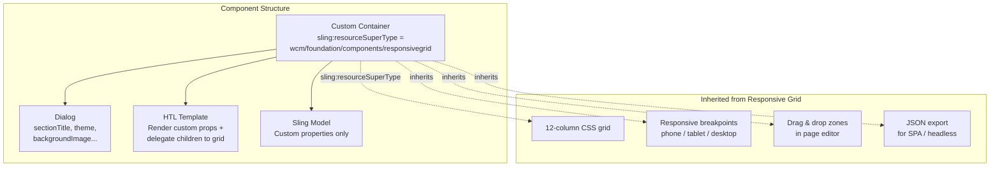
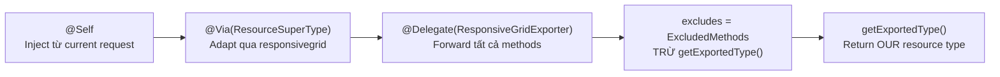

# Extending the Responsive Grid — AEM 6.5 On-Premise

> Phạm vi: AEM 6.5 on-premise, Touch UI, Editable Templates, Java 8/11

---

Responsive Grid (Layout Container) là container cốt lõi của AEM page editor — xử lý drag-and-drop, responsive breakpoints, và 12-column grid layout. Khi cần container component **vừa có dialog properties riêng** (title, background, theme...) **vừa cho phép drop child components**, phải extend responsive grid.

---

## 1. Khi Nào Dùng Custom Container

| Scenario | Approach |
|---|---|
| Component đơn giản, không có children | Component thông thường với dialog |
| Container không cần properties riêng | Dùng built-in Layout Container (`wcm/foundation/components/responsivegrid`) |
| Container có properties riêng + children drag-drop | **Extend responsive grid** (bài này) |
| Container có fixed child slots (không drag-drop) | `@ChildResource` + `data-sly-resource` trong HTL |

**Ví dụ thực tế:**
- **Section container** — background image, color theme, anchor ID + n content children
- **Accordion / Tab container** — variant selector + n panel children
- **Footer container** — title, logo + n link column children
- **Carousel** — autoplay settings, transition effect + n slide children

---

## 2. Cách Responsive Grid Hoạt Động



Responsive grid backed bởi `ResponsiveGrid` Sling Model và component `wcm/foundation/components/responsivegrid`. Cung cấp:

- CSS grid 12 cột (`aem-Grid--12`)
- Responsive breakpoints configurable qua template policies
- Column class names cho mỗi child (`aem-GridColumn--default--6`)
- Drag & drop zones trong page editor
- JSON export cho SPA scenarios

Khi extend, **tất cả** tính năng trên được kế thừa qua `sling:resourceSuperType`.

---

## 3. Step-by-Step: Tạo Custom Container

### 3.1 Component definition

```xml
<!-- ui.apps/.../components/section-container/.content.xml -->
<?xml version="1.0" encoding="UTF-8"?>
<jcr:root xmlns:cq="http://www.day.com/jcr/cq/1.0"
          xmlns:jcr="http://www.jcp.org/jcr/1.0"
          xmlns:sling="http://sling.apache.org/jcr/sling/1.0"
    cq:icon="layoutContainer"
    jcr:description="Section container with background and child components"
    jcr:primaryType="cq:Component"
    jcr:title="Section Container"
    sling:resourceSuperType="wcm/foundation/components/responsivegrid"
    componentGroup="My Project - Containers"/>
```

`sling:resourceSuperType="wcm/foundation/components/responsivegrid"` là dòng quyết định — cho component toàn bộ grid functionality.

### 3.2 Dialog

Dialog chỉ chứa properties riêng của container, không liên quan đến grid hay child components:

```xml
<!-- ui.apps/.../components/section-container/_cq_dialog/.content.xml -->
<?xml version="1.0" encoding="UTF-8"?>
<jcr:root xmlns:jcr="http://www.jcp.org/jcr/1.0"
          xmlns:sling="http://sling.apache.org/jcr/sling/1.0"
          xmlns:granite="http://www.adobe.com/jcr/granite/1.0"
    jcr:primaryType="nt:unstructured"
    jcr:title="Section Container"
    sling:resourceType="cq/gui/components/authoring/dialog">
    <content jcr:primaryType="nt:unstructured"
             sling:resourceType="granite/ui/components/coral/foundation/container">
        <items jcr:primaryType="nt:unstructured">
            <tabs jcr:primaryType="nt:unstructured"
                  sling:resourceType="granite/ui/components/coral/foundation/tabs">
                <items jcr:primaryType="nt:unstructured">

                    <properties jcr:primaryType="nt:unstructured"
                                jcr:title="Properties"
                                sling:resourceType="granite/ui/components/coral/foundation/container"
                                margin="{Boolean}true">
                        <items jcr:primaryType="nt:unstructured">

                            <sectionTitle
                                jcr:primaryType="nt:unstructured"
                                sling:resourceType="granite/ui/components/coral/foundation/form/textfield"
                                fieldLabel="Section Title"
                                name="./sectionTitle"/>

                            <anchorId
                                jcr:primaryType="nt:unstructured"
                                sling:resourceType="granite/ui/components/coral/foundation/form/textfield"
                                fieldLabel="Anchor ID"
                                fieldDescription="For in-page navigation (e.g. #features)"
                                name="./anchorId"/>

                            <backgroundImage
                                jcr:primaryType="nt:unstructured"
                                sling:resourceType="granite/ui/components/coral/foundation/form/pathfield"
                                fieldLabel="Background Image"
                                rootPath="/content/dam"
                                name="./backgroundImage"/>

                            <theme
                                jcr:primaryType="nt:unstructured"
                                sling:resourceType="granite/ui/components/coral/foundation/form/select"
                                fieldLabel="Theme"
                                name="./theme">
                                <items jcr:primaryType="nt:unstructured">
                                    <light jcr:primaryType="nt:unstructured"
                                           text="Light" value="light"
                                           selected="{Boolean}true"/>
                                    <dark jcr:primaryType="nt:unstructured"
                                          text="Dark" value="dark"/>
                                    <accent jcr:primaryType="nt:unstructured"
                                            text="Accent" value="accent"/>
                                </items>
                            </theme>

                            <fullWidth
                                jcr:primaryType="nt:unstructured"
                                sling:resourceType="granite/ui/components/coral/foundation/form/checkbox"
                                text="Full-width layout"
                                name="./fullWidth"
                                value="{Boolean}true"/>

                        </items>
                    </properties>

                </items>
            </tabs>
        </items>
    </content>
</jcr:root>
```

### 3.3 HTL Template

Render custom properties, delegate child rendering cho responsive grid:

```html
<!-- ui.apps/.../components/section-container/section-container.html -->
<sly data-sly-use.model="com.myproject.core.models.SectionContainerModel"/>

<section class="section-container section-container--${model.theme}"
         id="${model.anchorId}"
         data-sly-test="${!model.empty}"
         style="${model.backgroundImage ?
             'background-image: url(' @ join='' @ join=model.backgroundImage @ join=')' : ''}">

    <div class="section-container__inner
                ${model.fullWidth ? 'section-container__inner--full' : ''}">

        <h2 data-sly-test="${model.sectionTitle}"
            class="section-container__title">
            ${model.sectionTitle}
        </h2>

        <!--/* Delegate child rendering to the responsive grid */-->
        <sly data-sly-resource="${resource
            @ resourceSuperType='wcm/foundation/components/responsivegrid'}"/>

    </div>
</section>

<!--/* Empty placeholder for page editor */-->
<div data-sly-test="${model.empty && wcmmode.edit}"
     class="cq-placeholder"
     data-emptytext="Section Container — Drag components here">
</div>
```

Dòng quan trọng nhất:

```html
<sly data-sly-resource="${resource
    @ resourceSuperType='wcm/foundation/components/responsivegrid'}"/>
```

Delegate rendering child components sang responsive grid HTL — output drag-and-drop zone trong edit mode và child components với grid CSS classes.

### 3.4 Sling Model

Model chỉ hold properties riêng của container. Không iterate hay process child components — để grid framework xử lý.

```java
package com.myproject.core.models;

import org.apache.commons.lang3.StringUtils;
import org.apache.sling.api.SlingHttpServletRequest;
import org.apache.sling.api.resource.Resource;
import org.apache.sling.models.annotations.DefaultInjectionStrategy;
import org.apache.sling.models.annotations.Model;
import org.apache.sling.models.annotations.injectorspecific.SlingObject;
import org.apache.sling.models.annotations.injectorspecific.ValueMapValue;

@Model(
    adaptables = SlingHttpServletRequest.class,
    defaultInjectionStrategy = DefaultInjectionStrategy.OPTIONAL
)
public class SectionContainerModel {

    @ValueMapValue
    private String sectionTitle;

    @ValueMapValue
    private String anchorId;

    @ValueMapValue
    private String backgroundImage;

    @ValueMapValue
    private String theme;

    @ValueMapValue
    private Boolean fullWidth;

    @SlingObject
    private Resource resource;

    public String getSectionTitle() {
        return sectionTitle;
    }

    public String getAnchorId() {
        return anchorId;
    }

    public String getBackgroundImage() {
        return backgroundImage;
    }

    public String getTheme() {
        return theme != null ? theme : "light";
    }

    public boolean isFullWidth() {
        return Boolean.TRUE.equals(fullWidth);
    }

    public boolean isEmpty() {
        return StringUtils.isAllBlank(sectionTitle, backgroundImage)
            && !resource.hasChildren();
    }
}
```

### 3.5 Template Policy (allowed components)

Cấu hình child components nào được phép drop vào container qua template editor:

1. Mở editable template trong **Template Editor**
2. Switch sang **Structure** mode
3. Click vào Section Container
4. Mở **Policy** dialog
5. Tại **Allowed Components** — chọn component groups hoặc components cụ thể
6. Tại **Layout** — cấu hình responsive breakpoints và column count

---

## 4. SPA / Headless: JSON Export với ContainerExporter

Cho SPA Editor (React/Angular) hoặc headless, container phải export custom properties **kèm** responsive grid metadata (child items, column classes) dưới dạng JSON.

### @Delegate pattern (Lombok)

`ContainerExporter` có các method `getExportedItems()`, `getExportedItemsOrder()`, `getColumnClassNames()`... đã implemented trong `ResponsiveGrid`. Dùng Lombok `@Delegate` để forward thay vì reimplementing:

```java
package com.myproject.core.models;

import com.adobe.cq.export.json.ComponentExporter;
import com.adobe.cq.export.json.ContainerExporter;
import com.adobe.cq.export.json.ExporterConstants;
import com.day.cq.wcm.foundation.model.responsivegrid.ResponsiveGrid;
import com.day.cq.wcm.foundation.model.responsivegrid.export.ResponsiveGridExporter;
import com.fasterxml.jackson.annotation.JsonIgnore;
import com.fasterxml.jackson.annotation.JsonProperty;
import lombok.experimental.Delegate;
import org.apache.sling.api.SlingHttpServletRequest;
import org.apache.sling.models.annotations.DefaultInjectionStrategy;
import org.apache.sling.models.annotations.Exporter;
import org.apache.sling.models.annotations.Model;
import org.apache.sling.models.annotations.Via;
import org.apache.sling.models.annotations.injectorspecific.Self;
import org.apache.sling.models.annotations.injectorspecific.ValueMapValue;
import org.apache.sling.models.annotations.via.ResourceSuperType;

@Model(
    adaptables = SlingHttpServletRequest.class,
    adapters = {
        SectionContainerExporter.class,
        ComponentExporter.class,
        ContainerExporter.class
    },
    resourceType = SectionContainerExporter.RESOURCE_TYPE,
    defaultInjectionStrategy = DefaultInjectionStrategy.OPTIONAL
)
@Exporter(
    name = ExporterConstants.SLING_MODEL_EXPORTER_NAME,
    extensions = ExporterConstants.SLING_MODEL_EXTENSION
)
public class SectionContainerExporter implements ComponentExporter, ContainerExporter {

    public static final String RESOURCE_TYPE = "myproject/components/section-container";

    /**
     * Exclude getExportedType() — phải return resource type CỦA MÌNH,
     * không phải của responsive grid.
     */
    interface ExcludedMethods {
        String getExportedType();
    }

    @Self
    @Via(type = ResourceSuperType.class)
    @Delegate(types = ResponsiveGridExporter.class, excludes = ExcludedMethods.class)
    @JsonIgnore
    private ResponsiveGrid responsiveGrid;

    @ValueMapValue
    private String sectionTitle;

    @ValueMapValue
    private String anchorId;

    @ValueMapValue
    private String backgroundImage;

    @ValueMapValue
    private String theme;

    @ValueMapValue
    private Boolean fullWidth;

    @JsonProperty("sectionTitle")
    public String getSectionTitle() { return sectionTitle; }

    public String getAnchorId() { return anchorId; }

    public String getBackgroundImage() { return backgroundImage; }

    public String getTheme() { return theme != null ? theme : "light"; }

    public boolean isFullWidth() { return Boolean.TRUE.equals(fullWidth); }

    @Override
    public String getExportedType() {
        return RESOURCE_TYPE;
    }
}
```

### @Delegate annotations giải thích



| Annotation | Mục đích |
|---|---|
| `@Self` | Inject từ current adaptable (request) |
| `@Via(type = ResourceSuperType.class)` | Adapt qua resource super type (`responsivegrid`) |
| `@Delegate(types = ..., excludes = ...)` | Lombok generate forwarding methods cho tất cả method **trừ** excluded |
| `@JsonIgnore` | Ngăn Jackson serialize field — delegated methods đã handle serialization |

`ExcludedMethods` interface là **critical** — thiếu nó, `getExportedType()` trả về `wcm/foundation/components/responsivegrid` thay vì custom type → hỏng SPA component mapping.

### JSON output

Request `.model.json` trên component:

```json
{
    "sectionTitle": "Our Features",
    "anchorId": "features",
    "backgroundImage": "/content/dam/myproject/images/features-bg.jpg",
    "theme": "dark",
    "fullWidth": true,
    "columnClassNames": {
        "card1": "aem-GridColumn aem-GridColumn--default--4",
        "card2": "aem-GridColumn aem-GridColumn--default--4",
        "card3": "aem-GridColumn aem-GridColumn--default--4"
    },
    "columnCount": 12,
    "gridClassNames": "aem-Grid aem-Grid--12 aem-Grid--default--12",
    ":type": "myproject/components/section-container",
    ":itemsOrder": ["card1", "card2", "card3"],
    ":items": {
        "card1": {
            "title": "Feature One",
            ":type": "myproject/components/feature-card"
        },
        "card2": { ... },
        "card3": { ... }
    }
}
```

Custom properties (`sectionTitle`, `theme`...) nằm cạnh grid metadata (`:items`, `columnClassNames`).

---

## 5. Không Dùng Lombok — Manual Delegation

Nếu project không có Lombok, delegate thủ công:

```java
package com.myproject.core.models;

import com.adobe.cq.export.json.ComponentExporter;
import com.adobe.cq.export.json.ContainerExporter;
import com.adobe.cq.export.json.ExporterConstants;
import com.day.cq.wcm.foundation.model.responsivegrid.ResponsiveGrid;
import org.apache.sling.api.SlingHttpServletRequest;
import org.apache.sling.models.annotations.DefaultInjectionStrategy;
import org.apache.sling.models.annotations.Exporter;
import org.apache.sling.models.annotations.Model;
import org.apache.sling.models.annotations.Via;
import org.apache.sling.models.annotations.injectorspecific.Self;
import org.apache.sling.models.annotations.injectorspecific.ValueMapValue;
import org.apache.sling.models.annotations.via.ResourceSuperType;

import java.util.Map;

@Model(
    adaptables = SlingHttpServletRequest.class,
    adapters = {
        ManualContainerModel.class,
        ComponentExporter.class,
        ContainerExporter.class
    },
    resourceType = ManualContainerModel.RESOURCE_TYPE,
    defaultInjectionStrategy = DefaultInjectionStrategy.OPTIONAL
)
@Exporter(
    name = ExporterConstants.SLING_MODEL_EXPORTER_NAME,
    extensions = ExporterConstants.SLING_MODEL_EXTENSION
)
public class ManualContainerModel implements ComponentExporter, ContainerExporter {

    public static final String RESOURCE_TYPE = "myproject/components/manual-container";

    @Self
    @Via(type = ResourceSuperType.class)
    private ResponsiveGrid responsiveGrid;

    @ValueMapValue
    private String title;

    public String getTitle() { return title; }

    // --- Delegate ContainerExporter methods ---

    @Override
    public Map<String, ? extends ComponentExporter> getExportedItems() {
        return responsiveGrid.getExportedItems();
    }

    @Override
    public String[] getExportedItemsOrder() {
        return responsiveGrid.getExportedItemsOrder();
    }

    // --- Delegate ResponsiveGridExporter methods ---

    public Map<String, String> getColumnClassNames() {
        return responsiveGrid.getColumnClassNames();
    }

    public int getColumnCount() {
        return responsiveGrid.getColumnCount();
    }

    public String getGridClassNames() {
        return responsiveGrid.getGridClassNames();
    }

    @Override
    public String getExportedType() {
        return RESOURCE_TYPE;
    }
}
```

Lombok `@Delegate` ít boilerplate hơn đáng kể. Nếu project đã dùng Lombok (phần lớn AEM projects), ưu tiên dùng nó.

---

## 6. Responsive Breakpoints

Breakpoints và column count cấu hình qua **template policies**, không code:

1. Template Editor → **Structure** mode
2. Click container → **Policy** dialog
3. Cấu hình:

| Setting | Default | Mô tả |
|---|---|---|
| Column count | 12 | Số cột grid |
| Phone breakpoint | 768px | Dưới ngưỡng → phone layout |
| Tablet breakpoint | 1200px | Dưới ngưỡng → tablet layout |
| Allowed components | (all) | Component groups/names cho phép drop |

### CSS class pattern

```
aem-Grid--{columns}                   → aem-Grid--12
aem-Grid--default--{columns}          → aem-Grid--default--12
aem-GridColumn--default--{span}       → aem-GridColumn--default--6
aem-GridColumn--phone--{span}         → aem-GridColumn--phone--12
aem-GridColumn--offset--default--{n}  → aem-GridColumn--offset--default--1
```

### Include grid CSS

Grid CSS **phải** được include trên page — thiếu sẽ mất toàn bộ layout:

**Cách 1 — Dùng clientlib trực tiếp trong page component:**

```html
<!-- customheaderlibs.html -->
<sly data-sly-use.clientlib="/libs/granite/sightly/templates/clientlib.html"
     data-sly-call="${clientlib.css
         @ categories='wcm.foundation.components.responsivegrid'}"/>
```

**Cách 2 — Embed vào site clientlib:**

```css
/* css.txt: #base=css */
/* grid.css */
@import url('/etc.clientlibs/wcm/foundation/clientlibs/grid/grid.css');
```

---

## 7. JCR Node Structure

```
/content/myproject/en/home/jcr:content/root/container/section-container
├── sling:resourceType = "myproject/components/section-container"
├── sectionTitle       = "Our Features"
├── theme              = "dark"
├── backgroundImage    = "/content/dam/myproject/images/bg.jpg"
├── anchorId           = "features"
├── fullWidth          = true
│
├── cq:responsive/                  ← Responsive layout data (per breakpoint)
│   ├── default/
│   └── phone/
│
├── card1/                          ← Child component 1
│   ├── sling:resourceType = "myproject/components/feature-card"
│   ├── title = "Feature One"
│   └── ...
├── card2/                          ← Child component 2
│   └── ...
└── card3/                          ← Child component 3
    └── ...
```

Node `cq:responsive` lưu layout information (column spans per breakpoint) mà author set qua **Layout mode** trong page editor.

---

## 8. AEM 6.5: Layout Mode Cho Custom Container

Trên AEM 6.5, có trường hợp custom container extend responsive grid nhưng Layout mode (resize columns) không hoạt động. Nguyên nhân: editor JS chỉ nhận diện component có resourceType chính xác là `wcm/foundation/components/responsivegrid`.

**Fix — override `isResponsiveGrid()` trong editor clientlib:**

```javascript
// clientlib category: cq.authoring.editor
(function ($, ns, channel, window, undefined) {
    var originalFn = ns.responsive.isResponsiveGrid;

    ns.responsive.isResponsiveGrid = function (editable) {
        if (originalFn.call(this, editable)) {
            return true;
        }
        // Custom containers extending responsive grid
        return editable.type === 'myproject/components/section-container'
            || editable.type === 'myproject/components/tab-container';
    };
}(jQuery, Granite.author, jQuery(document), this));
```

Tạo clientlib dưới component hoặc `/apps/myproject/clientlibs/author`:

```xml
<!-- .content.xml -->
<jcr:root xmlns:cq="http://www.day.com/jcr/cq/1.0"
          xmlns:jcr="http://www.jcp.org/jcr/1.0"
    jcr:primaryType="cq:ClientLibraryFolder"
    categories="[cq.authoring.editor]">
</jcr:root>
```

```
// js.txt
#base=js
responsive-fix.js
```

---

## 9. SPA Frontend: React Component

Cho SPA Editor projects, React component extend `ResponsiveGrid` từ Adobe's editable components:

```jsx
import React from 'react';
import {
    MapTo,
    ResponsiveGrid,
    withComponentMappingContext
} from '@adobe/aem-react-editable-components';

const SectionContainerConfig = {
    emptyLabel: 'Section Container',
    isEmpty: (props) => {
        return !props || !props[':itemsOrder']
            || props[':itemsOrder'].length === 0;
    }
};

class SectionContainer extends ResponsiveGrid {

    render() {
        if (SectionContainerConfig.isEmpty(this.props)) {
            return (
                <div className="section-container section-container--empty">
                    <p>Section Container — Drag components here</p>
                </div>
            );
        }

        const bgStyle = this.props.backgroundImage
            ? { backgroundImage: `url(${this.props.backgroundImage})` }
            : {};

        return (
            <section
                className={`section-container section-container--${this.props.theme || 'light'}`}
                id={this.props.anchorId}
                style={bgStyle}
            >
                <div className={`section-container__inner
                    ${this.props.fullWidth ? 'section-container__inner--full' : ''}`}>

                    {this.props.sectionTitle && (
                        <h2 className="section-container__title">
                            {this.props.sectionTitle}
                        </h2>
                    )}

                    {/* Render responsive grid children */}
                    <div {...this.containerProps}>
                        {this.childComponents}
                        {this.placeholderComponent}
                    </div>
                </div>
            </section>
        );
    }
}

export default MapTo('myproject/components/section-container')(
    withComponentMappingContext(SectionContainer),
    SectionContainerConfig
);
```

| Pattern | Mục đích |
|---|---|
| `extends ResponsiveGrid` | Kế thừa grid rendering logic |
| `this.childComponents` | Render tất cả child components do author drop |
| `this.placeholderComponent` | Render drag-and-drop placeholder trong edit mode |
| `this.containerProps` | Props cho grid container div (CSS classes, data attributes) |
| `MapTo('resource/type')` | Map React component sang AEM resource type |
| `withComponentMappingContext` | Enable child component resolution trong nested containers |

---

## Best Practices

- **Luôn dùng `sling:resourceSuperType`** — không copy HTL/JS của grid. Inherit qua super type chain.
- **Restrict allowed children** — dùng template policies giới hạn components. Container không restrict = structure hỗn loạn.
- **Giữ container model thin** — model chỉ hold properties riêng. Không iterate/process child components trong model.
- **Test responsive breakpoints** — verify container tại tất cả breakpoints. Author set column spans khác nhau per breakpoint — wrapper HTML không được break grid CSS.
- **Placeholder rõ ràng** — trong edit mode, show placeholder nói rõ author cần làm gì: "Drag feature cards here".
- **Giới hạn nesting 2 levels** — container lồng container lồng container → 12-trong-12-trong-12 column math phức tạp, khó debug.

---

## Pitfalls Thường Gặp

| Vấn đề | Nguyên nhân | Fix |
|---|---|---|
| Children không hiện trong edit mode | Thiếu delegate trong HTL | Thêm `data-sly-resource="$\{resource @ resourceSuperType='wcm/foundation/components/responsivegrid'\}"` |
| Grid CSS classes mất | Thiếu grid clientlib | Include `wcm.foundation.components.responsivegrid` clientlib |
| JSON export thiếu `:items` và `:itemsOrder` | Chưa implement `ContainerExporter` | Dùng `@Delegate` hoặc manual delegation |
| `:type` trong JSON là `responsivegrid` thay vì custom type | `getExportedType()` delegate sang parent | Exclude `getExportedType()` khỏi `@Delegate`, return RESOURCE_TYPE riêng |
| Layout mode không hoạt động | Editor JS không nhận diện custom container | Override `isResponsiveGrid()` trong `cq.authoring.editor` clientlib |
| Author drop bất kỳ component | Thiếu policy | Cấu hình allowed components trong template policy |
| Container render child markup 2 lần | Vừa iterate children thủ công vừa delegate sang grid | Dùng **một** approach — delegate hoặc manual, không cả hai |
| `cq:responsive` data mất sau MSM rollout | Thiếu `contentUpdate` trong rollout config | Verify rollout configuration includes `contentUpdate` action |
| Background image XSS | Truyền path thẳng vào `style` | Validate path bắt đầu bằng `/content/dam/`, sanitize input |

---

## Tham Khảo

- [Configuring Layout Container and Layout Mode (AEM 6.5)](https://experienceleague.adobe.com/en/docs/experience-manager-65/content/sites/administering/operations/configuring-responsive-layout) — Adobe Experience League
- [Responsive Layout (AEM 6.5)](https://experienceleague.adobe.com/en/docs/experience-manager-65/content/sites/authoring/siteandpage/responsive-layout) — Adobe Experience League
- [AEM Responsive Grid System](https://adobe-marketing-cloud.github.io/aem-responsivegrid/) — GitHub reference
- [Lombok @Delegate](https://projectlombok.org/features/experimental/Delegate) — Lombok docs
