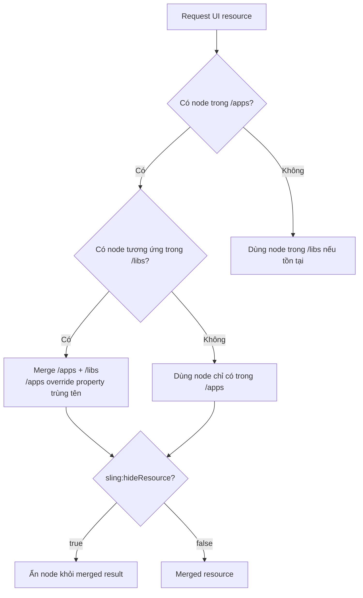

# Overlays trong AEM 6.5

> Nguồn học chính: [Overlays | Luca Nerlich](https://lucanerlich.com/aem/ui/overlays/).
> Note này viết lại bằng tiếng Việt để mình đọc, ôn và áp dụng cho AEM 6.5 on-premise.

## Ý chính cần nhớ

**Overlay** là cơ chế custom hoặc mở rộng UI có sẵn của AEM mà không sửa trực tiếp trong `/libs`.

Thay vì chỉnh product node dưới `/libs`, mình tạo lại cùng path dưới `/apps`. Khi runtime request resource, **Sling Resource Merger** sẽ merge node ở `/apps` với node tương ứng ở `/libs`.

Ví dụ:

```text
/libs/cq/core/content/nav
        |
        | overlay same path
        v
/apps/cq/core/content/nav
```

Kết quả là AEM vẫn giữ product default trong `/libs`, còn phần custom của mình nằm trong `/apps` và có precedence cao hơn.

Overlay thường dùng để custom Touch UI:

- Ẩn hoặc thêm item trong AEM start navigation
- Custom columns trong Sites console
- Thay đổi field, label, default value trong product dialog
- Thêm tab vào page properties
- Custom toolbar action trong page editor
- Mở rộng asset finder side panel

---

## Sling Resource Merger hoạt động thế nào

Khi một resource được resolve, Sling kiểm tra theo thứ tự:



| Tình huống | Kết quả |
|---|---|
| Node chỉ có trong `/libs` | Dùng product default |
| Node chỉ có trong `/apps` | Thêm vào merged result |
| Node có cả trong `/libs` và `/apps` | Properties được merge, `/apps` thắng nếu trùng tên |
| Node trong `/apps` có `sling:hideResource=true` | Ẩn toàn bộ node khỏi merged result |
| Node trong `/apps` có `sling:hideChildren` | Ẩn các child nodes được chỉ định |
| Node trong `/apps` có `sling:hideProperties` | Ẩn các properties được chỉ định |
| Node trong `/apps` có `sling:orderBefore` | Điều khiển thứ tự node so với sibling |

### Các property quan trọng

| Property | Type | Mục đích |
|---|---|---|
| `sling:hideResource` | `Boolean` | Ẩn node hiện tại khỏi merged result |
| `sling:hideChildren` | `String[]` | Ẩn một số child node theo tên, ví dụ `[decorative,linkURL]` |
| `sling:hideProperties` | `String[]` | Ẩn một số property khỏi merged result |
| `sling:orderBefore` | `String` | Đặt node hiện tại đứng trước sibling được chỉ định |

> Ghi nhớ: overlay không có nghĩa là copy toàn bộ `/libs`. Mình chỉ tạo lại phần path đủ để Resource Merger đi tới node cần thay đổi.

---

## Tạo overlay

### Cách nhanh trong CRXDE Lite

1. Mở CRXDE Lite.
2. Đi tới node trong `/libs`, ví dụ `/libs/cq/core/content/nav`.
3. Right-click node và chọn **Overlay Node**.
4. Xác nhận target path, ví dụ `/apps/cq/core/content/nav`.
5. CRXDE tạo structure tương ứng dưới `/apps`.
6. Chỉnh overlay node theo nhu cầu.

### Cách đúng cho project code

Trong AEM Maven project, overlay cần nằm dưới `ui.apps`:

```text
ui.apps/src/main/content/jcr_root/
└── apps/
    └── cq/
        └── core/
            └── content/
                └── nav/
                    └── .content.xml
```

Và phải thêm path vào `filter.xml`:

```xml
<!-- ui.apps/src/main/content/META-INF/vault/filter.xml -->
<filter root="/apps/cq/core/content/nav" mode="merge"/>
```

::: warning Quan trọng
Overlay path nên dùng `mode="merge"`. Nếu dùng default `mode="replace"`, package deploy có thể xóa các product nodes không có trong overlay của mình và làm hỏng UI.
:::

---

## Ví dụ 1: Ẩn item trong AEM main navigation

Mục tiêu: ẩn các item không dùng trong AEM start page:

```text
http://localhost:4502/aem/start.html
```

Overlay path:

```text
ui.apps/.../apps/cq/core/content/nav/.content.xml
```

```xml
<?xml version="1.0" encoding="UTF-8"?>
<jcr:root xmlns:jcr="http://www.jcp.org/jcr/1.0"
          xmlns:nt="http://www.jcp.org/jcr/nt/1.0"
          xmlns:sling="http://sling.apache.org/jcr/sling/1.0"
    jcr:primaryType="nt:unstructured"
    id="root">

    <projects
        jcr:primaryType="nt:unstructured"
        sling:hideResource="{Boolean}true"/>

    <screens
        jcr:primaryType="nt:unstructured"
        sling:hideResource="{Boolean}true"/>

    <personalization
        jcr:primaryType="nt:unstructured"
        sling:hideResource="{Boolean}true"/>

    <commerce
        jcr:primaryType="nt:unstructured"
        sling:hideResource="{Boolean}true"/>

    <communities
        jcr:primaryType="nt:unstructured"
        sling:hideResource="{Boolean}true"/>
</jcr:root>
```

Cách tìm node name: inspect `/libs/cq/core/content/nav` trong CRXDE Lite.

---

## Ví dụ 2: Thêm custom navigation button

Mục tiêu: thêm nút **HelpDesk** vào AEM homepage navigation.

```xml
<?xml version="1.0" encoding="UTF-8"?>
<jcr:root xmlns:jcr="http://www.jcp.org/jcr/1.0"
          xmlns:nt="http://www.jcp.org/jcr/nt/1.0"
    jcr:primaryType="nt:unstructured">

    <helpdesk
        jcr:primaryType="nt:unstructured"
        jcr:title="HelpDesk"
        href="https://support.mycompany.com"
        icon="callCenter"
        order="{Long}1600"
        target="_blank"/>
</jcr:root>
```

`order` quyết định vị trí hiển thị. Số nhỏ hơn thường hiện trước. Muốn chọn đúng vị trí thì inspect order của các item đang có trong `/libs/cq/core/content/nav`.


---

## Ví dụ 3: Custom Sites console columns

Mục tiêu: ẩn column **Published** và thêm custom column **Template** trong Sites console list view.

Overlay path:

```text
ui.apps/.../apps/cq/core/content/sites/jcr:content/views/list/columns/.content.xml
```

```xml
<?xml version="1.0" encoding="UTF-8"?>
<jcr:root xmlns:jcr="http://www.jcp.org/jcr/1.0"
          xmlns:nt="http://www.jcp.org/jcr/nt/1.0"
          xmlns:sling="http://sling.apache.org/jcr/sling/1.0"
    jcr:primaryType="nt:unstructured">

    <!-- Hide the "Published" column -->
    <published
        jcr:primaryType="nt:unstructured"
        sling:hideResource="{Boolean}true"/>

    <!-- Add a custom column -->
    <template
        jcr:primaryType="nt:unstructured"
        jcr:title="Template"
        sortable="{Boolean}true"
        sling:orderBefore="published"/>
</jcr:root>
```

Note cho mình: với console columns, cần kiểm tra thêm resource type / renderer của column nếu muốn column thật sự hiển thị data custom, không chỉ title.

---

## Ví dụ 4: Overlay một dialog field

Mục tiêu: thay đổi label và required state của field `alt` trong Core Component Image dialog.

Overlay path ví dụ:

```text
ui.apps/.../apps/core/wcm/components/image/v3/image/_cq_dialog/.content.xml
```

Partial XML:

```xml
<?xml version="1.0" encoding="UTF-8"?>
<jcr:root xmlns:jcr="http://www.jcp.org/jcr/1.0"
          xmlns:nt="http://www.jcp.org/jcr/nt/1.0"
    jcr:primaryType="nt:unstructured">

    <content jcr:primaryType="nt:unstructured">
        <items jcr:primaryType="nt:unstructured">
            <tabs jcr:primaryType="nt:unstructured">
                <items jcr:primaryType="nt:unstructured">
                    <properties jcr:primaryType="nt:unstructured">
                        <items jcr:primaryType="nt:unstructured">

                            <!-- Only override the specific field you need to change -->
                            <alt
                                jcr:primaryType="nt:unstructured"
                                fieldLabel="Accessibility Text (required)"
                                required="{Boolean}true"/>

                        </items>
                    </properties>
                </items>
            </tabs>
        </items>
    </content>
</jcr:root>
```

Điểm quan trọng: chỉ cần include các parent nodes trên đường tới field cần đổi. Không copy toàn bộ dialog từ `/libs`, vì copy full dialog dễ conflict khi upgrade AEM hoặc Core Components.

### Ẩn dialog fields bằng `sling:hideChildren`

Nếu muốn remove một vài field con khỏi inherited/overlaid dialog:

```xml
<items
    jcr:primaryType="nt:unstructured"
    sling:hideChildren="[decorative,linkURL]">
    <!-- decorative và linkURL từ /libs sẽ bị ẩn -->
</items>
```

---

## Ví dụ 5: Thêm tab vào Page Properties

Mục tiêu: thêm tab **Social Media** vào page properties dialog.

```xml
<?xml version="1.0" encoding="UTF-8"?>
<jcr:root xmlns:jcr="http://www.jcp.org/jcr/1.0"
          xmlns:nt="http://www.jcp.org/jcr/nt/1.0"
          xmlns:sling="http://sling.apache.org/jcr/sling/1.0"
    jcr:primaryType="nt:unstructured"
    jcr:title="Social Media"
    sling:resourceType="granite/ui/components/coral/foundation/container"
    sling:orderBefore="cloudservices">

    <items jcr:primaryType="nt:unstructured">
        <ogTitle
            jcr:primaryType="nt:unstructured"
            sling:resourceType="granite/ui/components/coral/foundation/form/textfield"
            fieldLabel="OG Title"
            name="./ogTitle"/>

        <ogDescription
            jcr:primaryType="nt:unstructured"
            sling:resourceType="granite/ui/components/coral/foundation/form/textarea"
            fieldLabel="OG Description"
            name="./ogDescription"/>

        <ogImage
            jcr:primaryType="nt:unstructured"
            sling:resourceType="granite/ui/components/coral/foundation/form/pathfield"
            fieldLabel="OG Image"
            rootPath="/content/dam"
            name="./ogImage"/>
    </items>
</jcr:root>
```

`sling:orderBefore="cloudservices"` giúp đặt tab mới trước tab Cloud Services.

---

## Toolbar action customization

Toolbar trong AEM page editor có các action như Edit, Configure, Copy, Delete. Các action này có thể custom bằng client-side JavaScript.

Có thể inspect action đang có trong browser console:

```javascript
Object.keys(Granite.author.EditorFrame.editableToolbar.config.actions);
```


### Disable Configure button cho một component cụ thể

```javascript
(function($document, author) {
    'use strict';

    $document.on('cq-layer-activated', function(ev) {
        if (ev.layer === 'Edit') {
            var originalCondition =
                author.EditorFrame.editableToolbar.config.actions.CONFIGURE.condition;

            author.EditorFrame.editableToolbar.config.actions.CONFIGURE.condition =
                function(editable) {
                    if (editable &&
                            editable.config &&
                            editable.config.dialog &&
                            editable.config.dialog ===
                                '/apps/myproject/components/abstractcomponent/cq:dialog') {
                        return false;
                    }

                    return originalCondition.call(this, editable);
                };
        }
    });
})($(document), Granite.author);
```

### Disable "Convert to Building Block"

```javascript
(function($document, author) {
    'use strict';

    $document.on('cq-layer-activated', function(ev) {
        if (ev.layer === 'Edit') {
            author.EditorFrame.editableToolbar.config.actions.BBCONVERT.condition =
                function() {
                    return false;
                };
        }
    });
})($(document), Granite.author);
```

### Thêm custom toolbar action

Ví dụ thêm action **View Analytics**:

```javascript
(function($document, author) {
    'use strict';

    $document.on('cq-layer-activated', function(ev) {
        if (ev.layer === 'Edit') {
            author.EditorFrame.editableToolbar.config.actions.ANALYTICS = {
                icon: 'graphBarVertical',
                text: 'View Analytics',
                handler: function(editable) {
                    var path = editable.path;
                    window.open(
                        '/mnt/overlay/dam/gui/content/assets/analysisreport.html?path=' + path,
                        '_blank'
                    );
                },
                condition: function(editable) {
                    return editable.type === 'wcm/foundation/components/responsivegrid';
                }
            };
        }
    });
})($(document), Granite.author);
```

### Clientlib category cho toolbar customization

Các file JS authoring toolbar nên được load qua clientlib category:

- `cq.authoring.dialog.all`
- hoặc `cq.authoring.editor`

```xml
<?xml version="1.0" encoding="UTF-8"?>
<jcr:root xmlns:cq="http://www.day.com/jcr/cq/1.0"
          xmlns:jcr="http://www.jcp.org/jcr/1.0"
    jcr:primaryType="cq:ClientLibraryFolder"
    categories="[cq.authoring.dialog.all]"
    allowProxy="{Boolean}true"/>
```

```text
# js.txt
#base=js
disableComponentEditing.js
hideBuildingBlocks.js
customToolbarAction.js
```

Note cho mình: phần này không phải overlay JCR node theo nghĩa `/apps` mirror `/libs`; đây là custom authoring behavior bằng clientlib, nhưng cùng nhóm bài vì mục tiêu vẫn là chỉnh Touch UI.

---

## Audio Asset Finder Controller

Mặc định AEM Assets side panel không có filter riêng cho audio file. Có thể thêm một asset finder controller custom bằng clientlib thay vì overlay product JS.


### Tạo audio controller

Product controllers nằm tại:

```text
/libs/cq/gui/components/authoring/editors/clientlibs/core/js/assetController
```

Mình copy pattern từ `videoController.js`, đổi `name` và `mimeType`:

```javascript
(function($, ns, channel, window, undefined) {
    'use strict';

    var self = {},
        name = 'Audio';

    self.searchRoot = '/content/dam';
    self.viewInAdminRoot = '/assetdetails.html{+item}';

    var searchPath = self.searchRoot,
        imageServlet = '/bin/wcm/contentfinder/asset/view.html',
        itemResourceType = 'cq/gui/components/authoring/assetfinder/asset';

    self.setUp = function() {};
    self.tearDown = function() {};

    self.loadAssets = function(query, lowerLimit, upperLimit) {
        var param = {
            '_dc': new Date().getTime(),
            'query': query.concat('order:"-jcr:content/jcr:lastModified" '),
            'mimeType': 'audio',
            'itemResourceType': itemResourceType,
            'limit': lowerLimit + '..' + upperLimit,
            '_charset_': 'utf-8'
        };

        return $.ajax({
            type: 'GET',
            dataType: 'html',
            url: Granite.HTTP.externalize(imageServlet) + searchPath,
            data: param
        });
    };

    self.setServlet = function(servlet) { imageServlet = servlet; };
    self.setSearchPath = function(path) { searchPath = path; };
    self.setItemResourceType = function(rt) { itemResourceType = rt; };
    self.resetSearchPath = function() { searchPath = self.searchRoot; };

    ns.ui.assetFinder.register(name, self);
}(jQuery, Granite.author, jQuery(document), this));
```

Clientlib:

```xml
<?xml version="1.0" encoding="UTF-8"?>
<jcr:root xmlns:cq="http://www.day.com/jcr/cq/1.0"
          xmlns:jcr="http://www.jcp.org/jcr/1.0"
    jcr:primaryType="cq:ClientLibraryFolder"
    categories="[cq.authoring.dialog.all]"
    allowProxy="{Boolean}true"/>
```

```text
# js.txt
#base=js
audioController.js
```

Sau deploy, asset finder dropdown sẽ có option **Audio**.

### Cho phép drag-and-drop audio asset vào component

Trong `_cq_editConfig.xml`, thêm MIME type pattern `audio/.*`:

```xml
<?xml version="1.0" encoding="UTF-8"?>
<jcr:root xmlns:sling="http://sling.apache.org/jcr/sling/1.0"
          xmlns:cq="http://www.day.com/jcr/cq/1.0"
          xmlns:jcr="http://www.jcp.org/jcr/1.0"
          xmlns:nt="http://www.jcp.org/jcr/nt/1.0"
    jcr:primaryType="cq:EditConfig">

    <cq:dropTargets jcr:primaryType="nt:unstructured">
        <file
            jcr:primaryType="cq:DropTargetConfig"
            accept="[application/pdf,audio/.*,video/.*,application/zip]"
            groups="[media]"
            propertyName="./fileReference">
            <parameters
                jcr:primaryType="nt:unstructured"
                sling:resourceType="myproject/components/mycomponent"/>
        </file>
    </cq:dropTargets>

    <cq:listeners
        jcr:primaryType="cq:EditListenersConfig"
        afteredit="REFRESH_PAGE"/>
</jcr:root>
```

`audio/.*` match các định dạng như MP3, WAV, OGG.

---

## Overlay vs `sling:resourceSuperType`

Đây là phần dễ nhầm.

| Approach | Cơ chế | Dùng khi |
|---|---|---|
| Overlay (`/apps` mirror `/libs`) | Sling Resource Merger | Chỉnh product UI: navigation, consoles, product dialogs |
| `sling:resourceSuperType` | Component inheritance | Tạo custom component kế thừa Core/Foundation Component |

### Khi nên overlay

- Ẩn navigation items
- Ẩn hoặc thêm console columns
- Thay label/default value/field properties trong product dialog
- Thêm tab vào page properties
- Thay đổi behavior của admin console

### Khi nên dùng inheritance

- Tạo custom component extend Core Components hoặc Foundation Components
- Tạo container component extend responsive grid
- Thêm fields cho custom component dialog nhưng vẫn giữ behavior parent

Quy tắc cá nhân: nếu mình đang chỉnh **AEM product UI có sẵn**, nghĩ tới overlay. Nếu mình đang tạo **component của project**, ưu tiên `sling:resourceSuperType`.

---

## Best practices

### 1. Giữ overlay nhỏ nhất có thể

Chỉ overlay node và property cần đổi.

```xml
<!-- Good: chỉ đổi một field -->
<alt
    jcr:primaryType="nt:unstructured"
    fieldLabel="Accessibility Text (required)"
    required="{Boolean}true"/>
```

Không copy cả dialog chỉ để đổi một field. Full copy sẽ dễ vỡ khi AEM/Core Components update.

### 2. Không overlay clientlibs trong `/libs`

Đừng overlay `js.txt`, `css.txt`, JS/CSS product files dưới `/libs`. Cách an toàn hơn là tạo clientlib riêng với category phù hợp rồi load custom code của mình.

### 3. Luôn dùng `mode="merge"` trong `filter.xml`

```xml
<filter root="/apps/cq/core/content/nav" mode="merge"/>
```

`mode="replace"` là rủi ro lớn vì có thể remove product content không nằm trong package của mình.

### 4. Document overlay

Overlay khá "vô hình" vì nó chỉ thể hiện khi runtime merge. Nên document:

- Overlay path
- Product path gốc dưới `/libs`
- Mục đích custom
- Ai/requirement nào cần custom này
- Cách test sau deploy

### 5. Test sau AEM upgrade/service pack

Adobe có thể thay đổi content dưới `/libs`. Sau mỗi upgrade hoặc service pack, cần verify overlay vẫn merge đúng và không che mất node mới.

### 6. Dùng `sling:orderBefore` khi cần định vị

Khi thêm item mới, đừng phụ thuộc hoàn toàn vào JCR node order.

```xml
<myCustomTab
    jcr:primaryType="nt:unstructured"
    jcr:title="My Tab"
    sling:orderBefore="cloudservices"/>
```

---

## Pitfalls thường gặp

| Vấn đề | Cách xử lý |
|---|---|
| Overlay không có tác dụng | Kiểm tra path dưới `/apps` match đúng `/libs` path, case-sensitive |
| Deploy rồi overlay không chạy | Kiểm tra `filter.xml` có include overlay path không |
| Navigation item vẫn hiện sau khi hide | Clear browser cache và rebuild AEM clientlibs tại `/libs/granite/ui/content/dumplibs.rebuild.html` |
| Overlay hỏng sau AEM upgrade | Giữ overlay minimal và test lại merged result |
| `filter.xml` dùng `mode="replace"` làm mất product nodes | Đổi sang `mode="merge"` cho overlay paths |
| Dialog overlay merge sai | Đảm bảo tạo đủ parent node path từ root tới target field |
| Custom navigation button không hiện | Kiểm tra `order` hoặc dùng `sling:orderBefore`; so sánh với `/libs/cq/core/content/nav` |
| Toolbar JS không load | Kiểm tra clientlib category `cq.authoring.dialog.all` hoặc `cq.authoring.editor` |

---

## Checklist khi mình làm overlay thật

1. Xác định product node gốc dưới `/libs`.
2. Tạo cùng path dưới `/apps`, chỉ gồm node cần custom và parent path bắt buộc.
3. Nếu muốn ẩn node: dùng `sling:hideResource`.
4. Nếu muốn ẩn vài child: dùng `sling:hideChildren`.
5. Nếu thêm node mới: set title/resourceType/action cần thiết và định vị bằng `sling:orderBefore` hoặc property order tương ứng.
6. Thêm path vào `filter.xml` với `mode="merge"`.
7. Deploy lên local AEM.
8. Test UI trong author.
9. Rebuild clientlibs/cache nếu custom UI chưa reflect.
10. Ghi chú overlay path và lý do custom trong project docs.

---

## Tài liệu tham khảo

- [Overlays | Luca Nerlich](https://lucanerlich.com/aem/ui/overlays/)
- [AEM 6.5 Overlays Documentation](https://experienceleague.adobe.com/docs/experience-manager-65/content/implementing/developing/platform/overlays.html)
- [Apache Sling Resource Merger](https://sling.apache.org/documentation/bundles/resource-merger.html)
- [Customising the AEM Sites Console](https://experienceleague.adobe.com/docs/experience-manager-cloud-service/content/implementing/developing/customizing-consoles.html)

