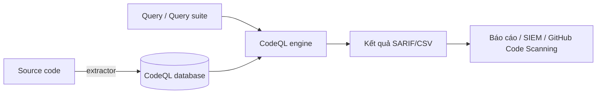
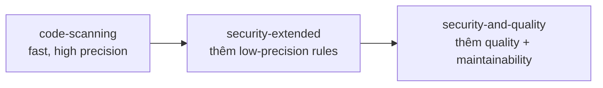
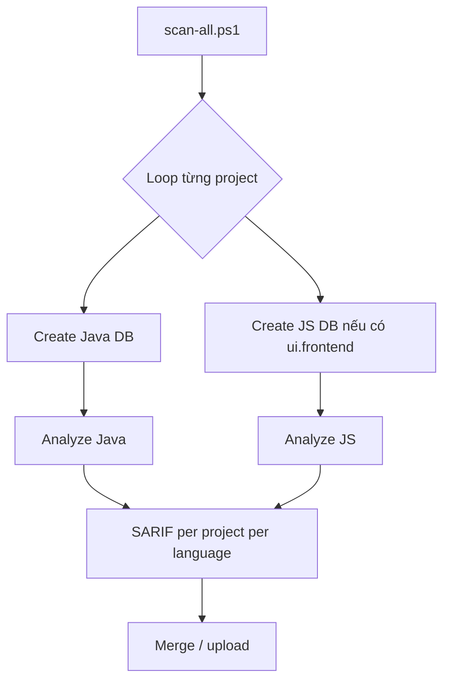
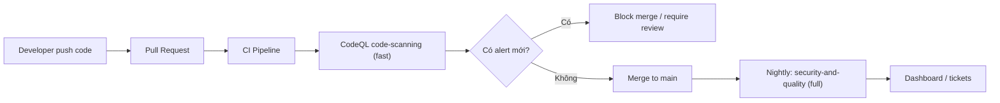

# CodeQL: Quét Security & Quality cho Multi-module Maven và JS/Vue Project

> Tài liệu hướng dẫn nâng cao cách dùng **CodeQL CLI 2.25.x** (latest) để quét **security** và **quality** trên dự án AEM 6.5 on-premise legacy có nhiều sub-project Maven archetype và frontend JS/Vue. Tập trung vào các kịch bản thực tế của AMS engineer: scan toàn repo, scan từng module, custom query, CI integration, và đọc SARIF output.

## Môi trường dự án

| Thành phần | Phiên bản |
|---|---|
| **AEM** | 6.5.24 (on-premise) |
| **Java** | 11 (Azul Zulu / Temurin) |
| **Maven** | 3.8+ |
| **Node.js** | 16 (LTS, dùng cho `ui.frontend`) |
| **Vue.js** | 2.x (trong `ui.frontend` HTL integration) |
| **CodeQL CLI** | 2.25.x (latest) |
| **Query pack Java** | `codeql/java-queries` (latest) |
| **Query pack JS** | `codeql/javascript-queries` (latest, bao gồm TS) |

> **Lưu ý Node 16**: Node 16 đã **End-of-Life** (tháng 9/2023). CodeQL JS extractor vẫn extract được code nhưng nếu có `npm install` trong CI, nên upgrade lên Node 18+ để tránh lỗi SSL/TLS khi download pack.

---

## 1. CodeQL là gì?

CodeQL là engine phân tích mã tĩnh của GitHub. Nó xem source code như **database**, query bằng ngôn ngữ truy vấn riêng (giống SQL nhưng cho code), và trả về các vị trí code khớp với rule.



Điểm mạnh so với SAST truyền thống:

- **Taint tracking** cross-function, cross-file thực sự.
- **Pack ecosystem**: Adobe, GitHub, third-party publish query pack qua `codeql pack publish`.
- **Multi-language một lần build**: Java, JavaScript/TypeScript, Python, C/C++, C#, Go, Ruby, Swift, Kotlin.
- **SARIF output** chuẩn — tích hợp được với GitHub Code Scanning, Defender, SonarQube, DefectDojo.

---

## 2. Cài đặt CodeQL CLI mới nhất

### 2.1 Download — Dùng CodeQL Bundle (khuyến nghị)

GitHub khuyến nghị tải **CodeQL Bundle** từ [`codeql-action/releases`](https://github.com/github/codeql-action/releases) thay vì `codeql-cli-binaries`. Bundle bao gồm:
- CodeQL CLI
- Query packs đã precompiled (nhanh hơn nhiều so với download pack riêng)
- Đảm bảo compatibility giữa CLI và query version

CLI tự bundle **JVM 21** (từ 2.20.0) — không cần cài JDK riêng cho CLI. Extractor Java vẫn cần Maven + JDK đúng version của project (JDK 11 với AEM 6.5).

```powershell
# Tải CodeQL Bundle cho Windows (tar.zst format — nhanh hơn tar.gz)
# Xem latest version tại: https://github.com/github/codeql-action/releases
$Version = "v3.28.16"   # cập nhật version mới nhất
$Url = "https://github.com/github/codeql-action/releases/download/$Version/codeql-bundle-win64.tar.zst"
Invoke-WebRequest -Uri $Url -OutFile "$env:USERPROFILE\codeql-bundle-win64.tar.zst"

# Giải nén — Windows 11 build 22000+ hỗ trợ tar native
mkdir C:\codeql -Force
tar -xf "$env:USERPROFILE\codeql-bundle-win64.tar.zst" -C C:\codeql
```

> Nếu cần dùng `.zip` từ `codeql-cli-binaries` (offline): tải `codeql-win64.zip` rồi `Expand-Archive`. Tuy nhiên sẽ cần `codeql pack download` thêm — xem mục 2.2.

Thêm vào PATH (khởi động lại terminal sau):

```powershell
[Environment]::SetEnvironmentVariable("Path", "$env:Path;C:\codeql\codeql", "User")
```

Kiểm tra:

```powershell
codeql --version
codeql resolve languages
codeql resolve packs       # liệt kê các pack đã có trong bundle
```

### 2.2 Tải query pack thêm (chỉ khi dùng CLI đơn lẻ)

Nếu tải `codeql-cli-binaries` (không phải bundle), phải download pack riêng:

```powershell
codeql pack download codeql/java-queries
codeql pack download codeql/javascript-queries   # đã bao gồm TypeScript
codeql pack download codeql/xml-queries
```

> `codeql/typescript-queries` đã được **hợp nhất vào `codeql/javascript-queries`** — không cần download riêng.

> Sau khi download, các pack nằm trong `~/.codeql/packages/`. Verify bằng `codeql resolve packs`.

---

## 3. Khái niệm cốt lõi

| Khái niệm | Vai trò |
|---|---|
| **Database** | Snapshot mã đã extract; mỗi ngôn ngữ = 1 database |
| **Extractor** | Component nhúng trong CLI build database từ source |
| **Query (`.ql`)** | Một query đơn lẻ |
| **Query suite (`.qls`)** | Danh sách query đóng gói (vd: `code-scanning`, `security-extended`, `security-and-quality`) |
| **Query pack** | Đơn vị phân phối query qua registry |
| **SARIF** | Định dạng output JSON chuẩn cho static analysis |
| **BQRS** | Binary query result store (output nội bộ trước khi decode) |

### Các suite quan trọng

| Suite | Mục đích |
|---|---|
| `code-scanning` | Default GitHub Code Scanning, fast |
| `security-extended` | Thêm rule security có precision thấp hơn (recall cao hơn) |
| `security-and-quality` | Bao gồm security + code quality (smell, dead code…) — **dùng cho AMS** |



---

## 4. Cấu trúc workspace AMS điển hình

```text
my-aem-workspace/
├── project-a/                  ← Maven archetype 1 (AEM 6.5)
│   ├── pom.xml
│   ├── all/
│   ├── core/
│   ├── ui.apps/
│   ├── ui.content/
│   ├── ui.frontend/            ← JS/Vue
│   └── dispatcher/
├── project-b/                  ← Maven archetype 2
│   ├── pom.xml
│   └── ...
├── project-c/                  ← Maven archetype 3
│   └── ...
└── shared-libs/                ← Common Java libs
```

Cần phân biệt **2 loại multi-module**:

- **Reactor multi-module**: một `pom.xml` cha + nhiều `&lt;module&gt;`. CodeQL build 1 lần qua `mvn install` ở root.
- **Multi-project độc lập**: mỗi sub-project có pom riêng, không share parent. Cần build từng project hoặc viết script combine.

---

## 5. Tạo database cho multi-module Maven (AEM archetype)

### 5.1 Khi sub-project có reactor pom chung

Đứng tại root chứa parent `pom.xml`:

```powershell
codeql database create db-java `
  --language=java `
  --source-root=. `
  --command="mvn clean install -DskipTests -B -ntp -T 1C"
```

Tham số quan trọng:

| Tham số | Ý nghĩa |
|---|---|
| `--language=java` | Java extractor (cũng cover Kotlin nếu có) |
| `--source-root` | Thư mục code, thường là repo root |
| `--command` | Build command CodeQL inject extractor vào |
| `--overwrite` | Ghi đè DB cũ |
| `--threads=0` | Dùng tất cả CPU cho extract |
| `--ram=8192` | Giới hạn RAM khi extract (MB) |

> CodeQL không **chỉ phân tích bytecode**: nó **hook vào javac** để nhận AST, type info, classpath. Vì vậy build phải thành công và phải gọi `javac` thực sự (không skip compile).

### 5.2 Khi mỗi sub-project độc lập — build từng project

Nếu `project-a`, `project-b`, `project-c` không cùng reactor, có 2 cách:

**Cách A — Build từng database, scan riêng:**

```powershell
foreach ($p in "project-a","project-b","project-c") {
  codeql database create "dbs/$p-java" `
    --language=java `
    --source-root="$p" `
    --command="mvn -f $p/pom.xml clean install -DskipTests -B -ntp"
}
```

**Cách B — Gộp thành một database với script wrapper:**

Tạo file `build-all.ps1`:

```powershell
mvn -f project-a/pom.xml clean install -DskipTests -B -ntp
mvn -f project-b/pom.xml clean install -DskipTests -B -ntp
mvn -f project-c/pom.xml clean install -DskipTests -B -ntp
```

Rồi:

```powershell
codeql database create db-java-all `
  --language=java `
  --source-root=. `
  --command="pwsh ./build-all.ps1"
```

> **Khuyến nghị cho AMS**: chọn **Cách A** để cô lập kết quả từng product, dễ assign owner. **Cách B** chỉ dùng khi cross-project taint analysis là yêu cầu thực sự.

### 5.3 Loại trừ file không cần extract

Tạo `.codeqlignore` ở source root:

```text
**/target/**
**/node_modules/**
**/dist/**
**/build/**
**/test/**
**/generated-sources/**
**/it.tests/**
```

`.codeqlignore` chỉ áp cho **JS/TS extractor**. Với Java, dùng pattern exclude qua `--working-dir` hoặc skip module ở mvn level (`-pl`, `-pl !module`).

---

## 6. Tạo database cho JS/Vue project

JS/TS extractor là **autonomous**: không cần command build, nó tự scan filesystem.

```powershell
codeql database create db-js `
  --language=javascript-typescript `
  --source-root=. `
  --threads=0
```

> Ngôn ngữ khai báo là `javascript-typescript` (thống nhất từ CLI 2.16+). TypeScript analysis chạy tự động khi có `.ts` / `.tsx` file trong source root — không cần cấu hình thêm.

### 6.1 Xử lý Vue Single File Component (SFC)

CodeQL hiểu được `&lt;script&gt;` block trong file `.vue` từ pack `codeql/javascript-queries` ≥ 0.8.0. Tuy nhiên:

- **Template `&lt;template&gt;`** không được phân tích semantic (chỉ text).
- **Computed property qua `@vue/composition-api`** đôi khi không trace được.

Để improve coverage:

- Đảm bảo TypeScript được compile với `tsc --noEmit` chạy thành công trước extract (CodeQL dùng TS server để improve type info).
- **Node.js 14+ phải có trên PATH** (`node` executable) để TypeScript extraction hoạt động.

> **Quan trọng:** `node_modules` và `bower_components` bị **exclude mặc định** bởi JS extractor. Không cần và không nên cố include chúng. CodeQL resolve types qua `tsconfig.json` + TS compiler, không qua `node_modules` runtime.

### 6.2 Multi-frontend trong workspace

Nếu mỗi project có `ui.frontend/` riêng, JS extractor scan toàn bộ tree mặc định:

```powershell
codeql database create db-js-all `
  --language=javascript-typescript `
  --source-root=. `
  --threads=0
```

Hoặc scan từng frontend:

```powershell
foreach ($p in "project-a","project-b","project-c") {
  codeql database create "dbs/$p-js" `
    --language=javascript-typescript `
    --source-root="$p/ui.frontend" `
    --threads=0
}
```

---

## 7. Chạy query và xuất SARIF

### 7.1 Chạy suite `security-and-quality`

```powershell
codeql database analyze db-java `
  --format=sarif-latest `
  --output=results/java.sarif `
  --threads=0 `
  --download `
  codeql/java-queries:codeql-suites/java-security-and-quality.qls
```

Với JS/TS:

```powershell
codeql database analyze db-js `
  --format=sarif-latest `
  --output=results/js.sarif `
  --threads=0 `
  --download `
  codeql/javascript-queries:codeql-suites/javascript-security-and-quality.qls
```

Tham số:

| Tham số | Ý nghĩa |
|---|---|
| `--download` | Auto-download pack còn thiếu (không cần nếu dùng bundle) |
| `--format` | `sarif-latest` (khuyến nghị), `sarifv2.1.0`, `csv` |
| `--sarif-category` | Bắt buộc khi upload nhiều DB cho cùng commit lên GitHub |
| `--sarif-add-baseline-file-info` | Thêm metadata cho diff scan (tool status page) |
| `--sarif-include-query-help` | `always` / `custom_queries_only` / `never` — nhúng help text vào SARIF |
| `--threat-model=local` | Thêm local sources (file, env vars, CLI args) vào taint analysis — Java/Kotlin only |
| `--threads=0` | Dùng tất cả CPU cores |
| `--rerun` | Bỏ cache result, chạy lại toàn bộ query |

### 7.2 Chạy suite chuẩn khác

```powershell
# Code scanning default (nhanh, dùng cho PR check)
... java-code-scanning.qls

# Security extended (recall cao)
... java-security-extended.qls
```

### 7.3 Chạy nhiều suite gộp

```powershell
codeql database analyze db-java `
  --format=sarif-latest `
  --output=results/java-all.sarif `
  codeql/java-queries:codeql-suites/java-security-and-quality.qls `
  codeql/java-queries:codeql-suites/java-security-extended.qls
```

### 7.4 Chạy một query cụ thể

```powershell
codeql database analyze db-java `
  --format=sarif-latest `
  --output=results/sqli.sarif `
  codeql/java-queries:Security/CWE/CWE-089/SqlInjection.ql
```

```powershell
codeql database analyze codeql-db codeql/javascript-queries:codeql-suites/javascript-security-and-quality.qls --format=sarif-latest --output=js.sarif
```

---

## 8. Script tổng cho AMS workspace

`scan-all.ps1` — scan toàn bộ workspace, Java + JS, gộp SARIF:

```powershell
$Projects = @("project-a","project-b","project-c")
$Out = "results"
New-Item -ItemType Directory -Force -Path $Out | Out-Null

foreach ($p in $Projects) {
  Write-Host "=== $p : Java ==="
  codeql database create "dbs/$p-java" `
    --language=java `
    --source-root="$p" `
    --command="mvn -f $p/pom.xml clean install -DskipTests -B -ntp" `
    --overwrite

  codeql database analyze "dbs/$p-java" `
    --format=sarif-latest `
    --output="$Out/$p-java.sarif" `
    --sarif-category="$p-java" `
    --download `
    codeql/java-queries:codeql-suites/java-security-and-quality.qls

  Write-Host "=== $p : JS ==="
  if (Test-Path "$p/ui.frontend") {
    codeql database create "dbs/$p-js" `
      --language=javascript-typescript `
      --source-root="$p/ui.frontend" `
      --overwrite

    codeql database analyze "dbs/$p-js" `
      --format=sarif-latest `
      --output="$Out/$p-js.sarif" `
      --sarif-category="$p-js" `
      --download `
      codeql/javascript-queries:codeql-suites/javascript-security-and-quality.qls
  }
}
```



---

## 9. Đọc và xử lý SARIF

### 9.1 Xem kết quả trong VS Code

Cách nhanh nhất:

- Cài extension **SARIF Viewer** (Microsoft DevLabs).
- Mở file `.sarif`, click cảnh báo → nhảy đúng dòng code.

Xuất CSV để review bằng Excel:

```powershell
# Chạy analyze với format csv thay vì sarif
codeql database analyze db-java `
  --format=csv `
  --output=results/java.csv `
  codeql/java-queries:codeql-suites/java-security-and-quality.qls
```

> `codeql database interpret-results` là lệnh nội bộ dùng để re-interpret BQRS → SARIF, không phải convert SARIF → CSV.

### 9.2 Upload lên GitHub Code Scanning

Dùng `codeql github upload-results` (khuyến nghị — xử lý compression tự động):

```powershell
codeql github upload-results `
  --repository=OWNER/REPO `
  --ref=refs/heads/main `
  --commit=$(git rev-parse HEAD) `
  --sarif=results/java.sarif `
  --github-auth-stdin
```

Hoặc dùng `gh api` nhưng phải **encode base64** SARIF trước:

```powershell
$sarif = Get-Content results/java.sarif -Raw
$encoded = [Convert]::ToBase64String([Text.Encoding]::UTF8.GetBytes($sarif))

gh api `
  --method POST `
  -H "Accept: application/vnd.github+json" `
  /repos/OWNER/REPO/code-scanning/sarifs `
  -f commit_sha=$(git rev-parse HEAD) `
  -f ref=refs/heads/main `
  -f sarif=$encoded
```

> SARIF phải < 10MB sau khi compress, < 25k results, < 5k rules. Nếu vượt, **split theo project** hoặc lọc bớt rule.

### 9.3 Filter và baseline

Loại trừ rule không quan tâm bằng `--sarif-category` + GitHub UI, hoặc dùng `codeql bqrs decode` để query thủ công:

```powershell
codeql database analyze db-java `
  --format=sarifv2.1.0 `
  --output=results/java.sarif `
  --sarif-add-baseline-file-info `
  ...
```

Baseline diff scan: chỉ alert vấn đề mới so với main branch — thực hiện ở CI bằng GitHub Code Scanning hoặc tự diff SARIF.

---

## 10. Tích hợp CI/CD

### 10.1 GitHub Actions

`.github/workflows/codeql.yml`:

```yaml
name: CodeQL

on:
  push:
    branches: [main]
  pull_request:
    branches: [main]
  schedule:
    - cron: '0 17 * * 0'

jobs:
  analyze:
    name: Analyze (${{ matrix.language }})
    runs-on: ubuntu-latest
    permissions:
      security-events: write
      actions: read
      contents: read

    strategy:
      fail-fast: false
      matrix:
        include:
          - language: java-kotlin
            build-mode: manual
          - language: javascript-typescript
            build-mode: none

    steps:
      - uses: actions/checkout@v4

      - uses: actions/setup-java@v4
        if: matrix.language == 'java-kotlin'
        with:
          distribution: temurin
          java-version: '11'
          cache: maven

      - name: Initialize CodeQL
        uses: github/codeql-action/init@v3
        with:
          languages: ${{ matrix.language }}
          build-mode: ${{ matrix.build-mode }}
          queries: security-and-quality

      - name: Build Java
        if: matrix.language == 'java-kotlin'
        run: mvn clean install -DskipTests -B -ntp

      - name: Analyze
        uses: github/codeql-action/analyze@v3
        with:
          category: "/language:${{ matrix.language }}"
```

> AEM 6.5 chạy Java 11 — đảm bảo `setup-java` chọn **đúng version** project dùng. Mismatch có thể làm build fail hoặc bytecode bị extract sai.

### 10.2 Jenkins on-premise

```groovy
pipeline {
  agent any
  stages {
    stage('CodeQL: Java') {
      steps {
        sh '''
          codeql database create db-java \
            --language=java \
            --source-root=. \
            --command="mvn clean install -DskipTests -B -ntp"

          codeql database analyze db-java \
            --format=sarif-latest \
            --output=results/java.sarif \
            --download \
            codeql/java-queries:codeql-suites/java-security-and-quality.qls
        '''
      }
    }
    stage('CodeQL: JS') {
      steps {
        sh '''
          codeql database create db-js --language=javascript-typescript --source-root=.
          codeql database analyze db-js \
            --format=sarif-latest \
            --output=results/js.sarif \
            --download \
            codeql/javascript-queries:codeql-suites/javascript-security-and-quality.qls
        '''
      }
    }
    stage('Publish') {
      steps {
        archiveArtifacts artifacts: 'results/*.sarif'
      }
    }
  }
}
```

---

## 11. Custom Query nâng cao cho AEM

### 11.1 Tạo query pack

```powershell
codeql pack init my-team/aem-queries
cd aem-queries
```

`qlpack.yml`:

```yaml
name: my-team/aem-queries
version: 0.0.1
dependencies:
  codeql/java-all: "*"
library: false
```

### 11.2 Ví dụ: tìm Sling Servlet không có authentication check

`SlingServletNoAuth.ql`:

```ql
/**
 * @name Sling Servlet thiếu authentication check
 * @kind problem
 * @problem.severity warning
 * @id custom/sling-servlet-no-auth
 * @tags security aem
 */
import java

class SlingServletClass extends Class {
  SlingServletClass() {
    this.getAnAnnotation()
        .getType()
        .hasQualifiedName("org.osgi.service.component.annotations", "Component")
    and
    this.getAnAnnotation().getAStringValue() = "javax.servlet.Servlet"
  }
}

from SlingServletClass c, Method m
where
  m.getDeclaringType() = c and
  m.getName().regexpMatch("do(Get|Post|Put|Delete)") and
  not exists(MethodAccess ma |
    ma.getEnclosingCallable() = m and
    ma.getMethod().getName().regexpMatch("(?i).*(auth|permission|principal|user).*")
  )
select m, "Servlet method $@ không kiểm tra authentication.", m, m.getName()
```

### 11.3 Chạy query custom

```powershell
codeql database analyze db-java `
  --format=sarif-latest `
  --output=results/custom.sarif `
  ./aem-queries/SlingServletNoAuth.ql
```

### 11.4 Publish pack nội bộ

```powershell
codeql pack publish --registry=ghcr.io/my-org
```

Sau đó các CI khác có thể `codeql pack download my-team/aem-queries`.

---

## 12. Feature & command nâng cao thường dùng

### 12.1 Diff giữa 2 commit/branch

```powershell
# Tạo DB cho 2 ref
git worktree add ../main-tree main
git worktree add ../pr-tree feature/x

codeql database create db-main --language=java --source-root=../main-tree --command="mvn ..."
codeql database create db-pr   --language=java --source-root=../pr-tree   --command="mvn ..."

# Analyze cả 2, diff SARIF bằng tool ngoài hoặc upload lên GitHub
```

### 12.2 Test query nhanh trong VS Code

Cài **CodeQL extension**, mở folder pack, right-click `.ql` → **CodeQL: Run Query on Selected Database**.

### 12.3 Query console

```powershell
codeql database run-queries db-java `
  --search-path=./aem-queries `
  ./aem-queries/SlingServletNoAuth.ql
codeql bqrs decode --format=text db-java/results/.../*.bqrs
```

### 12.4 In AST của file để debug query

Dùng VS Code CodeQL extension để xem AST trực quan: mở file nguồn → **CodeQL: View AST**.

Hoặc dùng CLI để chạy query AST built-in:

```powershell
# In AST toàn bộ file qua query run
codeql query run `
  --database=db-java `
  --output=ast.bqrs `
  path/to/PrintAst.ql
codeql bqrs decode --format=text ast.bqrs
```

### 12.5 Tối ưu performance

| Vấn đề | Giải pháp |
|---|---|
| OOM khi extract Java | `--ram=12000`, tăng `-Xmx` cho mvn |
| Extract chậm | `--threads=0`, dùng SSD, exclude `target/` |
| Analyze chậm | Bỏ `security-extended`, chỉ chạy `code-scanning` cho PR |
| DB quá lớn | Exclude module test, skip `it.tests` |
| Pack download chậm | Mirror pack qua internal registry |

### 12.6 Verify database

```powershell
codeql database info db-java
codeql database cleanup db-java --mode=brutal   # xóa cache trung gian, giữ DB
codeql database cleanup db-java --mode=light    # chỉ compact, giữ cache
```

### 12.7 Resolve query suite

Xem chính xác query nào trong suite:

```powershell
codeql resolve queries codeql/java-queries:codeql-suites/java-security-and-quality.qls
```

---

## 13. Troubleshooting thường gặp

### 13.1 "No source code seen during build"

**Nguyên nhân:** build incremental, `mvn` không gọi `javac` vì module đã compile.

**Fix:** thêm `clean`:

```powershell
--command="mvn clean install -DskipTests -B -ntp"
```

### 13.2 Extractor bỏ qua một module Maven

**Nguyên nhân:** module dùng `&lt;packaging&gt;pom&lt;/packaging&gt;` hoặc skip compile.

**Fix:** kiểm tra `mvn -X` log có gọi `javac` cho module đó không. Nếu module thuần content (`ui.apps`, `ui.content` của AEM), bỏ qua là đúng.

### 13.3 `qlpack not found`

**Nguyên nhân:** chưa download pack.

**Fix:**

```powershell
codeql pack download codeql/java-queries codeql/javascript-queries
```

Hoặc thêm `--download` vào `analyze`.

### 13.4 SARIF upload lên GitHub fail

- File > 10MB → split.
- > 25k results → giảm scope hoặc filter rule.
- Sai `commit_sha` / `ref` → verify với `git rev-parse HEAD`.

### 13.5 JS/TS extractor không hiểu Vue file

- Đảm bảo pack version mới (`codeql pack download codeql/javascript-queries`).
- Đảm bảo `node_modules` tồn tại lúc extract.
- Build TypeScript thành công trước khi extract.

### 13.6 Java 8 vs Java 11 mismatch

CodeQL CLI từ 2.20.0 bundle **JVM 21** để chạy engine nội bộ. Extractor Java hook vào `javac` của project, nên `JAVA_HOME` phải trỏ đúng JDK 11 (AEM 6.5). Hai JVM này hoàn toàn độc lập — không bị conflict.

---

## 14. Best practice cho AMS workflow



Khuyến nghị:

- **PR check**: chỉ chạy suite `code-scanning` để < 5 phút.
- **Nightly**: chạy full `security-and-quality` cho từng product.
- **Custom pack riêng** cho rule đặc thù AEM/Sling/Granite.
- **Owner mapping**: mỗi sub-project có CODEOWNERS → alert auto-assign.
- **Severity gate**: chỉ block khi `error` + CWE trong allow-list nội bộ.
- **Refresh DB hằng tuần** thay vì rebuild mỗi PR khi codebase ổn định.

---

## 15. Tham khảo

- [CodeQL CLI Manual](https://docs.github.com/en/code-security/codeql-cli)
- [CodeQL CLI command reference](https://docs.github.com/en/code-security/codeql-cli/codeql-cli-manual)
- [Built-in query suites](https://docs.github.com/en/code-security/code-scanning/managing-your-code-scanning-configuration/built-in-queries)
- [CodeQL for Java](https://codeql.github.com/docs/codeql-language-guides/codeql-for-java-and-kotlin/)
- [CodeQL for JavaScript/TypeScript](https://codeql.github.com/docs/codeql-language-guides/codeql-for-javascript/)
- [CodeQL pack management](https://docs.github.com/en/code-security/codeql-cli/using-the-advanced-functionality-of-the-codeql-cli/publishing-and-using-codeql-packs)
- [SARIF spec 2.1.0](https://docs.oasis-open.org/sarif/sarif/v2.1.0/sarif-v2.1.0.html)
