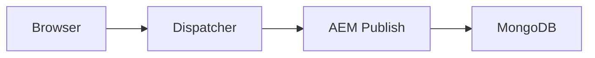

# VSCode Hidden Gems cho AEM Dev

Các tính năng ít người biết nhưng cực kỳ hữu ích trong VSCode khi làm việc với AEM 6.5 project.

---

## 1. Multi-Cursor Editing

### Thêm cursor ở nhiều vị trí

| Phím tắt | Mô tả |
|----------|-------|
| `Alt+Click` | Thêm cursor tại vị trí click |
| `Ctrl+Alt+↑/↓` | Thêm cursor lên/xuống |
| `Ctrl+D` | Select next occurrence của từ hiện tại |
| `Ctrl+Shift+L` | Select tất cả occurrences |

**Use case AEM:** Sửa tất cả `sling:resourceType` trong `.content.xml` cùng lúc:
1. Select `mysite/components/old`
2. `Ctrl+Shift+L`
3. Gõ `mysite/components/new`

---

## 2. Column (Box) Selection

`Shift+Alt+Drag` → select theo hình chữ nhật.

**Use case:** Copy column data từ table trong log file, hoặc align code theo cột.

---

## 3. Breadcrumbs Navigation

`Ctrl+Shift+.` → mở breadcrumb navigation ở top editor.

Click vào breadcrumb item → xem outline của file, nhảy nhanh tới method/class.

**AEM use case:** Navigate trong Sling Model lớn có nhiều methods.

---

## 4. Go to Symbol

| Command | Phím tắt |
|---------|----------|
| Go to Symbol in File | `Ctrl+Shift+O` |
| Go to Symbol in Workspace | `Ctrl+T` |

Gõ tên class/method → nhảy ngay tới definition.

**AEM use case:** Tìm nhanh `@Model` class hoặc `@SlingServlet` trong workspace lớn.

---

## 5. Peek Definition

`Alt+F12` trên symbol → xem definition trong inline popup, không cần mở file mới.

**AEM use case:** Xem nhanh Sling Model code khi đang đọc HTL template.

---

## 6. Timeline View

Click icon **Timeline** ở Explorer sidebar → xem:
- Git commit history của file
- Local file history (auto-saved versions)

**AEM use case:** So sánh version cũ của component dialog khi bị lỗi sau khi sửa.

---

## 7. Sticky Scroll

Settings → search `Sticky Scroll` → enable.

Khi scroll xuống, heading/function name sẽ "dính" ở top → luôn biết đang ở context nào.

**AEM use case:** Đọc file `.content.xml` dài, luôn thấy parent node name.

---

## 8. Emmet trong XML

Emmet không chỉ cho HTML. Dùng trong `.content.xml`:

```xml
dialog>items>tabs>items>tab[jcr:title="Properties"]>items
```

Tab → expand thành:
```xml
<dialog>
    <items>
        <tabs>
            <items>
                <tab jcr:title="Properties">
                    <items></items>
                </tab>
            </items>
        </tabs>
    </items>
</dialog>
```

---

## 9. Regex Find & Replace

`Ctrl+H` → bật regex mode (icon `.*`).

**Use case:** Đổi tất cả `@ValueMapValue` thành `@Inject`:

Find:
```regex
@ValueMapValue\s+private\s+(\w+)\s+(\w+);
```

Replace:
```java
@Inject\nprivate $1 $2;
```

---

## 10. Workspace Trust

Khi mở AEM project từ Git, VSCode hỏi "Do you trust this workspace?".

**Lưu ý:** Chỉ trust nếu biết rõ nguồn gốc. Untrusted workspace sẽ disable:
- Task execution
- Extension execution
- Debugging

---

## 11. Problems Panel Filters

`Ctrl+Shift+M` → mở Problems panel.

Click filter icon → filter theo:
- Severity (Error/Warning/Info)
- File type
- Text search

**AEM use case:** Filter chỉ Java errors, bỏ qua XML validation warnings.

---

## 12. Refactor Preview

Khi rename symbol (`F2`), VSCode show preview panel với tất cả thay đổi.

**AEM use case:** Rename Sling Model field → xem tất cả HTL files bị ảnh hưởng trước khi apply.

---

## 13. Source Control Graph

Install extension **Git Graph** → xem commit history dạng tree.

Click commit → xem diff, checkout, cherry-pick.

**AEM use case:** Trace khi nào component dialog bị thay đổi, ai commit.

---

## 14. Snippets với Placeholders

Tạo snippet trong User Snippets (`Ctrl+Shift+P` → "Configure User Snippets"):

```json
{
  "Sling Model": {
    "prefix": "aem-model",
    "body": [
      "@Model(adaptables = ${1|SlingHttpServletRequest,Resource|}.class,",
      "       defaultInjectionStrategy = DefaultInjectionStrategy.OPTIONAL)",
      "public class ${2:ModelName} {",
      "    ",
      "    @ValueMapValue",
      "    private String ${3:fieldName};",
      "    ",
      "    public String get${3/(.*)/${1:/capitalize}/}() {",
      "        return ${3};",
      "    }",
      "}"
    ]
  }
}
```

Gõ `aem-model` + Tab → snippet expand với placeholders, Tab để nhảy giữa các placeholders.

---

## 15. Terminal Splitting

`Ctrl+Shift+5` → split terminal.

**AEM use case:**
- Terminal 1: `mvn clean install -PautoInstallBundle`
- Terminal 2: `tail -f crx-quickstart/logs/error.log`
- Terminal 3: `npm run dev` (ui.frontend)

---

## 16. Workspace Recommended Extensions

Tạo `.vscode/extensions.json`:

```json
{
  "recommendations": [
    "redhat.java",
    "vscjava.vscode-java-pack",
    "vscjava.vscode-maven",
    "dbaeumer.vscode-eslint",
    "esbenp.prettier-vscode"
  ]
}
```

Khi teammate clone repo → VSCode suggest install các extensions này.

---

## 17. Tasks với Problem Matchers

`.vscode/tasks.json`:

```json
{
  "version": "2.0.0",
  "tasks": [
    {
      "label": "Deploy Core Bundle",
      "type": "shell",
      "command": "mvn clean install -PautoInstallBundle",
      "options": { "cwd": "${workspaceFolder}/core" },
      "group": "build",
      "problemMatcher": "$maven-compiler"
    }
  ]
}
```

`Ctrl+Shift+B` → chạy task → errors tự động hiện trong Problems panel.

---

## 18. Fold All Regions

`Ctrl+K Ctrl+0` → fold tất cả code blocks.
`Ctrl+K Ctrl+J` → unfold tất cả.

**Custom regions trong Java:**
```java
//#region Getters
public String getTitle() { return title; }
public String getDescription() { return description; }
//#endregion
```

Click fold icon → collapse region.

---

## 19. Compare Files

Right-click file 1 → **Select for Compare**.
Right-click file 2 → **Compare with Selected**.

**AEM use case:** So sánh 2 component dialogs, hoặc 2 versions của `.content.xml`.

---

## 20. Zen Mode

`Ctrl+K Z` → fullscreen, hide tất cả panels.

Chỉ còn editor. Thoát bằng `Esc Esc`.

**Use case:** Focus code review hoặc viết HTL template phức tạp.

---

## 21. Auto Save với Delay

Settings → `Files: Auto Save` → `afterDelay`.
`Files: Auto Save Delay` → `1000` (ms).

**AEM use case:** Khi edit HTL, auto-save → Maven watch task tự deploy → refresh browser thấy ngay thay đổi.

---

## 22. Search Editor

`Ctrl+Shift+F` → search → click **Open in Editor** icon.

Search results mở trong editor tab → có thể edit, save, share với teammate.

**AEM use case:** Search tất cả `sling:resourceType` trong project → save results làm documentation.

---

## 23. Markdown Preview Enhanced

Install extension **Markdown Preview Enhanced**.

Features:
- Mermaid diagrams
- PlantUML
- Math equations (KaTeX)
- Export to PDF

**AEM use case:** Viết architecture diagram trong markdown:



---

## 24. Remote Repositories

`Ctrl+Shift+P` → "Open Remote Repository".

Nhập GitHub URL → VSCode clone vào temp folder, mở ngay.

**AEM use case:** Xem nhanh AEM Core Components source code mà không cần clone full repo.

---

## 25. Settings Sync

Sign in GitHub → Settings Sync tự động sync:
- Extensions
- Settings
- Keybindings
- Snippets

Giữa máy dev và laptop luôn consistent.

---

## 26. Inline Values (Debug)

Khi debug Java, enable **Debug: Inline Values** trong settings.

Variable values hiện ngay bên cạnh code, không cần hover.

---

## 27. Conditional Breakpoints với Hit Count

Right-click breakpoint → **Edit Breakpoint** → chọn **Hit Count**.

Ví dụ: `> 10` → chỉ dừng sau 10 lần hit.

**AEM use case:** Debug loop xử lý 100 items, chỉ quan tâm item thứ 50.

---

## 28. Data Breakpoints (Java)

Khi debug, right-click variable → **Break on Value Change**.

Debugger sẽ dừng khi variable đó bị modify.

**AEM use case:** Tìm đoạn code nào đang modify property không mong muốn.

---

## 29. Workspace Storage

VSCode lưu workspace state (opened files, scroll position, etc.) tự động.

Đóng VSCode → mở lại → mọi thứ y nguyên.

**Tip:** Tạo multiple workspaces cho các AEM projects khác nhau.

---

## 30. Command Palette History

`Ctrl+Shift+P` → gõ command → VSCode nhớ history.

Lần sau chỉ cần `Ctrl+Shift+P` → `↑` → chọn command đã dùng gần đây.

---

## Bonus: Extensions ít người biết

| Extension | Mô tả |
|-----------|-------|
| **Error Lens** | Hiện error message inline ngay dòng code |
| **Todo Tree** | Highlight và list tất cả `// TODO` comments |
| **Better Comments** | Color-code comments (`// !`, `// ?`, `// *`) |
| **Peacock** | Đổi màu workspace → phân biệt nhiều VSCode windows |
| **Path Intellisense** | Autocomplete file paths trong code |
| **Bracket Pair Colorizer 2** | (Built-in từ VSCode 1.60+) |
| **Import Cost** | Hiện size của import trong JS/TS |
| **REST Client** | Test HTTP requests ngay trong VSCode (thay Postman) |

---

## REST Client Example (AEM)

Tạo file `aem-api.http`:

```http
### Get page JSON
GET http://localhost:4502/content/mysite/en/home.infinity.json
Authorization: Basic admin:admin

### Create page
POST http://localhost:4502/content/mysite/en
Authorization: Basic admin:admin
Content-Type: application/x-www-form-urlencoded

./jcr:primaryType=cq:Page
./jcr:content/jcr:primaryType=cq:PageContent
./jcr:content/jcr:title=New Page
./jcr:content/sling:resourceType=mysite/components/page/content-page

### Query Builder
GET http://localhost:4502/bin/querybuilder.json?path=/content/mysite&type=cq:Page&p.limit=5
Authorization: Basic admin:admin
```

Click **Send Request** → response hiện ngay dưới.

---

## Tổng kết

Những features này giúp:
- **Tăng tốc** navigation và editing
- **Giảm context switching** (ít phải rời VSCode)
- **Debug hiệu quả** hơn với breakpoints nâng cao
- **Collaborate** tốt hơn với workspace settings và extensions sync

Luyện dần từng feature → productivity tăng đáng kể.
