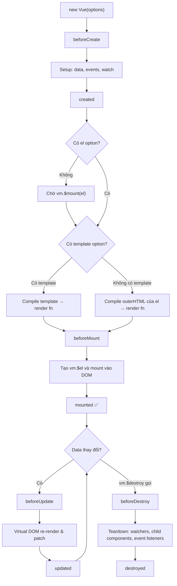

# Vue Instance

> **Ghi chú cá nhân** — Tài liệu về Vue Instance (vm) trong Vue 2.7.x, bao gồm data reactivity, instance properties/methods và lifecycle hooks. Có tips tích hợp với AEM HTL.

## Tạo một Vue Instance

Mọi ứng dụng Vue đều bắt đầu bằng cách tạo một **Vue instance** mới với hàm `Vue`:

```js
var vm = new Vue({
  // options object
})
```

Mặc dù Vue không theo hoàn toàn pattern [MVVM](https://en.wikipedia.org/wiki/Model_View_ViewModel), nhưng thiết kế có lấy cảm hứng từ đó. Theo quy ước, biến `vm` (viết tắt của **ViewModel**) thường được dùng để chỉ Vue instance.

Khi tạo instance, ta truyền vào một **options object** — đây là trung tâm của mọi thứ trong Vue 2.

### Cây component của một ứng dụng Vue

Một ứng dụng Vue bao gồm một **root Vue instance**, tổ chức thành cây các component có thể tái sử dụng:

```
Root Instance (new Vue)
└─ TodoList
   ├─ TodoItem
   │  ├─ TodoButtonDelete
   │  └─ TodoButtonEdit
   └─ TodoListFooter
      ├─ TodosButtonClear
      └─ TodoListStatistics
```

::: info
Tất cả Vue components cũng là Vue instances → chúng nhận cùng options object (trừ một số options chỉ dành cho root instance như `el`).
:::

---

## Data và Reactivity

Khi một Vue instance được tạo, tất cả các properties trong object `data` được thêm vào **hệ thống reactivity** của Vue. Khi giá trị thay đổi, view sẽ **tự động re-render** để phản ánh thay đổi đó.

```js
// Object data ban đầu
var data = { a: 1 }

// Truyền vào Vue instance
var vm = new Vue({
  data: data
})

// Truy cập property từ instance → lấy từ data gốc
vm.a === data.a // => true

// Thay đổi qua instance → cập nhật data gốc
vm.a = 2
data.a // => 2

// Và ngược lại
data.a = 3
vm.a // => 3
```

### ⚠️ Chỉ reactive nếu khai báo từ đầu

Properties trong `data` **chỉ reactive nếu tồn tại khi instance được tạo**. Nếu thêm property sau khi tạo instance, Vue sẽ không theo dõi nó:

```js
var vm = new Vue({ data: { a: 1 } })

// ❌ KHÔNG reactive — Vue không theo dõi vm.b
vm.b = 'hi'
```

**Giải pháp:** Luôn khai báo các properties với giá trị khởi tạo (dù rỗng):

```js
data: {
  newTodoText: '',
  visitCount: 0,
  hideCompletedTodos: false,
  todos: [],
  error: null
}
```

### Object.freeze() — vô hiệu hóa reactivity

`Object.freeze()` ngăn Vue theo dõi sự thay đổi của object:

```js
var obj = { foo: 'bar' }
Object.freeze(obj)

new Vue({
  el: '#app',
  data: obj
})
```

```html
<div id="app">
  <p>{{ foo }}</p>
  <!-- ❌ Button này sẽ không cập nhật foo! -->
  <button v-on:click="foo = 'baz'">Thay đổi</button>
</div>
```

::: tip Khi nào dùng Object.freeze()?
Dùng để tối ưu performance với danh sách data lớn **chỉ đọc** (read-only), ví dụ: bảng tra cứu tĩnh, config constants. Vue sẽ bỏ qua việc setup reactive getters/setters → tiết kiệm bộ nhớ.
:::

---

## Instance Properties & Methods

Vue instance cung cấp nhiều **properties và methods** hữu ích, được prefix bằng `$` để phân biệt với properties do user định nghĩa:

```js
var data = { a: 1 }

var vm = new Vue({
  el: '#example',
  data: data
})

// Properties
vm.$data === data                                    // => true
vm.$el === document.getElementById('example')       // => true

// Methods
vm.$watch('a', function (newValue, oldValue) {
  // Callback này chạy khi vm.a thay đổi
  console.log(`a changed: ${oldValue} → ${newValue}`)
})
```

### Các instance properties quan trọng

| Property | Mô tả |
|----------|-------|
| `vm.$data` | Object data của instance |
| `vm.$el` | DOM element mà instance mount vào |
| `vm.$options` | Options object được dùng khi khởi tạo |
| `vm.$parent` | Instance cha (nếu có) |
| `vm.$root` | Root instance của cây component |
| `vm.$children` | Array các component con trực tiếp |
| `vm.$refs` | Object chứa các DOM elements / child components được đánh dấu `ref` |
| `vm.$slots` | Object chứa nội dung slot |
| `vm.$attrs` | Attributes không được khai báo là props |

### Các instance methods quan trọng

| Method | Mô tả |
|--------|-------|
| `vm.$watch(expr, cb)` | Theo dõi sự thay đổi của expression |
| `vm.$set(obj, key, val)` | Thêm reactive property vào object |
| `vm.$delete(obj, key)` | Xóa reactive property |
| `vm.$emit(event, ...args)` | Emit một custom event |
| `vm.$on(event, cb)` | Lắng nghe một custom event |
| `vm.$off(event, cb)` | Hủy lắng nghe event |
| `vm.$nextTick(cb)` | Callback sau khi DOM update xong |
| `vm.$mount(el)` | Mount instance vào DOM element |
| `vm.$destroy()` | Destroy instance |
| `vm.$forceUpdate()` | Force re-render (dùng cẩn thận!) |

---

## Lifecycle Hooks

Mỗi Vue instance trải qua một loạt các **bước khởi tạo** khi được tạo: setup data observation, compile template, mount vào DOM, update DOM khi data thay đổi... Trong quá trình đó, Vue cung cấp các **lifecycle hooks** để ta thêm code tại các thời điểm cụ thể.

### Toàn bộ lifecycle hooks

```js
new Vue({
  // --- Khởi tạo ---
  beforeCreate() {
    // Instance vừa được tạo, data/events chưa setup
    // this.$data chưa có
  },

  created() {
    // ✅ Data, computed, watch, methods đã sẵn sàng
    // ❌ DOM chưa mount ($el chưa tồn tại)
    // Thường dùng để: gọi API, khởi tạo data
    console.log('created - a is:', this.a)
  },

  // --- Mount vào DOM ---
  beforeMount() {
    // Template đã compile, sắp mount vào DOM
    // Hầu như không dùng
  },

  mounted() {
    // ✅ Instance đã mount vào DOM ($el tồn tại)
    // Thường dùng để: thao tác DOM, init thư viện third-party
    console.log('mounted - el:', this.$el)
  },

  // --- Cập nhật ---
  beforeUpdate() {
    // Data thay đổi, DOM sắp re-render
    // Có thể đọc DOM trước khi update
  },

  updated() {
    // DOM đã re-render xong
    // ⚠️ Tránh thay đổi data ở đây → infinite loop!
  },

  // --- Destroy ---
  beforeDestroy() {
    // Instance sắp bị destroy
    // ✅ Dùng để: cleanup event listeners, timers, subscriptions
  },

  destroyed() {
    // Instance đã bị destroy hoàn toàn
    // Tất cả directives, event listeners đã được unbind
  }
})
```

### Sơ đồ Lifecycle



### Hook nào dùng cho việc gì?

| Hook | Dùng khi |
|------|----------|
| `created` | Gọi API để lấy data, khởi tạo state ban đầu |
| `mounted` | Thao tác DOM, init jQuery plugins, init chart libraries |
| `beforeDestroy` | Clear setTimeout/setInterval, unsubscribe events |
| `updated` | Thực thi code sau khi DOM đã cập nhật (dùng `$nextTick` nếu cần) |

---

## ⚠️ Không dùng Arrow Function trong Hooks

```js
// ❌ SAI — arrow function không có `this` riêng
new Vue({
  created: () => {
    console.log(this.a) // this = undefined hoặc window!
  }
})

// ❌ SAI trong $watch
vm.$watch('a', newValue => this.myMethod()) // lỗi!

// ✅ ĐÚNG — dùng regular function
new Vue({
  created() {
    console.log(this.a) // this = Vue instance ✓
  }
})

// ✅ ĐÚNG trong $watch
vm.$watch('a', function(newValue, oldValue) {
  this.myMethod() // this = Vue instance ✓
})
```

::: danger Lý do
Arrow function không có `this` riêng → `this` bị bind vào scope cha (thường là `window` hoặc `undefined` trong strict mode) → gây lỗi `Cannot read property of undefined`.
:::

---

## Tips & Tricks — Vue Instance trong AEM

### Mount Vue vào element HTL render ra

Vì HTL render server-side trước, Vue instance chỉ cần mount vào DOM đã có:

```html
<!-- HTL component: myComponent.html -->
<div data-sly-use.model="com.example.MyModel"
     id="my-app"
     data-items="${model.itemsJson}">
</div>
```

```js
// clientlib/js/myComponent.js
(function() {
  var el = document.getElementById('my-app')
  if (!el) return // guard: element không tồn tại

  var vm = new Vue({
    el: el,
    data: function() {
      return {
        // Parse JSON data từ HTL thông qua data attribute
        items: JSON.parse(el.dataset.items || '[]'),
        loading: false
      }
    },
    created: function() {
      console.log('[MyApp] Vue instance created, items:', this.items.length)
    },
    mounted: function() {
      console.log('[MyApp] Mounted to DOM element:', this.$el.id)
    }
  })
})()
```

### Dùng $nextTick sau khi cập nhật data

```js
var vm = new Vue({
  el: '#app',
  data: { items: [] },
  methods: {
    loadItems: function() {
      this.items = fetchItems() // data thay đổi

      // ❌ DOM chưa cập nhật tại đây
      console.log(this.$el.querySelectorAll('.item').length) // có thể sai

      // ✅ Đợi DOM update xong
      this.$nextTick(function() {
        console.log(this.$el.querySelectorAll('.item').length) // chính xác
      })
    }
  }
})
```

### Expose Vue instance ra window để debug

```js
// Chỉ dùng trong development!
var vm = new Vue({ /* ... */ })

if (process.env.NODE_ENV !== 'production') {
  window.__vm = vm
}
```

### Cleanup đúng cách khi AEM SPA navigate

Trong AEM SPA hoặc khi component bị remove khỏi DOM, luôn destroy Vue instance:

```js
var vm = new Vue({ el: '#app' /* ... */ })

// Khi component bị unmount/remove
function cleanup() {
  if (vm) {
    vm.$destroy()
    vm = null
  }
}
```

---

## Tham khảo API

- [`new Vue(options)`](https://v2.vuejs.org/v2/api/#Options-Data) — Full options reference
- [Instance Properties](https://v2.vuejs.org/v2/api/#Instance-Properties)
- [Instance Methods / Data](https://v2.vuejs.org/v2/api/#Instance-Methods-Data)
- [Instance Methods / Lifecycle](https://v2.vuejs.org/v2/api/#Instance-Methods-Lifecycle)
