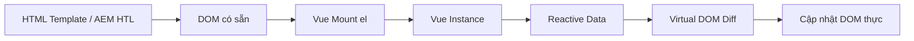

# Giới thiệu Vue 2

> **Ghi chú cá nhân** — Tài liệu này viết cho bản thân để tham chiếu nhanh khi phát triển Vue 2.7.x, đặc biệt trong môi trường AEM (Adobe Experience Manager).

## Vue.js là gì?

Vue (phát âm là `/vjuː/`, giống như **view**) là một **Progressive JavaScript Framework** dùng để xây dựng giao diện người dùng (UI). Không giống như các monolithic framework, Vue được thiết kế từ đầu để có thể áp dụng từng phần (incrementally adoptable).

- **Core** chỉ tập trung vào **view layer** → dễ tích hợp với thư viện hoặc dự án sẵn có.
- Kết hợp với tooling hiện đại → xây dựng **Single-Page Applications (SPA)** phức tạp.

::: tip Tại sao dùng Vue 2.7.x với AEM?
Vue 2.7.x là phiên bản LTS cuối của Vue 2, vẫn được dùng phổ biến trong dự án AEM vì:
- AEM clientlibs tương thích tốt với Vue 2 runtime build (không cần bundler).
- HTL (HTML Template Language) render server-side → Vue mount vào DOM đã có sẵn.
- Vue 2.7 backport Composition API từ Vue 3 → có thể dùng `setup()`, `ref()`, `computed()` mà không cần nâng cấp.
:::

## Tương thích trình duyệt

Vue 2 **không hỗ trợ IE8** vì sử dụng các tính năng ECMAScript 5 không thể polyfill trên IE8. Tuy nhiên hỗ trợ tất cả trình duyệt [tuân thủ ECMAScript 5](https://caniuse.com/#feat=es5).

## Phiên bản mới nhất

| Phiên bản | Ghi chú |
|-----------|---------|
| `2.7.16`  | Bản stable mới nhất — LTS, EOL tháng 12/2023 |
| `2.7.x`   | Backport Composition API từ Vue 3 |

::: warning EOL Notice
Vue 2 đã chính thức **End of Life** vào 31/12/2023. Không còn nhận security patches mới. Với dự án AEM cũ vẫn dùng Vue 2, hãy kiểm soát dependency chặt chẽ.
:::

---

## Cài đặt

### 1. CDN (Đơn giản nhất — dùng trong AEM clientlibs)

Phù hợp để **prototype** hoặc tích hợp trực tiếp vào AEM clientlib mà không cần build step:

```html
<!-- Development (có warnings đầy đủ) -->
<script src="https://cdn.jsdelivr.net/npm/vue@2.7.16/dist/vue.js"></script>

<!-- Production (minified, tối ưu tốc độ) -->
<script src="https://cdn.jsdelivr.net/npm/vue@2.7.16/dist/vue.min.js"></script>
```

::: danger Lưu ý quan trọng
Không dùng bản **minified** trong môi trường development — sẽ mất đi toàn bộ warning hữu ích khi debug!
:::

Cho production, pin cụ thể version để tránh breaking changes bất ngờ:

```html
<script src="https://cdn.jsdelivr.net/npm/vue@2.7.16"></script>
```

Nếu dùng **ES Modules** native trong browser:

```html
<script type="module">
  import Vue from 'https://cdn.jsdelivr.net/npm/vue@2.7.16/dist/vue.esm.browser.js'
</script>
```

### 2. NPM (Khuyến nghị cho dự án lớn)

```bash
# Cài phiên bản stable mới nhất của Vue 2
npm install vue@^2
```

NPM kết hợp tốt với các module bundler như **Webpack** hoặc **Rollup**, và hỗ trợ [Single File Components (.vue)]
### 3. Vue CLI

Vue cung cấp [official CLI](https://github.com/vuejs/vue-cli) để scaffold SPA nhanh chóng:

```bash
npm install -g @vue/cli
vue create my-project
```

::: tip
CLI yêu cầu kiến thức về Node.js và build tools. Nếu mới bắt đầu, hãy thử CDN trước!
:::

---

## Các loại build của Vue 2

Vue 2 cung cấp nhiều build khác nhau trong thư mục `dist/`. Hiểu rõ để chọn đúng build cho từng môi trường:

| Build | Mô tả |
|-------|-------|
| **Full** | Bao gồm cả Compiler + Runtime |
| **Runtime-only** | Chỉ Runtime, nhẹ hơn ~30%, dùng khi template đã pre-compile |
| **UMD** | Dùng trực tiếp qua `&lt;script&gt;` tag (CDN) |
| **CommonJS** | Dùng với Browserify / Webpack 1 (`pkg.main`) |
| **ES Module** | Dùng với Webpack 2+, Rollup (`pkg.module`) |

### Full vs Runtime-only

```js
// ❌ Cần Compiler (dùng Full build)
new Vue({
  template: '<div>{{ message }}</div>'
})

// ✅ Không cần Compiler (dùng Runtime-only build)
new Vue({
  render(h) {
    return h('div', this.message)
  }
})
```

Khi dùng `vue-loader` với file `.vue`, template đã được pre-compile → **chỉ cần Runtime build**, nhẹ hơn 30%.

### Cấu hình alias Webpack (dùng Full build)

```js
// webpack.config.js
module.exports = {
  resolve: {
    alias: {
      // Dùng full build (có compiler)
      'vue$': 'vue/dist/vue.esm.js'
      // Webpack 1: 'vue/dist/vue.common.js'
    }
  }
}
```

---

## Development vs Production Mode

| Mode | UMD | CommonJS / ESM |
|------|-----|----------------|
| Development | File không minified (`vue.js`) | Dựa vào `process.env.NODE_ENV` |
| Production | File minified (`vue.min.js`) | Cần config bundler |

### Webpack 4+ (khuyến nghị)

```js
module.exports = {
  mode: 'production' // tự động set NODE_ENV=production
}
```

### Webpack 3 (dùng DefinePlugin)

```js
const webpack = require('webpack')
module.exports = {
  plugins: [
    new webpack.DefinePlugin({
      'process.env': {
        NODE_ENV: JSON.stringify('production')
      }
    })
  ]
}
```

---

## CSP (Content Security Policy)

Một số môi trường (ví dụ: Google Chrome Apps) áp dụng CSP, cấm `new Function()` — tính năng mà **Full build** dùng để compile template.

**Giải pháp:** Dùng **Runtime-only build** kết hợp với `vue-loader` / `vueify` để pre-compile template → hoàn toàn tương thích CSP.

::: tip Với AEM + HTL
AEM render HTML server-side qua HTL. Vue mount vào DOM có sẵn → **không cần compile template phía client** → dùng **Runtime-only build** là đủ và tối ưu nhất!

```html
<!-- AEM HTL component -->
<div data-sly-use.model="com.example.MyModel"
     id="my-vue-app">
  <!-- Vue mount vào đây sau khi HTL render xong -->
</div>
```

```js
// clientlib JS
new Vue({
  el: '#my-vue-app',
  data: {
    message: 'Hello from Vue!'
  }
  // Không cần template string → Runtime build là đủ
})
```
:::

---

## Vue Devtools

Cài extension để debug Vue app dễ dàng hơn:

- [Chrome / Edge](https://chrome.google.com/webstore/detail/vuejs-devtools/nhdogjmejiglipccpnnnanhbledajbpd)
- [Firefox](https://addons.mozilla.org/en-US/firefox/addon/vue-js-devtools/)

::: warning
Với AEM, đôi khi Vue Devtools không detect được app nếu Vue được load trong AEM clientlib iframe. Hãy kiểm tra Console để xem Vue instance đã được mount chưa.
:::

---

## Luồng hoạt động cơ bản



---

## Tips & Tricks — Vue 2 + AEM HTL

### Tránh xung đột HTL và Vue template syntax

HTL dùng `$\{\}` và `$\{'...'\}`, Vue dùng `\{\{ \}\}`. Chúng không xung đột nhau vì:
- HTL xử lý **server-side** (Java) → render ra HTML thuần.
- Vue xử lý **client-side** (JavaScript) → mount vào DOM đã render xong.

```html
<!-- HTL xử lý trước (server-side) -->
<div data-sly-use.model="com.example.MyModel">
  <span id="greeting-app"
        data-name="${model.userName}">
  </span>
</div>

<!-- Vue đọc data từ attribute, không cần biết HTL -->
<script>
new Vue({
  el: '#greeting-app',
  data() {
    return {
      name: document.getElementById('greeting-app').dataset.name
    }
  },
  template: '<span>Xin chào, {{ name }}!</span>'
})
</script>
```

### Truyền data từ HTL sang Vue qua `data-*` attributes

```html
<!-- HTL -->
<div id="product-app"
     data-product-id="${properties.productId}"
     data-price="${properties.price @ context='number'}">
</div>
```

```js
// Vue mount
const el = document.getElementById('product-app')
new Vue({
  el,
  data: {
    productId: el.dataset.productId,
    price: parseFloat(el.dataset.price)
  }
})
```

### Sử dụng `v-cloak` để tránh FOUC (Flash of Uncompiled Content)

```css
/* clientlib CSS */
[v-cloak] { display: none; }
```

```html
<!-- HTML -->
<div id="app" v-cloak>
  <p>{{ message }}</p>
</div>
```

> `v-cloak` sẽ được Vue tự động xóa sau khi mount → tránh hiện `\{\{ message \}\}` thô trước khi Vue chạy.

---

## Tài nguyên tham khảo

| Tài nguyên | Link |
|-----------|------|
| Vue 2 Official Docs | [v2.vuejs.org](https://v2.vuejs.org/v2/guide/) |
| Vue 2.7 Migration | [v2.vuejs.org/v2/guide/migration-vue-2-7](https://v2.vuejs.org/v2/guide/migration-vue-2-7) |
| Vue Devtools | [github.com/vuejs/vue-devtools](https://github.com/vuejs/vue-devtools) |
| AEM HTL Spec | [adobe.github.io/htl-spec](https://adobe.github.io/htl-spec/) |
| Vue CLI | [cli.vuejs.org](https://cli.vuejs.org) |
